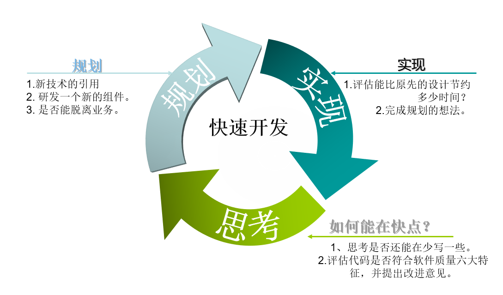

# 项目介绍

> Cap-hr 快速开发平台，不仅仅是一个后台开发框架，它是一个组工人事领域的一个综合解决方案，后端基于经典组合 Spring Boot、Spring Security、MyBatis，前端采用Vue2.x ,element-ui，Vxe-table 等技术栈。并提供在线代码生成，元数据管理，工作流，自定义表单等功能，。采用松耦合设计，微内核和插件架构，模块增减便捷；及时消息推送；多元化第三方登录；在线定时任务配置；支持多数据源；支持读写分离、分库分表；支持全文检索等功能。

> Cap-hr 快速开发平台，只是先进技术的搬运工，全部采用流行的开源中间件，本着非必要不研发的原则。尽量做到无培训成本，能够让初级的研发人员快速的开发出复杂的业务功能，中高级人员有时间做一些更有用的事情。让开发者注重专注业务，其余有平台来封装技术细节，降低技术难度，从而节省人力成本，缩短项目周期，提高软件安全质量。

> Cap-hr 结合了多年总结和经验，以及各方面的应用案例，对架构完成了一次全部重构，也纳入很多新的思想。不管是从开发者模式、底层架构、逻辑处理还是到用户界面，用户交互体验上都有很大的进步，在不忘学习成本、提高开发效率的情况下，安全方面也做和很多工作，包括：密码策略、安全审计、审计日志等众多安全选项供你选择。努力为大中小微企业打造全方位企业级快速开发解决方案。

## 主思想理念

