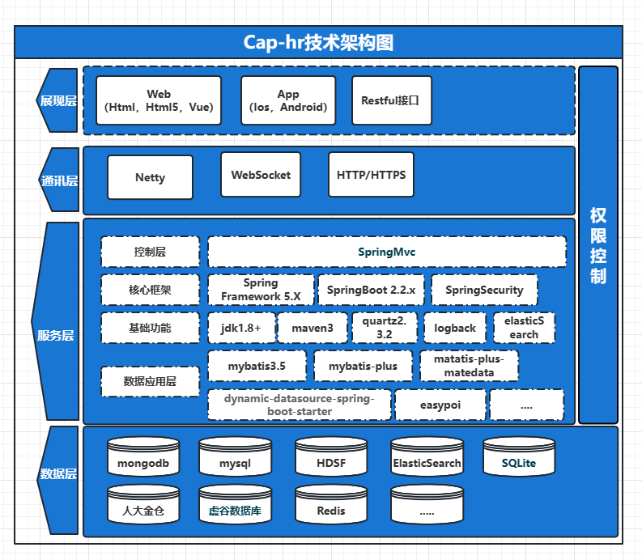
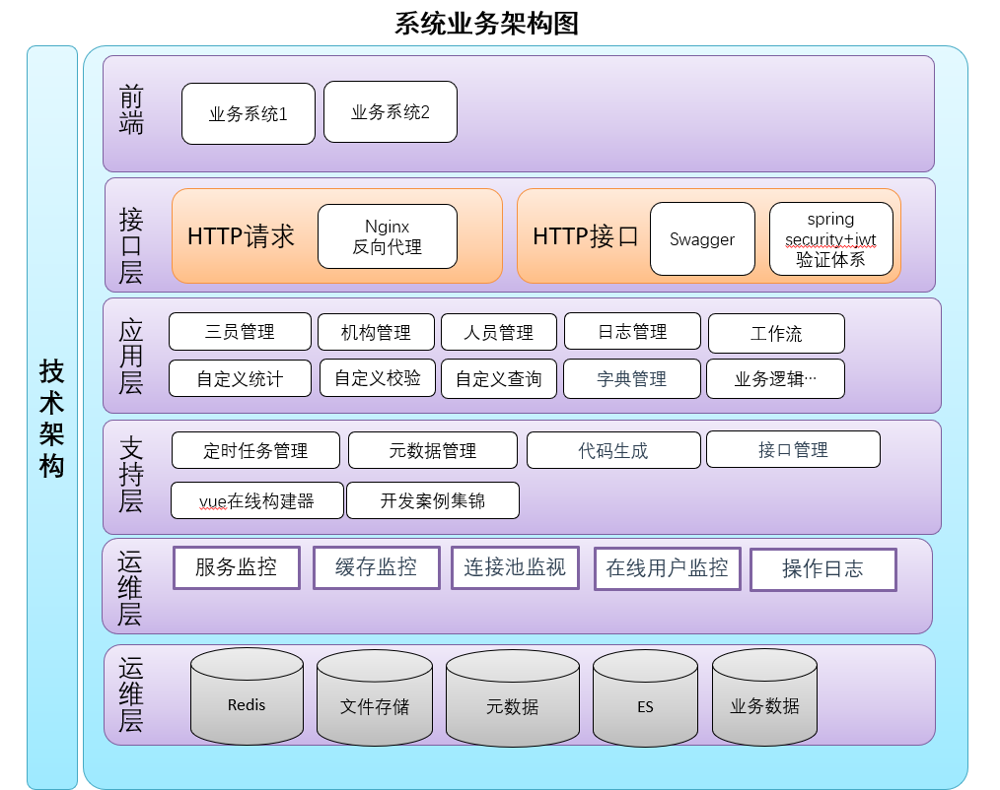
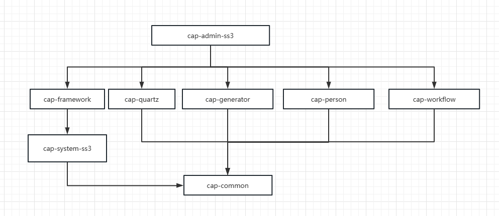

# 技术架构与选型

## 技术架构图




## 业务架构




## 目录结构


```commad
cap-hr
├─ cap-admin-ss3   三员管理
├─ cap-common 工具包
├─ cap-demo  所有的Demo
├─ cap-fileupload 上传下载
├─ cap-framework  架构
├─ cap-generator 代码生成器
├─ cap-person 人员管理和机构管理
├─ cap-quartz 定时任务
├─ cap-system-ss3 三员系统包
├─ cap-workflow 工作流
├─ doc 开发文档
├─ lib
├─ logs
└─ pom.xml
```


## 依赖关系





## 架构选型


**1、系统环境**

- Java EE 8
- Servlet 3.1
- Apache Maven 3

**2、主框架**

- Spring Boot 2.2.x
- Spring Framework 5.2.x
- Spring Security 5.2.x

**3、持久层**

- Apache MyBatis 3.5.x
- Mybatis-plus 3.5.1
- Hibernate Validation 6.0.x
- Alibaba Druid 1.2.x
- dynamic-datasource 3.5.1

**4、视图层**

- Vue 2.6.x
- Axios 0.21.x
- Element 2.15.x
- Vxe-table
- zTree 3.5

**5、工具包**

* easypoi 4.3.0
* aviator 5.2.7
* hutool 5.7.17
* 日志框架：Logback 1.2
* 工具类库：Apache Commons
* 对象序列化：FST 2.57
* JSON 序列化：Jackson 2.13
* Office 工具：POI 4.1

- 分布式任务调度：Quartz 2.3
- 全文检索引擎：ElasticSearch 7、Lucene
- Flowable V6.6 工作流引擎
- 消息队列：ActiveMQ


## 开发规范

 [阿里巴巴Java开发手册终极版v1.3.0.pdf](pdf\阿里巴巴Java开发手册终极版v1.3.0.pdf) 

规约的范围包含:编程规约、单元测试规约、异常日志规约、MySQL规约、工程规约、安全规约。

开发的程序应该围绕，健壮性，可读性，扩展性进行展开。这里主要遵循阿里巴巴Java开发手册进行规范。

## 前台开发规范(少波补充)

## 后台开发规范（补充）

已阿里巴巴Java开发手册为主，还需要遵守

###  2、数据列表

#### 1）列对齐方式

- 短小字符居中，比较长的字符居左，日期居中，货币或带小数点的数字居右
- 数值位数相等的字段，如：编码、编号：居中
- 字典类，如：分类、类型、类别、状态：居中
- 不规则长度，5个字符以上，名称、标题：居左
- 日期时间：居中
- 与货币相关的，金额、单价：居右
- 带小数点的数字，数量、百分数：居右
- 整数型数字，年龄，个数：居中
- 合计，与合计列对齐方式相同

#### 2）列显示格式

- 与货币相关，金额或单价：保留两位小数，如无特殊要求，不加货币符号，不使用千分位符号，默认单位“元”，如果单位不是“元”，则必须在列标题或当前页标明单位，如：金额（万元）
- 长字符列，名称、标题、备注等：当列宽不足时，用 … 号表示无法显示的字符
- 日期：yyyy-MM-dd，日期时间：yyyy-MM-dd HH:mm，如业务无特别要求，不带秒，如需要时分秒，格式为： yyyy-MM-dd HH:mm:ss 采用24小时制
- 列宽要适中，根据内容调整列宽大小

#### 3）其他要求

- 列表中存在与金额相关的列，或者与数量相关的列，根据业务要求，列表底部增加合计，如果列表是分页列表，合计默认为查询结果的合计，而不是当前页合计
- 合计校验：明细行合计值，与合计行值相同，不要出现明细与合计的数值不对的情况
- 汇总与明细校验：汇总值与钻取的明细合计值相同，同上
- 根据业务要求，比较大或比较耗时的页面，第一次打开时，如没有特殊要求，默认不执行查询显示数据，需要点击查询，执行显示数据，并提示“点击查询显示数据”信息
- 对于列与数字相关的，如：金额、数量、证件号码（如：身份证）或其它由长数字组成的字段，不能出现科学计数法格式
- 明细行中不能存在重复记录

#### 4）查询条件

- 数据字典字段作为查询条件，无特殊要求，信息内容相对固定少于20行时，采用下拉选择方式，否则采用弹出对话框选择方式；有特别要求时，可以采用输入方式，进行模糊查询，除此之外，必须采用选择方式
- 查询条件为多行时，标签需要上下两端对齐，标签单行右对齐，注意美观
- 输入框或选择框，上下两端对齐，宽度适中

### 3、编辑表单

#### 1）表单控件

- 必填信息，必须明确区分，标签前增加红色星号，醒目显示，必填信息在保存时必须增加必填验证
- 数值类型，必须增加数值验证
- 日期类型，必须增加日期格式验证
- 边界验证，录入信息的长度不得多于数据库字段长度，input标签必须包含增加maxlength属性
- 无特殊情况，如：电话、身份证、邮箱，能用正则表达式验证的字段必须启用验证
- 界面录入信息与列表显示信息保持一致，避免字段张冠李戴
- 界面显示信息与数字相关的，如：金额、数量、证件号码（如：身份证）或其它由长数字组成的字段，不能出现科学计数法格式
- 必须避免提交类型按钮多次执行，出现多条相同信息，在未成功之前，不能多次点击

#### 2）其它要求

- 对整个项目进行跨浏览器的测试（必须兼容IE9+、360、Chrome、Firefox浏览器）
- 界面大小应该适合美学观点，感觉协调舒适，能在有效的范围内吸引用户的注意力，注意细节（观察1像素距离、列表文字对齐）
- 必须保证在最小分辨率1024x768的可视性（不允许错版），在高分辨率下页面要自适应，不能出现标题背景空白，错位情况
- 每一步操作，如保存、更新、审核，都要有提示，如：保存xx成功！
- 检查界面是否有文字错误，避免出现看不懂的文字
- 手机端或PC端图标及标题内容显示不全的，应尽量减少文字，不显示…，让文字显示全


## 数据库开发规范

### 1、命名规范

- 数据库对象，如：表、列、索引、视图、存储过程、自定义函数，的命名的原则是简、短，易懂好记，有意义的英文单词、常用缩写，多个单词组成的，当长度比较大时应使用缩写，特殊情况使用拼音或首字母,（人事系统除外）
- 人事系统有其特殊性，则统一用 rs开头，例如人员子集 rs_a01。
- 数据表命名：必须带有模块前缀，如人员管理：rs_a01
- 如果命名由多个词汇组成，词汇之间加 _ 下划线，如：sys_log

### 2、设计规范

- 通常情况下每张表必须有主键，对于非主键，具有唯一性质的，必须加，唯一索引
- 每张表，每个字段都必须有正确的中文描述说明，以便快速生成数据字典
- 业务数据表必要时冗余基础信息表的核心字段，如：部门编码、部门名称，需要成对出现在业务数据表中
- 对于字符类型（VERCHAR）字段，确定数据值仅是数字、字母并无其它特殊字符的情况下使用VERCHAR字段，其它必须使用NVARCHAR类型，避免使用VARCHAR类型
- 表字段的长度要统一，尤其基础数据在业务数据中的引用，
- 存储过程、自定义函数、视图，以及调度，必须要有详细的注释说明
- 统一入口，统一出口原则：相同意义的数据存储、提取，使用同一过程和方法
- 不要盲目的加入其他索引，根据需要统一加索引


### 3、使用规范

- 在指定用户下，只有项目经理具有数据表对象的设计权限，其他开发人员不得调整表结构
- 作业调度需要有详细的登记台账（也是项目管理要求的一部分）
- SQL书写采用：关键字大写，表名，列名小写   (业务表 大写兼容oracle)


​                                                                


## 数据库设计


# I    表清单

## I.1   表清单

| 名称                                                         | 代码                         |
| ------------------------------------------------------------ | ---------------------------- |
| 作业执行器表。用于存放当前作业的执行信息，比如创建时间。执行开始时间，执行结束时间，执行的哪个Job实例，执行状态等。 | batch_job_execution          |
| 作业执行上下文表。用于存放作业执行器上下文的信息。           | batch_job_execution_context  |
| 作业参数表。用于存放每个Job执行时候的参数信息，该参数实际上是对应Job实例的。 | batch_job_execution_params   |
| 作业执行器序列表。用于给表BATCH_JOB_EXECUTION和BATCH_JOB_EXECUTION_CONTEXT提供主键。 | batch_job_execution_seq      |
| 作业实例表。用于存放Job的实例信息。                          | batch_job_instance           |
| 作业序列表。用于给表BATCH_JOB_INSTANCE和BATCH_JOB_EXECUTION_PARAMS提供主键 | batch_job_seq                |
| 作业步执行器表。用于存放每个Step执行器的信息，比如作业步的开始时间、执行完成时间、执行状态、读/写次数、跳过次数等。 | batch_step_execution         |
| 作业步执行上下文表。用于存放每个作业步的上下文信息。         | batch_step_execution_context |
| 作业步序列表。用于给表BATCH_STEP_EXECUTION和BATCH_STEP_EXECUTION_CONTEXT提供主键。 | batch_step_execution_seq     |
| bk_tb_check_temp_err                                         | bk_tb_check_temp_err         |
| bp_message                                                   | bp_message                   |
| cap_busi_table                                               | cap_busi_table               |
| Demo例子-成绩表                                              | cap_demo_stu_score           |
| Demo例子-学生表                                              | cap_demo_student             |
| 类型转化表                                           | caphr_report_field           |
| 元数据-条件表                                                | ci_conditions                |
| 元数据-参数表                                                | ci_conditions_param          |
| 元数据-表管理                                                | ci_from_to                   |
| 元数据-接口                                                  | ci_interface                 |
| 元数据-参数                                                  | ci_interface_parameter       |
| 元数据-表与表之间的关系                                      | ci_pk_fk_relation            |
| 元数据-项目表                                                | ci_project                   |
| ci_remind_config                                             | ci_remind_config             |
| 元数据-接口返回值                                             | ci_return_filter             |
| 元数据-表字段                                              | ci_table_comlun              |
| 代码生成器-表名                                                    | gen_table                    |
| 代码生成器-字段名                                             | gen_table_column             |
| 密码规则表                                               | password_rules               |
| ps_dic_info                                                  | ps_dic_info                  |
| ps_sys_sync_mess                                             | ps_sys_sync_mess             |
| qrtz_blob_triggers                                           | qrtz_blob_triggers           |
| qrtz_calendars                                               | qrtz_calendars               |
| qrtz_cron_triggers                                           | qrtz_cron_triggers           |
| qrtz_fired_triggers                                          | qrtz_fired_triggers          |
| qrtz_job_details                                             | qrtz_job_details             |
| qrtz_locks                                                   | qrtz_locks                   |
| qrtz_paused_trigger_grps                                     | qrtz_paused_trigger_grps     |
| qrtz_scheduler_state                                         | qrtz_scheduler_state         |
| qrtz_simple_triggers                                         | qrtz_simple_triggers         |
| qrtz_simprop_triggers                                        | qrtz_simprop_triggers        |
| qrtz_triggers                                                | qrtz_triggers                |
| rs_a01                                                       | rs_a01                       |
| rs_a01_userpic                                               | rs_a01_userpic               |
| rs_a02                                                       | rs_a02                       |
| rs_a05                                                       | rs_a05                       |
| rs_a06                                                       | rs_a06                       |
| rs_a08                                                       | rs_a08                       |
| rs_a11                                                       | rs_a11                       |
| rs_a14                                                       | rs_a14                       |
| rs_a15                                                       | rs_a15                       |
| rs_a17                                                       | rs_a17                       |
| rs_a29                                                       | rs_a29                       |
| rs_a30                                                       | rs_a30                       |
| rs_a31                                                       | rs_a31                       |
| rs_a33                                                       | rs_a33                       |
| rs_a36                                                       | rs_a36                       |
| rs_a37                                                       | rs_a37                       |
| rs_a39                                                       | rs_a39                       |
| rs_a53                                                       | rs_a53                       |
| rs_a65                                                       | rs_a65                       |
| rs_a71                                                       | rs_a71                       |
| rs_a72                                                       | rs_a72                       |
| rs_a99                                                       | rs_a99                       |
| rs_diff_log                                                  | rs_diff_log                  |
| rs_drop_id                                                   | rs_drop_id                   |
| rs_rmpc                                                      | rs_rmpc                      |
| rs_rmwjsc                                                    | rs_rmwjsc                    |
| rs_rmwjsc_pc                                                 | rs_rmwjsc_pc                 |
| rs_roster                                                    | rs_roster                    |
| rs_roster_comlun                                             | rs_roster_comlun             |
| rs_train_batch                                               | rs_train_batch               |
| rs_train_person                                              | rs_train_person              |
| rs_unmk                                                      | rs_unmk                      |
| rs_unmk_backups                                              | rs_unmk_backups              |
| rs_y01                                                       | rs_y01                       |
| rs_y02                                                       | rs_y02                       |
| rs_y05                                                       | rs_y05                       |
| rs_y36                                                       | rs_y36                       |
| rs_y65                                                       | rs_y65                       |
| rs_zdy_c05                                                   | rs_zdy_c05                   |
| rs_zdy_c06                                                   | rs_zdy_c06                   |
| rs_zdy_err                                                   | rs_zdy_err                   |
| rs_zdy_err_wzh                                               | rs_zdy_err_wzh               |
| rs_zdy_err_zyf                                               | rs_zdy_err_zyf               |
| rs_zdy_ign_wzh                                               | rs_zdy_ign_wzh               |
| sys_bis_log                                                  | sys_bis_log                  |
| sys_config                                                   | sys_config                   |
| sys_config_caphr                                             | sys_config_caphr             |
| sys_dept                                                     | sys_dept                     |
| sys_dict_data                                                | sys_dict_data                |
| sys_dict_data_chanpin                                        | sys_dict_data_chanpin        |
| sys_dict_type                                                | sys_dict_type                |
| sys_dict_type_chanpin                                        | sys_dict_type_chanpin        |
| sys_group                                                    | sys_group                    |
| sys_job                                                      | sys_job                      |
| sys_job_log                                                  | sys_job_log                  |
| sys_logininfor                                               | sys_logininfor               |
| sys_menu                                                     | sys_menu                     |
| sys_meta_info                                                | sys_meta_info                |
| sys_notice                                                   | sys_notice                   |
| sys_oper_log                                                 | sys_oper_log                 |
| sys_post                                                     | sys_post                     |
| sys_role                                                     | sys_role                     |
| sys_role_dept                                                | sys_role_dept                |
| IAOsys_role_group                                            | sys_role_group               |
| sys_role_menu                                                | sys_role_menu                |
| sys_role奥_post                                              | sys_role_post                |
| sys_tree_dict                                                | sys_tree_dict                |
| sys_tree_dict_chanpin                                        | sys_tree_dict_chanpin        |
| sys_tree_dict_data                                           | sys_tree_dict_data           |
| sys_tree_dict_data_chanpin                                   | sys_tree_dict_data_chanpin   |
| sys_tree_dict_data_copy1                                     | sys_tree_dict_data_copy1     |
| sys_user                                                     | sys_user                     |
| sys_user_menu                                                | sys_user_menu                |
| sys_user_post                                                | sys_user_post                |
| sys_user_role                                                | sys_user_role                |
| target_manage                                                | target_manage                |
| targetment_manage                                            | targetment_manage            |
| temp_table_log                                               | temp_table_log               |
| template_form                                                | template_form                |
| template_form_config                                         | template_form_config         |
| wf_hi_task                                                   | wf_hi_task                   |
| wf_re_def                                                    | wf_re_def                    |
| wf_re_group                                                  | wf_re_group                  |
| wf_re_path                                                   | wf_re_path                   |
| wf_re_task_node                                              | wf_re_task_node              |
| wf_ru_task                                                   | wf_ru_task                   |
| zebra_file                                                   | zebra_file                   |
| zhlb_cert_manage                                             | zhlb_cert_manage             |
| zk_dic_config                                                | zk_dic_config                |
| zk_table_config                                              | zk_table_config              |

 

# II   表列清单

## II.1  表 batch_job_execution

### II.1.1 表 <batch_job_execution> 的列清单

| 代码                       | 名称                       | 数据类型      | 主要的 | 强制  | 注释 |
| -------------------------- | -------------------------- | ------------- | ------ | ----- | ---- |
| JOB_EXECUTION_ID           | JOB_EXECUTION_ID           | bigint        | TRUE   | TRUE  |      |
| VERSION                    | VERSION                    | bigint        | FALSE  | FALSE |      |
| JOB_INSTANCE_ID            | JOB_INSTANCE_ID            | bigint        | FALSE  | TRUE  |      |
| CREATE_TIME                | CREATE_TIME                | datetime(6)   | FALSE  | TRUE  |      |
| START_TIME                 | START_TIME                 | datetime(6)   | FALSE  | FALSE |      |
| END_TIME                   | END_TIME                   | datetime(6)   | FALSE  | FALSE |      |
| STATUS                     | STATUS                     | varchar(10)   | FALSE  | FALSE |      |
| EXIT_CODE                  | EXIT_CODE                  | varchar(2500) | FALSE  | FALSE |      |
| EXIT_MESSAGE               | EXIT_MESSAGE               | varchar(2500) | FALSE  | FALSE |      |
| LAST_UPDATED               | LAST_UPDATED               | datetime(6)   | FALSE  | FALSE |      |
| JOB_CONFIGURATION_LOCATION | JOB_CONFIGURATION_LOCATION | varchar(2500) | FALSE  | FALSE |      |

 

## II.2  表 batch_job_execution_context

### II.2.1 表 <batch_job_execution_context> 的列清单

| 代码               | 名称               | 数据类型      | 主要的 | 强制  | 注释 |
| ------------------ | ------------------ | ------------- | ------ | ----- | ---- |
| JOB_EXECUTION_ID   | JOB_EXECUTION_ID   | bigint        | TRUE   | TRUE  |      |
| SHORT_CONTEXT      | SHORT_CONTEXT      | varchar(2500) | FALSE  | TRUE  |      |
| SERIALIZED_CONTEXT | SERIALIZED_CONTEXT | text          | FALSE  | FALSE |      |

 

## II.3  表 batch_job_execution_params

### II.3.1 表 <batch_job_execution_params> 的列清单

| 代码             | 名称             | 数据类型     | 主要的 | 强制  | 注释 |
| ---------------- | ---------------- | ------------ | ------ | ----- | ---- |
| JOB_EXECUTION_ID | JOB_EXECUTION_ID | bigint       | FALSE  | TRUE  |      |
| TYPE_CD          | TYPE_CD          | varchar(6)   | FALSE  | TRUE  |      |
| KEY_NAME         | KEY_NAME         | varchar(100) | FALSE  | TRUE  |      |
| STRING_VAL       | STRING_VAL       | varchar(250) | FALSE  | FALSE |      |
| DATE_VAL         | DATE_VAL         | datetime(6)  | FALSE  | FALSE |      |
| LONG_VAL         | LONG_VAL         | bigint       | FALSE  | FALSE |      |
| DOUBLE_VAL       | DOUBLE_VAL       | double       | FALSE  | FALSE |      |
| IDENTIFYING      | IDENTIFYING      | char(1)      | FALSE  | TRUE  |      |

 

## II.4  表 batch_job_execution_seq

### II.4.1 表 <batch_job_execution_seq> 的列清单

| 代码       | 名称       | 数据类型 | 主要的 | 强制 | 注释 |
| ---------- | ---------- | -------- | ------ | ---- | ---- |
| ID         | ID         | bigint   | FALSE  | TRUE |      |
| UNIQUE_KEY | UNIQUE_KEY | char(1)  | FALSE  | TRUE |      |

 

## II.5  表 batch_job_instance

### II.5.1 表 <batch_job_instance> 的列清单

| 代码            | 名称            | 数据类型     | 主要的 | 强制  | 注释 |
| --------------- | --------------- | ------------ | ------ | ----- | ---- |
| JOB_INSTANCE_ID | JOB_INSTANCE_ID | bigint       | TRUE   | TRUE  |      |
| VERSION         | VERSION         | bigint       | FALSE  | FALSE |      |
| JOB_NAME        | JOB_NAME        | varchar(100) | FALSE  | TRUE  |      |
| JOB_KEY         | JOB_KEY         | varchar(32)  | FALSE  | TRUE  |      |

 

## II.6  表 batch_job_seq

### II.6.1 表 <batch_job_seq> 的列清单

| 代码       | 名称       | 数据类型 | 主要的 | 强制 | 注释 |
| ---------- | ---------- | -------- | ------ | ---- | ---- |
| ID         | ID         | bigint   | FALSE  | TRUE |      |
| UNIQUE_KEY | UNIQUE_KEY | char(1)  | FALSE  | TRUE |      |

 

## II.7  表 batch_step_execution

### II.7.1 表 <batch_step_execution> 的列清单

| 代码               | 名称               | 数据类型      | 主要的 | 强制  | 注释 |
| ------------------ | ------------------ | ------------- | ------ | ----- | ---- |
| STEP_EXECUTION_ID  | STEP_EXECUTION_ID  | bigint        | TRUE   | TRUE  |      |
| VERSION            | VERSION            | bigint        | FALSE  | TRUE  |      |
| STEP_NAME          | STEP_NAME          | varchar(100)  | FALSE  | TRUE  |      |
| JOB_EXECUTION_ID   | JOB_EXECUTION_ID   | bigint        | FALSE  | TRUE  |      |
| START_TIME         | START_TIME         | datetime(6)   | FALSE  | TRUE  |      |
| END_TIME           | END_TIME           | datetime(6)   | FALSE  | FALSE |      |
| STATUS             | STATUS             | varchar(10)   | FALSE  | FALSE |      |
| COMMIT_COUNT       | COMMIT_COUNT       | bigint        | FALSE  | FALSE |      |
| READ_COUNT         | READ_COUNT         | bigint        | FALSE  | FALSE |      |
| FILTER_COUNT       | FILTER_COUNT       | bigint        | FALSE  | FALSE |      |
| WRITE_COUNT        | WRITE_COUNT        | bigint        | FALSE  | FALSE |      |
| READ_SKIP_COUNT    | READ_SKIP_COUNT    | bigint        | FALSE  | FALSE |      |
| WRITE_SKIP_COUNT   | WRITE_SKIP_COUNT   | bigint        | FALSE  | FALSE |      |
| PROCESS_SKIP_COUNT | PROCESS_SKIP_COUNT | bigint        | FALSE  | FALSE |      |
| ROLLBACK_COUNT     | ROLLBACK_COUNT     | bigint        | FALSE  | FALSE |      |
| EXIT_CODE          | EXIT_CODE          | varchar(2500) | FALSE  | FALSE |      |
| EXIT_MESSAGE       | EXIT_MESSAGE       | varchar(2500) | FALSE  | FALSE |      |
| LAST_UPDATED       | LAST_UPDATED       | datetime(6)   | FALSE  | FALSE |      |

 

## II.8  表 batch_step_execution_context

### II.8.1 表 <batch_step_execution_context> 的列清单

| 代码               | 名称               | 数据类型      | 主要的 | 强制  | 注释 |
| ------------------ | ------------------ | ------------- | ------ | ----- | ---- |
| STEP_EXECUTION_ID  | STEP_EXECUTION_ID  | bigint        | TRUE   | TRUE  |      |
| SHORT_CONTEXT      | SHORT_CONTEXT      | varchar(2500) | FALSE  | TRUE  |      |
| SERIALIZED_CONTEXT | SERIALIZED_CONTEXT | text          | FALSE  | FALSE |      |

 

## II.9  表 batch_step_execution_seq

### II.9.1 表 <batch_step_execution_seq> 的列清单

| 代码       | 名称       | 数据类型 | 主要的 | 强制 | 注释 |
| ---------- | ---------- | -------- | ------ | ---- | ---- |
| ID         | ID         | bigint   | FALSE  | TRUE |      |
| UNIQUE_KEY | UNIQUE_KEY | char(1)  | FALSE  | TRUE |      |

 

## II.10   表 bk_tb_check_temp_err

### II.10.1 表 <bk_tb_check_temp_err> 的列清单

| 代码          | 名称          | 数据类型      | 主要的 | 强制  | 注释 |
| ------------- | ------------- | ------------- | ------ | ----- | ---- |
| ID            | ID            | varchar(225)  | FALSE  | FALSE |      |
| ERRID         | ERRID         | varchar(64)   | TRUE   | TRUE  |      |
| SID           | SID           | varchar(100)  | FALSE  | FALSE |      |
| TP            | TP            | varchar(32)   | FALSE  | FALSE |      |
| ERRMSG        | ERRMSG        | text          | FALSE  | FALSE |      |
| TABLECODE     | TABLECODE     | varchar(64)   | FALSE  | FALSE |      |
| METACODE      | METACODE      | varchar(64)   | FALSE  | FALSE |      |
| TB            | TB            | varchar(32)   | FALSE  | FALSE |      |
| nid           | nid           | varchar(200)  | FALSE  | FALSE |      |
| FUNID         | FUNID         | varchar(64)   | FALSE  | FALSE |      |
| USERNID       | USERNID       | varchar(64)   | FALSE  | FALSE |      |
| KEYTABLE      | KEYTABLE      | varchar(64)   | FALSE  | FALSE |      |
| KEYFIELD      | KEYFIELD      | varchar(64)   | FALSE  | FALSE |      |
| NOWUNIT       | NOWUNIT       | varchar(1000) | FALSE  | FALSE |      |
| NAMEFIELD     | NAMEFIELD     | varchar(255)  | FALSE  | FALSE |      |
| USERID        | USERID        | varchar(255)  | FALSE  | FALSE |      |
| TABLEDESC     | TABLEDESC     | varchar(255)  | FALSE  | FALSE |      |
| TABLETYPE     | TABLETYPE     | varchar(255)  | FALSE  | FALSE |      |
| VERSIONNUMBER | VERSIONNUMBER | varchar(255)  | FALSE  | FALSE |      |
| SFZ           | SFZ           | varchar(64)   | FALSE  | FALSE |      |

 

## II.11   表 bp_message

### II.11.1 表 <bp_message> 的列清单

| 代码           | 名称           | 数据类型     | 主要的 | 强制  | 注释         |
| -------------- | -------------- | ------------ | ------ | ----- | ------------ |
| id             | id             | varchar(150) | TRUE   | TRUE  | 备份ID       |
| user_code      | user_code      | varchar(150) | FALSE  | FALSE | 用户名       |
| operating_date | operating_date | varchar(100) | FALSE  | FALSE | 操作时间     |
| file_path      | file_path      | varchar(300) | FALSE  | FALSE | 备份文件地址 |
| segement       | segement       | varchar(100) | FALSE  | FALSE | 模块         |
| create_by      | create_by      | varchar(64)  | FALSE  | TRUE  | 创建者       |
| create_time    | create_time    | datetime     | FALSE  | FALSE | 创建时间     |
| update_by      | update_by      | varchar(64)  | FALSE  | FALSE | 更新者       |
| update_time    | update_time    | datetime     | FALSE  | FALSE | 更新时间     |
| remark         | remark         | varchar(500) | FALSE  | FALSE | 备注         |

 

## II.12   表 cap_busi_table

### II.12.1 表 <cap_busi_table> 的列清单

| 代码         | 名称         | 数据类型    | 主要的 | 强制  | 注释     |
| ------------ | ------------ | ----------- | ------ | ----- | -------- |
| id           | id           | varchar(32) | FALSE  | TRUE  | 主键     |
| course_ame   | course_ame   | varchar(32) | FALSE  | TRUE  | 课程名称 |
| course_score | course_score | double(4,1) | FALSE  | TRUE  | 课程分数 |
| stu_id       | stu_id       | varchar(32) | FALSE  | FALSE | 学生学号 |

 

## II.13   表 cap_demo_stu_score

### II.13.1 表 <cap_demo_stu_score> 的列清单

| 代码         | 名称         | 数据类型    | 主要的 | 强制  | 注释     |
| ------------ | ------------ | ----------- | ------ | ----- | -------- |
| id           | id           | varchar(32) | TRUE   | TRUE  | 主键     |
| course_ame   | course_ame   | varchar(32) | FALSE  | TRUE  | 课程名称 |
| course_score | course_score | double(4,1) | FALSE  | TRUE  | 课程分数 |
| stu_id       | stu_id       | varchar(32) | FALSE  | FALSE | 学生学号 |
| create_by    | create_by    | varchar(64) | FALSE  | FALSE | 创建者   |
| create_time  | create_time  | datetime    | FALSE  | FALSE | 创建时间 |
| update_by    | update_by    | varchar(64) | FALSE  | FALSE | 更新者   |
| update_time  | update_time  | datetime    | FALSE  | FALSE | 更新时间 |

 

## II.14   表 cap_demo_student

### II.14.1 表 <cap_demo_student> 的列清单

| 代码                       | 名称                       | 数据类型     | 主要的 | 强制  | 注释         |
| -------------------------- | -------------------------- | ------------ | ------ | ----- | ------------ |
| id                         | id                         | varchar(32)  | TRUE   | TRUE  | 学号（主键） |
| stu_name                   | stu_name                   | varchar(32)  | FALSE  | TRUE  | 学生姓名     |
| birthday                   | birthday                   | date         | FALSE  | FALSE | 学生生日     |
| stu_sex                    | stu_sex                    | int          | FALSE  | FALSE |              |
| idCard                     | idCard                     | varchar(32)  | FALSE  | FALSE | 身份证号     |
| native_Place               | native_Place               | varchar(64)  | FALSE  | FALSE | 籍贯         |
| phone_number               | phone_number               | varchar(64)  | FALSE  | FALSE | 手机         |
| age                        | age                        | int          | FALSE  | FALSE | 年龄         |
| my_class                   | my_class                   | varchar(20)  | FALSE  | FALSE | 班级         |
| household_egistration_type | household_egistration_type | varchar(12)  | FALSE  | FALSE | 户口性质     |
| create_by                  | create_by                  | varchar(64)  | FALSE  | FALSE | 创建者       |
| create_time                | create_time                | datetime     | FALSE  | FALSE | 创建时间     |
| update_by                  | update_by                  | varchar(64)  | FALSE  | FALSE | 更新者       |
| update_time                | update_time                | datetime     | FALSE  | FALSE | 更新时间     |
| remark                     | remark                     | varchar(500) | FALSE  | FALSE | 备注         |

 

## II.15   表 caphr_report_field

### II.15.1 表 <caphr_report_field> 的列清单

| 代码                   | 名称                   | 数据类型    | 主要的 | 强制  | 注释                                |
| ---------------------- | ---------------------- | ----------- | ------ | ----- | ----------------------------------- |
| ANO_TABLE_NAME         | ANO_TABLE_NAME         | varchar(64) | FALSE  | FALSE | 其他系统的表名称                    |
| ANO_COLUMN_NAME        | ANO_COLUMN_NAME        | varchar(64) | FALSE  | FALSE | 其他系统的列名称                    |
| ANO_ORDINAL_POSITION   | ANO_ORDINAL_POSITION   | bigint      | FALSE  | FALSE | 其他系统列字段序号                  |
| ANO_DATA_TYPE          | ANO_DATA_TYPE          | varchar(64) | FALSE  | FALSE | 其他系统的字段类型(mysql字段类型  ) |
| ANO_EXIST              | ANO_EXIST              | int         | FALSE  | FALSE | 字段是否存在                        |
| CAPHR_TABLE_NAME       | CAPHR_TABLE_NAME       | varchar(64) | FALSE  | FALSE | caphr 系统表名称                    |
| CAPHR_COLUMN_NAME      | CAPHR_COLUMN_NAME      | varchar(64) | FALSE  | FALSE | caphr系统列名称                     |
| CAPHR_ORDINAL_POSITION | CAPHR_ORDINAL_POSITION | bigint      | FALSE  | FALSE | caphr系统列序号                     |
| CAPHR_DATA_TYPE        | CAPHR_DATA_TYPE        | varchar(64) | FALSE  | FALSE | caphr系统 列数据类型                |
| CAPHR_EXIST            | CAPHR_EXIST            | int         | FALSE  | FALSE | caphr系统是否存在该字段             |
| ANO_SYS_TYPE           | ANO_SYS_TYPE           | int         | FALSE  | FALSE | 其他系统标识                        |

 

## II.16   表 ci_conditions

### II.16.1 表 <ci_conditions> 的列清单

| 代码                 | 名称                 | 数据类型     | 主要的 | 强制  | 注释     |
| -------------------- | -------------------- | ------------ | ------ | ----- | -------- |
| id                   | id                   | varchar(32)  | TRUE   | TRUE  | 主键     |
| condition_name       | condition_name       | varchar(255) | FALSE  | FALSE | 条件名称 |
| condition_expression | condition_expression | varchar(500) | FALSE  | FALSE | 表达式   |
| explain_content      | explain_content      | varchar(500) | FALSE  | FALSE | 解释内容 |
| create_by            | create_by            | varchar(64)  | FALSE  | FALSE | 创建者   |
| create_time          | create_time          | datetime     | FALSE  | FALSE | 创建时间 |
| update_by            | update_by            | varchar(64)  | FALSE  | FALSE | 更新者   |
| update_time          | update_time          | datetime     | FALSE  | FALSE | 更新时间 |
| remark               | remark               | varchar(500) | FALSE  | FALSE | 备注     |
| query_code           | query_code           | varchar(255) | FALSE  | FALSE |          |

 

## II.17   表 ci_conditions_param

### II.17.1 表 <ci_conditions_param> 的列清单

| 代码             | 名称             | 数据类型     | 主要的 | 强制  | 注释                                     |
| ---------------- | ---------------- | ------------ | ------ | ----- | ---------------------------------------- |
| id               | id               | varchar(32)  | TRUE   | TRUE  | 主键                                     |
| table_code       | table_code       | varchar(255) | FALSE  | TRUE  | 表名                                     |
| variable_code    | variable_code    | varchar(255) | FALSE  | TRUE  | 字段名称                                 |
| variable_key     | variable_key     | varchar(255) | FALSE  | FALSE | 变量名称                                 |
| alias_desc       | alias_desc       | varchar(255) | FALSE  | FALSE | 表别名                                   |
| var_type         | var_type         | varchar(255) | FALSE  | FALSE | 类型                                     |
| variable_value   | variable_value   | varchar(255) | FALSE  | FALSE | 默认数值                                 |
| order_param      | order_param      | varchar(255) | FALSE  | FALSE | 站位符(1) 或者 (2)                       |
| create_by        | create_by        | varchar(64)  | FALSE  | FALSE | 创建者                                   |
| create_time      | create_time      | datetime     | FALSE  | FALSE | 创建时间                                 |
| update_by        | update_by        | varchar(64)  | FALSE  | FALSE | 更新者                                   |
| update_time      | update_time      | datetime     | FALSE  | FALSE | 更新时间                                 |
| remark           | remark           | varchar(500) | FALSE  | FALSE | 备注                                     |
| ci_conditions_id | ci_conditions_id | varchar(32)  | FALSE  | FALSE | 外键ID                                   |
| is_required      | is_required      | int          | FALSE  | FALSE | 是否必填（页面如何不传参数，需要增加上） |

 

## II.18   表 ci_from_to

### II.18.1 表 <ci_from_to> 的列清单

| 代码           | 名称           | 数据类型     | 主要的 | 强制  | 注释                         |
| -------------- | -------------- | ------------ | ------ | ----- | ---------------------------- |
| id             | id             | varchar(100) | TRUE   | TRUE  | id                           |
| table_desc     | table_desc     | varchar(100) | FALSE  | TRUE  | 表中文名                     |
| table_name     | table_name     | varchar(100) | FALSE  | TRUE  | 表英文名                     |
| alias_desc     | alias_desc     | varchar(50)  | FALSE  | TRUE  | 表别名                       |
| clazz_name     | clazz_name     | varchar(255) | FALSE  | FALSE | 对应映射                     |
| project_status | project_status | int          | FALSE  | FALSE | 0启用1禁用                   |
| table_type     | table_type     | int          | FALSE  | TRUE  | 类型（1实体2虚拟）           |
| create_by      | create_by      | varchar(64)  | FALSE  | FALSE | 创建者                       |
| create_time    | create_time    | datetime     | FALSE  | FALSE | 创建时间                     |
| update_by      | update_by      | varchar(64)  | FALSE  | FALSE | 更新者                       |
| update_time    | update_time    | datetime     | FALSE  | FALSE | 更新时间                     |
| remark         | remark         | varchar(500) | FALSE  | FALSE | 备注                         |
| group_code     | group_code     | varchar(100) | FALSE  | FALSE | 表分组 10:信息校验 20:花名册 |

 

## II.19   表 ci_interface

### II.19.1 表 <ci_interface> 的列清单

| 代码           | 名称           | 数据类型      | 主要的 | 强制  | 注释                                 |
| -------------- | -------------- | ------------- | ------ | ----- | ------------------------------------ |
| id             | id             | varchar(100)  | TRUE   | TRUE  | id                                   |
| ci_project_id  | ci_project_id  | varchar(100)  | FALSE  | TRUE  | 项目名称表id                         |
| method_name    | method_name    | varchar(50)   | FALSE  | TRUE  | 方法名                               |
| type_name      | type_name      | varchar(10)   | FALSE  | TRUE  | 类型(select/insert/update/delete)    |
| main_form_id   | main_form_id   | varchar(100)  | FALSE  | TRUE  | 主表id                               |
| compile_sql    | compile_sql    | varchar(9999) | FALSE  | FALSE | 完整sql                              |
| disable_flag   | disable_flag   | int           | FALSE  | TRUE  | 状态（1启用/0禁用）                  |
| request_path   | request_path   | varchar(50)   | FALSE  | FALSE | 接口code                             |
| channel_name   | channel_name   | varchar(50)   | FALSE  | FALSE | 信道                                 |
| create_by      | create_by      | varchar(64)   | FALSE  | FALSE | 创建者                               |
| create_time    | create_time    | datetime      | FALSE  | FALSE | 创建时间                             |
| update_by      | update_by      | varchar(64)   | FALSE  | FALSE | 更新者                               |
| update_time    | update_time    | datetime      | FALSE  | FALSE | 更新时间                             |
| remark         | remark         | varchar(500)  | FALSE  | FALSE | 备注                                 |
| dict_deal_type | dict_deal_type | int           | FALSE  | FALSE | 字典处理方式(1值2中文名3值和中文名)  |
| data_base_type | data_base_type | int           | FALSE  | FALSE | 数据库类型(1mysql 2oracle 3人大金仓) |
| page_status    | page_status    | int           | FALSE  | FALSE | 是否分页1是0否                       |
| pid            | pid            | varchar(100)  | FALSE  | FALSE | 聚合接口的pid                        |
| aggregate_flag | aggregate_flag | int           | FALSE  | FALSE | 聚合标志（1单接口2聚合接口）         |
| plugin_id      | plugin_id      | varchar(100)  | FALSE  | FALSE | 插件id                               |
| analysis_flag  | analysis_flag  | int           | FALSE  | FALSE | 解析标志（0不需要解析1需要解析）     |

 

## II.20   表 ci_interface_parameter

### II.20.1 表 <ci_interface_parameter> 的列清单

| 代码              | 名称              | 数据类型     | 主要的 | 强制  | 注释             |
| ----------------- | ----------------- | ------------ | ------ | ----- | ---------------- |
| id                | id                | varchar(100) | TRUE   | TRUE  | id               |
| ci_interface_id   | ci_interface_id   | varchar(100) | FALSE  | TRUE  | 接口名称表id     |
| form_type         | form_type         | varchar(50)  | FALSE  | FALSE | 表格数据类       |
| is_validate       | is_validate       | int          | FALSE  | FALSE | 是否校验         |
| validate_pattern  | validate_pattern  | varchar(300) | FALSE  | FALSE | 校验公式         |
| filter_format     | filter_format     | varchar(100) | FALSE  | FALSE | 格式             |
| filed_code        | filed_code        | varchar(100) | FALSE  | FALSE | 字段名           |
| filed_name        | filed_name        | varchar(100) | FALSE  | FALSE | 字段中文名       |
| all_field_name    | all_field_name    | varchar(100) | FALSE  | FALSE | 表别名.字段别名  |
| variable_name     | variable_name     | varchar(100) | FALSE  | FALSE | 变量名           |
| filter_expression | filter_expression | varchar(200) | FALSE  | FALSE | 表达式           |
| data_type         | data_type         | varchar(100) | FALSE  | FALSE | 类型             |
| is_required       | is_required       | int          | FALSE  | FALSE | 是否必填(0否1是) |
| validate_rule     | validate_rule     | varchar(100) | FALSE  | FALSE | 检验规则         |
| data_length       | data_length       | varchar(100) | FALSE  | FALSE | 长度             |
| create_by         | create_by         | varchar(64)  | FALSE  | FALSE | 创建者           |
| create_time       | create_time       | datetime     | FALSE  | FALSE | 创建时间         |
| update_by         | update_by         | varchar(64)  | FALSE  | FALSE | 更新者           |
| update_time       | update_time       | datetime     | FALSE  | FALSE | 更新时间         |
| remark            | remark            | varchar(500) | FALSE  | FALSE | 备注             |

 

## II.21   表 ci_pk_fk_relation

### II.21.1 表 <ci_pk_fk_relation> 的列清单

| 代码           | 名称           | 数据类型     | 主要的 | 强制  | 注释                 |
| -------------- | -------------- | ------------ | ------ | ----- | -------------------- |
| id             | id             | varchar(100) | TRUE   | TRUE  |                      |
| main_id        | main_id        | varchar(100) | TRUE   | TRUE  | 主表id               |
| flow_id        | flow_id        | varchar(100) | TRUE   | TRUE  | 从表id               |
| main_table_key | main_table_key | varchar(100) | TRUE   | TRUE  | 主键名(支持联合主键) |
| flow_table_key | flow_table_key | varchar(100) | TRUE   | TRUE  | 外键名(支持联合主键) |
| create_by      | create_by      | varchar(64)  | FALSE  | FALSE | 创建者               |
| create_time    | create_time    | datetime     | FALSE  | FALSE | 创建时间             |
| update_by      | update_by      | varchar(64)  | FALSE  | FALSE | 更新者               |
| update_time    | update_time    | datetime     | FALSE  | FALSE | 更新时间             |
| is_self        | is_self        | int          | FALSE  | FALSE | 是否自关联（1是0否） |
| remark         | remark         | varchar(500) | FALSE  | FALSE | 备注                 |

 

## II.22   表 ci_project

### II.22.1 表 <ci_project> 的列清单

| 代码         | 名称         | 数据类型     | 主要的 | 强制  | 注释             |
| ------------ | ------------ | ------------ | ------ | ----- | ---------------- |
| id           | id           | varchar(100) | TRUE   | TRUE  | id               |
| project_name | project_name | varchar(100) | FALSE  | TRUE  | 项目名           |
| project_code | project_code | varchar(100) | FALSE  | TRUE  | 项目code         |
| disable_flag | disable_flag | int          | FALSE  | TRUE  | 状态(1启用0禁用) |
| create_by    | create_by    | varchar(64)  | FALSE  | FALSE | 创建者           |
| create_time  | create_time  | datetime     | FALSE  | FALSE | 创建时间         |
| update_by    | update_by    | varchar(64)  | FALSE  | FALSE | 更新者           |
| update_time  | update_time  | datetime     | FALSE  | FALSE | 更新时间         |
| remark       | remark       | varchar(500) | FALSE  | FALSE | 备注             |

 

## II.23   表 ci_remind_config

### II.23.1 表 <ci_remind_config> 的列清单

| 代码         | 名称         | 数据类型     | 主要的 | 强制  | 注释             |
| ------------ | ------------ | ------------ | ------ | ----- | ---------------- |
| id           | id           | varchar(32)  | TRUE   | TRUE  | 主键             |
| name         | name         | varchar(500) | FALSE  | FALSE | 名称             |
| disable_flag | disable_flag | int          | FALSE  | TRUE  | 状态(1启用0禁用) |
| create_by    | create_by    | varchar(64)  | FALSE  | FALSE | 创建者           |
| create_time  | create_time  | datetime     | FALSE  | FALSE | 创建时间         |
| update_by    | update_by    | varchar(64)  | FALSE  | FALSE | 更新者           |
| update_time  | update_time  | datetime     | FALSE  | FALSE | 更新时间         |
| remark       | remark       | varchar(500) | FALSE  | FALSE | 备注             |

 

## II.24   表 ci_return_filter

### II.24.1 表 <ci_return_filter> 的列清单

| 代码              | 名称              | 数据类型     | 主要的 | 强制  | 注释                   |
| ----------------- | ----------------- | ------------ | ------ | ----- | ---------------------- |
| id                | id                | varchar(64)  | TRUE   | TRUE  | id                     |
| ci_interface_id   | ci_interface_id   | varchar(64)  | FALSE  | FALSE | 接口名称表id           |
| filed_code        | filed_code        | varchar(500) | FALSE  | FALSE | 字段名                 |
| filed_name        | filed_name        | varchar(500) | FALSE  | FALSE | 字段中文名             |
| comlun_desc       | comlun_desc       | varchar(500) | FALSE  | FALSE | 字段描述               |
| is_show           | is_show           | int          | FALSE  | FALSE | 是否显示(1显示0不显示) |
| order_num         | order_num         | int          | FALSE  | FALSE | 排序(值越大排序越靠后) |
| dict_code         | dict_code         | varchar(200) | FALSE  | FALSE | 字典名称               |
| formula           | formula           | varchar(500) | FALSE  | FALSE | 公式                   |
| alias_name        | alias_name        | varchar(500) | FALSE  | FALSE | 别名                   |
| filter_expression | filter_expression | varchar(500) | FALSE  | FALSE | 表达式                 |
| filter_format     | filter_format     | varchar(500) | FALSE  | FALSE | 格式                   |
| data_type         | data_type         | varchar(500) | FALSE  | FALSE | 类型                   |
| control_length    | control_length    | int          | FALSE  | FALSE | 控件长度               |
| control_type      | control_type      | varchar(500) | FALSE  | FALSE | 控件类型               |
| list_display      | list_display      | int          | FALSE  | FALSE | 列表显示(0否1是)       |
| form_display      | form_display      | int          | FALSE  | FALSE | 表单显示(0否1是)       |
| query_condition   | query_condition   | int          | FALSE  | FALSE | 查询条件(0否1是)       |
| read_only         | read_only         | int          | FALSE  | FALSE | 只读(0否1是)           |
| is_group          | is_group          | int          | FALSE  | FALSE | 分组(0否1是)           |
| table_column_name | table_column_name | varchar(100) | FALSE  | FALSE | 表明.字段名            |
| create_by         | create_by         | varchar(64)  | FALSE  | FALSE | 创建者                 |
| create_time       | create_time       | datetime     | FALSE  | FALSE | 创建时间               |
| update_by         | update_by         | varchar(64)  | FALSE  | FALSE | 更新者                 |
| update_time       | update_time       | datetime     | FALSE  | FALSE | 更新时间               |
| remark            | remark            | varchar(500) | FALSE  | FALSE | 备注                   |

 

## II.25   表 ci_table_comlun

### II.25.1 表 <ci_table_comlun> 的列清单

| 代码          | 名称          | 数据类型      | 主要的 | 强制  | 注释                     |
| ------------- | ------------- | ------------- | ------ | ----- | ------------------------ |
| id            | id            | varchar(100)  | TRUE   | TRUE  | id                       |
| ci_from_to_id | ci_from_to_id | varchar(100)  | FALSE  | TRUE  | 主从信息表id             |
| comlun_desc   | comlun_desc   | varchar(100)  | FALSE  | FALSE | 字段描述                 |
| type_name     | type_name     | varchar(50)   | FALSE  | TRUE  | 数据类型                 |
| alias_name    | alias_name    | varchar(50)   | FALSE  | FALSE | 字段别名                 |
| comlun_length | comlun_length | varchar(50)   | FALSE  | FALSE | 字段长度                 |
| dict_code     | dict_code     | varchar(50)   | FALSE  | FALSE | 字典名称                 |
| is_show       | is_show       | int(1)        | FALSE  | FALSE | 是否显示(1显示0不显示)   |
| formatted     | formatted     | varchar(255)  | FALSE  | FALSE | 格式化                   |
| expression    | expression    | varchar(2000) | FALSE  | FALSE | 校验公式                 |
| is_required   | is_required   | int(1)        | FALSE  | FALSE | 是否必填 1.必填 0.非必填 |
| form_type     | form_type     | varchar(50)   | FALSE  | FALSE | 表格数据类型             |
| filed_code    | filed_code    | varchar(100)  | FALSE  | FALSE | 字段名                   |
| filed_name    | filed_name    | varchar(100)  | FALSE  | FALSE | 字段中文名               |
| create_by     | create_by     | varchar(64)   | FALSE  | FALSE | 创建者                   |
| create_time   | create_time   | datetime      | FALSE  | FALSE | 创建时间                 |
| update_by     | update_by     | varchar(64)   | FALSE  | FALSE | 更新者                   |
| update_time   | update_time   | datetime      | FALSE  | FALSE | 更新时间                 |
| remark        | remark        | varchar(500)  | FALSE  | FALSE | 备注                     |
| order_num     | order_num     | int           | FALSE  | FALSE | 排序(值越大排序越靠后)   |

 

## II.26   表 deal_card

### II.26.1 表 <deal_card> 的列清单

| 代码        | 名称        | 数据类型     | 主要的 | 强制  | 注释       |
| ----------- | ----------- | ------------ | ------ | ----- | ---------- |
| ID          | ID          | varchar(182) | TRUE   | TRUE  | 主键       |
| IDCARD_NO   | IDCARD_NO   | varchar(30)  | FALSE  | FALSE | 身份证号码 |
| create_by   | create_by   | varchar(64)  | FALSE  | FALSE |            |
| create_time | create_time | datetime     | FALSE  | FALSE |            |
| update_by   | update_by   | varchar(64)  | FALSE  | FALSE |            |
| update_time | update_time | datetime     | FALSE  | FALSE |            |
| remark      | remark      | varchar(500) | FALSE  | FALSE |            |

 

## II.27   表 del_ls_id

### II.27.1 表 <del_ls_id> 的列清单

| 代码 | 名称 | 数据类型     | 主要的 | 强制  | 注释   |
| ---- | ---- | ------------ | ------ | ----- | ------ |
| ID   | ID   | varchar(182) | FALSE  | FALSE | 人员ID |

 

## II.28   表 del_sign

### II.28.1 表 <del_sign> 的列清单

| 代码        | 名称        | 数据类型     | 主要的 | 强制  | 注释   |
| ----------- | ----------- | ------------ | ------ | ----- | ------ |
| ID          | ID          | varchar(182) | TRUE   | TRUE  | 主键   |
| TABLE_NAME  | TABLE_NAME  | varchar(100) | FALSE  | FALSE | 表名   |
| SID         | SID         | varchar(182) | FALSE  | FALSE | 外键   |
| TABLE_TYPE  | TABLE_TYPE  | varchar(10)  | FALSE  | FALSE | 表类型 |
| IS_CHOOSED  | IS_CHOOSED  | varchar(10)  | FALSE  | FALSE | 外键   |
| create_by   | create_by   | varchar(64)  | FALSE  | FALSE |        |
| create_time | create_time | datetime     | FALSE  | FALSE |        |
| update_by   | update_by   | varchar(64)  | FALSE  | FALSE |        |
| update_time | update_time | datetime     | FALSE  | FALSE |        |
| remark      | remark      | varchar(500) | FALSE  | FALSE |        |

 

## II.29   表 del_unmk

### II.29.1 表 <del_unmk> 的列清单

| 代码 | 名称 | 数据类型     | 主要的 | 强制  | 注释             |
| ---- | ---- | ------------ | ------ | ----- | ---------------- |
| ID   | ID   | varchar(182) | FALSE  | FALSE | 需要删除的机构ID |

 

## II.30   表 del_zs_id

### II.30.1 表 <del_zs_id> 的列清单

| 代码 | 名称 | 数据类型     | 主要的 | 强制  | 注释     |
| ---- | ---- | ------------ | ------ | ----- | -------- |
| ID   | ID   | varchar(182) | FALSE  | FALSE | 人员主键 |

 

## II.31   表 gen_table

### II.31.1 表 <gen_table> 的列清单

| 代码              | 名称              | 数据类型      | 主要的 | 强制  | 注释                                    |
| ----------------- | ----------------- | ------------- | ------ | ----- | --------------------------------------- |
| table_id          | table_id          | bigint        | TRUE   | TRUE  | 编号                                    |
| table_name        | table_name        | varchar(200)  | FALSE  | FALSE | 表名称                                  |
| table_comment     | table_comment     | varchar(500)  | FALSE  | FALSE | 表描述                                  |
| sub_table_name    | sub_table_name    | varchar(64)   | FALSE  | FALSE | 关联子表的表名                          |
| sub_table_fk_name | sub_table_fk_name | varchar(64)   | FALSE  | FALSE | 子表关联的外键名                        |
| class_name        | class_name        | varchar(100)  | FALSE  | FALSE | 实体类名称                              |
| tpl_category      | tpl_category      | varchar(200)  | FALSE  | FALSE | 使用的模板（crud单表操作 tree树表操作） |
| package_name      | package_name      | varchar(100)  | FALSE  | FALSE | 生成包路径                              |
| module_name       | module_name       | varchar(30)   | FALSE  | FALSE | 生成模块名                              |
| business_name     | business_name     | varchar(30)   | FALSE  | FALSE | 生成业务名                              |
| function_name     | function_name     | varchar(50)   | FALSE  | FALSE | 生成功能名                              |
| function_author   | function_author   | varchar(50)   | FALSE  | FALSE | 生成功能作者                            |
| gen_type          | gen_type          | char(1)       | FALSE  | FALSE | 生成代码方式（0zip压缩包 1自定义路径）  |
| gen_path          | gen_path          | varchar(200)  | FALSE  | FALSE | 生成路径（不填默认项目路径）            |
| options           | options           | varchar(1000) | FALSE  | FALSE | 其它生成选项                            |
| create_by         | create_by         | varchar(64)   | FALSE  | FALSE | 创建者                                  |
| create_time       | create_time       | datetime      | FALSE  | FALSE | 创建时间                                |
| update_by         | update_by         | varchar(64)   | FALSE  | FALSE | 更新者                                  |
| update_time       | update_time       | datetime      | FALSE  | FALSE | 更新时间                                |
| remark            | remark            | varchar(500)  | FALSE  | FALSE | 备注                                    |

 

## II.32   表 gen_table_column

### II.32.1 表 <gen_table_column> 的列清单

| 代码           | 名称           | 数据类型     | 主要的 | 强制  | 注释                                                         |
| -------------- | -------------- | ------------ | ------ | ----- | ------------------------------------------------------------ |
| column_id      | column_id      | bigint       | TRUE   | TRUE  | 编号                                                         |
| table_id       | table_id       | bigint       | FALSE  | FALSE | 归属表编号                                                   |
| column_name    | column_name    | varchar(200) | FALSE  | FALSE | 列名称                                                       |
| column_comment | column_comment | varchar(500) | FALSE  | FALSE | 列描述                                                       |
| column_type    | column_type    | varchar(100) | FALSE  | FALSE | 列类型                                                       |
| java_type      | java_type      | varchar(500) | FALSE  | FALSE | JAVA类型                                                     |
| java_field     | java_field     | varchar(200) | FALSE  | FALSE | JAVA字段名                                                   |
| is_pk          | is_pk          | char(1)      | FALSE  | FALSE | 是否主键（1是）                                              |
| is_increment   | is_increment   | char(1)      | FALSE  | FALSE | 是否自增（1是）                                              |
| is_required    | is_required    | char(1)      | FALSE  | FALSE | 是否必填（1是）                                              |
| is_insert      | is_insert      | char(1)      | FALSE  | FALSE | 是否为插入字段（1是）                                        |
| is_edit        | is_edit        | char(1)      | FALSE  | FALSE | 是否编辑字段（1是）                                          |
| is_list        | is_list        | char(1)      | FALSE  | FALSE | 是否列表字段（1是）                                          |
| is_query       | is_query       | char(1)      | FALSE  | FALSE | 是否查询字段（1是）                                          |
| query_type     | query_type     | varchar(200) | FALSE  | FALSE | 查询方式（等于、不等于、大于、小于、范围）                   |
| html_type      | html_type      | varchar(200) | FALSE  | FALSE | 显示类型（文本框、文本域、下拉框、复选框、单选框、日期控件） |
| dict_type      | dict_type      | varchar(200) | FALSE  | FALSE | 字典类型                                                     |
| sort           | sort           | int          | FALSE  | FALSE | 排序                                                         |
| create_by      | create_by      | varchar(64)  | FALSE  | FALSE | 创建者                                                       |
| create_time    | create_time    | datetime     | FALSE  | FALSE | 创建时间                                                     |
| update_by      | update_by      | varchar(64)  | FALSE  | FALSE | 更新者                                                       |
| update_time    | update_time    | datetime     | FALSE  | FALSE | 更新时间                                                     |

 

## II.33   表 lead_select_sql

### II.33.1 表 <lead_select_sql> 的列清单

| 代码        | 名称        | 数据类型     | 主要的 | 强制  | 注释         |
| ----------- | ----------- | ------------ | ------ | ----- | ------------ |
| ID          | ID          | varchar(64)  | TRUE   | TRUE  | 主键         |
| name        | name        | varchar(64)  | FALSE  | FALSE | 条件名称     |
| user_id     | user_id     | varchar(100) | FALSE  | FALSE | 用户ID       |
| param       | param       | text         | FALSE  | FALSE | 请求参数     |
| display     | display     | text         | FALSE  | FALSE | 显示文本参数 |
| type        | type        | int          | FALSE  | FALSE | 类型         |
| create_by   | create_by   | varchar(64)  | FALSE  | FALSE | 创建者       |
| create_time | create_time | datetime     | FALSE  | FALSE | 创建时间     |
| update_by   | update_by   | varchar(64)  | FALSE  | FALSE | 更新者       |
| update_time | update_time | datetime     | FALSE  | FALSE | 更新时间     |
| remark      | remark      | varchar(500) | FALSE  | FALSE | 备注         |

 

## II.34   表 password_rules

### II.34.1 表 <password_rules> 的列清单

| 代码                    | 名称                    | 数据类型     | 主要的 | 强制  | 注释                               |
| ----------------------- | ----------------------- | ------------ | ------ | ----- | ---------------------------------- |
| id                      | id                      | bigint       | TRUE   | TRUE  | id                                 |
| password_interval_start | password_interval_start | varchar(255) | FALSE  | FALSE | 密码区间开始                       |
| password_interval_end   | password_interval_end   | varchar(255) | FALSE  | FALSE | 密码区间结束                       |
| minimum_permission      | minimum_permission      | varchar(255) | FALSE  | FALSE | 最短密码使用权限                   |
| notice_date             | notice_date             | varchar(255) | FALSE  | FALSE | 密码到期前的通知日期               |
| input_number_lock       | input_number_lock       | int          | FALSE  | FALSE | 输入次数锁定                       |
| lock_date               | lock_date               | varchar(255) | FALSE  | FALSE | 锁定时间                           |
| rules                   | rules                   | int          | FALSE  | FALSE | 密码规则                           |
| create_by               | create_by               | varchar(64)  | FALSE  | FALSE | 创建者                             |
| create_time             | create_time             | datetime     | FALSE  | FALSE | 创建时间                           |
| update_by               | update_by               | varchar(64)  | FALSE  | FALSE | 更新者                             |
| update_time             | update_time             | datetime     | FALSE  | FALSE | 更新时间                           |
| remark                  | remark                  | varchar(500) | FALSE  | FALSE | 备注                               |
| rules_name              | rules_name              | varchar(255) | FALSE  | FALSE | 规则名                             |
| del_flag                | del_flag                | char(1)      | FALSE  | FALSE | 删除标志（0代表存在 2代表删除）    |
| state                   | state                   | char(255)    | FALSE  | FALSE | 启用字段（0代表禁用，1是代表启用） |

 

## II.35   表 promote_conf

### II.35.1 表 <promote_conf> 的列清单

| 代码        | 名称        | 数据类型     | 主要的 | 强制  | 注释     |
| ----------- | ----------- | ------------ | ------ | ----- | -------- |
| ID          | ID          | varchar(64)  | FALSE  | FALSE | id       |
| PID         | PID         | varchar(64)  | FALSE  | FALSE | 父ID     |
| ZHGL        | ZHGL        | varchar(64)  | FALSE  | FALSE | 职级     |
| NX          | NX          | decimal(5,0) | FALSE  | FALSE | 晋升年限 |
| SORT        | SORT        | decimal(5,0) | FALSE  | FALSE | 排序     |
| DEL_FLAG    | DEL_FLAG    | varchar(1)   | FALSE  | FALSE | 是否有效 |
| REMARKS     | REMARKS     | varchar(200) | FALSE  | FALSE | 中文备注 |
| NAME        | NAME        | varchar(64)  | FALSE  | FALSE | 名称     |
| create_by   | create_by   | varchar(64)  | FALSE  | FALSE | 创建者   |
| create_time | create_time | datetime     | FALSE  | FALSE | 创建时间 |
| update_by   | update_by   | varchar(64)  | FALSE  | FALSE | 更新者   |
| update_time | update_time | datetime     | FALSE  | FALSE | 更新时间 |
| remark      | remark      | varchar(500) | FALSE  | FALSE | 备注     |

 

## II.36   表 promotion_log

### II.36.1 表 <promotion_log> 的列清单

| 代码              | 名称              | 数据类型    | 主要的 | 强制  | 注释             |
| ----------------- | ----------------- | ----------- | ------ | ----- | ---------------- |
| ID                | ID                | varchar(64) | FALSE  | FALSE | 主键             |
| SID               | SID               | varchar(64) | FALSE  | FALSE | 人员ID           |
| ID_CARD_NO        | ID_CARD_NO        | varchar(64) | FALSE  | FALSE | 身份证号码       |
| NAME              | NAME              | varchar(64) | FALSE  | FALSE | 姓名             |
| CALCULATE_PROCESS | CALCULATE_PROCESS | text        | FALSE  | FALSE | 描述             |
| CREATE_DATE       | CREATE_DATE       | date        | FALSE  | FALSE | 创建时间         |
| DEL_FLAG          | DEL_FLAG          | varchar(10) | FALSE  | FALSE | 删除标记         |
| FOREIGN_KEY       | FOREIGN_KEY       | varchar(64) | FALSE  | FALSE | 外键 (RS_A65.ID) |
| BUILD_TYPE        | BUILD_TYPE        | varchar(10) | FALSE  | FALSE | 构建类型         |
| PROMOTED          | PROMOTED          | varchar(10) | FALSE  | FALSE | 晋升标志         |
| SORT              | SORT              | varchar(64) | FALSE  | FALSE | 顺序             |

 

## II.37   表 promotion_log_tgbk

### II.37.1 表 <promotion_log_tgbk> 的列清单

| 代码              | 名称              | 数据类型    | 主要的 | 强制  | 注释             |
| ----------------- | ----------------- | ----------- | ------ | ----- | ---------------- |
| ID                | ID                | varchar(64) | TRUE   | TRUE  | 主键             |
| SID               | SID               | varchar(64) | FALSE  | FALSE | 人员ID           |
| ID_CARD_NO        | ID_CARD_NO        | varchar(64) | FALSE  | FALSE | 身份证号码       |
| NAME              | NAME              | varchar(64) | FALSE  | FALSE | 姓名             |
| CALCULATE_PROCESS | CALCULATE_PROCESS | text        | FALSE  | FALSE | 描述             |
| CREATE_DATE       | CREATE_DATE       | date        | FALSE  | FALSE | 创建时间         |
| DEL_FLAG          | DEL_FLAG          | varchar(10) | FALSE  | FALSE | 删除标记         |
| FOREIGN_KEY       | FOREIGN_KEY       | varchar(64) | FALSE  | FALSE | 外键 (RS_A65.ID) |
| BUILD_TYPE        | BUILD_TYPE        | varchar(10) | FALSE  | FALSE | 构建类型         |
| PROMOTED          | PROMOTED          | varchar(10) | FALSE  | FALSE | 晋升标志         |
| SORT              | SORT              | varchar(64) | FALSE  | FALSE | 顺序             |
| PCH               | PCH               | varchar(32) | TRUE   | TRUE  | 批次号           |

 

## II.38   表 ps_dic_info

### II.38.1 表 <ps_dic_info> 的列清单

| 代码        | 名称        | 数据类型      | 主要的 | 强制  | 注释 |
| ----------- | ----------- | ------------- | ------ | ----- | ---- |
| id          | id          | varchar(32)   | TRUE   | TRUE  |      |
| category_id | category_id | varchar(32)   | FALSE  | TRUE  |      |
| dic_code    | dic_code    | varchar(100)  | FALSE  | TRUE  |      |
| dic_name    | dic_name    | varchar(1000) | FALSE  | TRUE  |      |
| sn          | sn          | int           | FALSE  | FALSE |      |
| memo        | memo        | varchar(200)  | FALSE  | FALSE |      |
| status      | status      | varchar(1)    | FALSE  | FALSE |      |
| pid         | pid         | varchar(50)   | FALSE  | FALSE |      |
| code        | code        | varchar(50)   | FALSE  | FALSE |      |
| is_parent   | is_parent   | int           | FALSE  | FALSE |      |
| root_value  | root_value  | varchar(50)   | FALSE  | FALSE |      |
| node_sql    | node_sql    | varchar(1000) | FALSE  | FALSE |      |
| type        | type        | varchar(30)   | FALSE  | FALSE |      |

 

## II.39   表 ps_sys_sync_mess

### II.39.1 表 <ps_sys_sync_mess> 的列清单

| 代码           | 名称           | 数据类型     | 主要的 | 强制  | 注释       |
| -------------- | -------------- | ------------ | ------ | ----- | ---------- |
| ID             | ID             | varchar(64)  | TRUE   | TRUE  | 主键       |
| CREATE_TIME    | CREATE_TIME    | datetime     | FALSE  | FALSE | 创建时间   |
| TABLE_NAME     | TABLE_NAME     | varchar(200) | FALSE  | FALSE | 变更的表   |
| NAME           | NAME           | varchar(200) | FALSE  | FALSE | 变更的人名 |
| IDCARD         | IDCARD         | varchar(64)  | FALSE  | FALSE | 身份证号   |
| SIGN           | SIGN           | int          | FALSE  | FALSE | 签收标志   |
| SIGN_TIME      | SIGN_TIME      | datetime     | FALSE  | FALSE | 签收时间   |
| OPERATION_TYPE | OPERATION_TYPE | varchar(20)  | FALSE  | FALSE | 操作类型   |

 

## II.40   表 qrtz_blob_triggers

### II.40.1 表 <qrtz_blob_triggers> 的列清单

| 代码          | 名称          | 数据类型     | 主要的 | 强制  | 注释                               |
| ------------- | ------------- | ------------ | ------ | ----- | ---------------------------------- |
| sched_name    | sched_name    | varchar(120) | TRUE   | TRUE  | 调度名称                           |
| trigger_name  | trigger_name  | varchar(200) | TRUE   | TRUE  | qrtz_triggers表trigger_name的外键  |
| trigger_group | trigger_group | varchar(200) | TRUE   | TRUE  | qrtz_triggers表trigger_group的外键 |
| blob_data     | blob_data     | blob         | FALSE  | FALSE | 存放持久化Trigger对象              |

 

## II.41   表 qrtz_calendars

### II.41.1 表 <qrtz_calendars> 的列清单

| 代码          | 名称          | 数据类型     | 主要的 | 强制 | 注释                   |
| ------------- | ------------- | ------------ | ------ | ---- | ---------------------- |
| sched_name    | sched_name    | varchar(120) | TRUE   | TRUE | 调度名称               |
| calendar_name | calendar_name | varchar(200) | TRUE   | TRUE | 日历名称               |
| calendar      | calendar      | blob         | FALSE  | TRUE | 存放持久化calendar对象 |

 

## II.42   表 qrtz_cron_triggers

### II.42.1 表 <qrtz_cron_triggers> 的列清单

| 代码            | 名称            | 数据类型     | 主要的 | 强制  | 注释                               |
| --------------- | --------------- | ------------ | ------ | ----- | ---------------------------------- |
| sched_name      | sched_name      | varchar(120) | TRUE   | TRUE  | 调度名称                           |
| trigger_name    | trigger_name    | varchar(200) | TRUE   | TRUE  | qrtz_triggers表trigger_name的外键  |
| trigger_group   | trigger_group   | varchar(200) | TRUE   | TRUE  | qrtz_triggers表trigger_group的外键 |
| cron_expression | cron_expression | varchar(200) | FALSE  | TRUE  | cron表达式                         |
| time_zone_id    | time_zone_id    | varchar(80)  | FALSE  | FALSE | 时区                               |

 

## II.43   表 qrtz_fired_triggers

### II.43.1 表 <qrtz_fired_triggers> 的列清单

| 代码              | 名称              | 数据类型     | 主要的 | 强制  | 注释                               |
| ----------------- | ----------------- | ------------ | ------ | ----- | ---------------------------------- |
| sched_name        | sched_name        | varchar(120) | TRUE   | TRUE  | 调度名称                           |
| entry_id          | entry_id          | varchar(95)  | TRUE   | TRUE  | 调度器实例id                       |
| trigger_name      | trigger_name      | varchar(200) | FALSE  | TRUE  | qrtz_triggers表trigger_name的外键  |
| trigger_group     | trigger_group     | varchar(200) | FALSE  | TRUE  | qrtz_triggers表trigger_group的外键 |
| instance_name     | instance_name     | varchar(200) | FALSE  | TRUE  | 调度器实例名                       |
| fired_time        | fired_time        | bigint       | FALSE  | TRUE  | 触发的时间                         |
| sched_time        | sched_time        | bigint       | FALSE  | TRUE  | 定时器制定的时间                   |
| priority          | priority          | int          | FALSE  | TRUE  | 优先级                             |
| state             | state             | varchar(16)  | FALSE  | TRUE  | 状态                               |
| job_name          | job_name          | varchar(200) | FALSE  | FALSE | 任务名称                           |
| job_group         | job_group         | varchar(200) | FALSE  | FALSE | 任务组名                           |
| is_nonconcurrent  | is_nonconcurrent  | varchar(1)   | FALSE  | FALSE | 是否并发                           |
| requests_recovery | requests_recovery | varchar(1)   | FALSE  | FALSE | 是否接受恢复执行                   |

 

## II.44   表 qrtz_job_details

### II.44.1 表 <qrtz_job_details> 的列清单

| 代码              | 名称              | 数据类型     | 主要的 | 强制  | 注释              |
| ----------------- | ----------------- | ------------ | ------ | ----- | ----------------- |
| sched_name        | sched_name        | varchar(120) | TRUE   | TRUE  | 调度名称          |
| job_name          | job_name          | varchar(200) | TRUE   | TRUE  | 任务名称          |
| job_group         | job_group         | varchar(200) | TRUE   | TRUE  | 任务组名          |
| description       | description       | varchar(250) | FALSE  | FALSE | 相关介绍          |
| job_class_name    | job_class_name    | varchar(250) | FALSE  | TRUE  | 执行任务类名称    |
| is_durable        | is_durable        | varchar(1)   | FALSE  | TRUE  | 是否持久化        |
| is_nonconcurrent  | is_nonconcurrent  | varchar(1)   | FALSE  | TRUE  | 是否并发          |
| is_update_data    | is_update_data    | varchar(1)   | FALSE  | TRUE  | 是否更新数据      |
| requests_recovery | requests_recovery | varchar(1)   | FALSE  | TRUE  | 是否接受恢复执行  |
| job_data          | job_data          | blob         | FALSE  | FALSE | 存放持久化job对象 |

 

## II.45   表 qrtz_locks

### II.45.1 表 <qrtz_locks> 的列清单

| 代码       | 名称       | 数据类型     | 主要的 | 强制 | 注释       |
| ---------- | ---------- | ------------ | ------ | ---- | ---------- |
| sched_name | sched_name | varchar(120) | TRUE   | TRUE | 调度名称   |
| lock_name  | lock_name  | varchar(40)  | TRUE   | TRUE | 悲观锁名称 |

 

## II.46   表 qrtz_paused_trigger_grps

### II.46.1 表 <qrtz_paused_trigger_grps> 的列清单

| 代码          | 名称          | 数据类型     | 主要的 | 强制 | 注释                               |
| ------------- | ------------- | ------------ | ------ | ---- | ---------------------------------- |
| sched_name    | sched_name    | varchar(120) | TRUE   | TRUE | 调度名称                           |
| trigger_group | trigger_group | varchar(200) | TRUE   | TRUE | qrtz_triggers表trigger_group的外键 |

 

## II.47   表 qrtz_scheduler_state

### II.47.1 表 <qrtz_scheduler_state> 的列清单

| 代码              | 名称              | 数据类型     | 主要的 | 强制 | 注释         |
| ----------------- | ----------------- | ------------ | ------ | ---- | ------------ |
| sched_name        | sched_name        | varchar(120) | TRUE   | TRUE | 调度名称     |
| instance_name     | instance_name     | varchar(200) | TRUE   | TRUE | 实例名称     |
| last_checkin_time | last_checkin_time | bigint       | FALSE  | TRUE | 上次检查时间 |
| checkin_interval  | checkin_interval  | bigint       | FALSE  | TRUE | 检查间隔时间 |

 

## II.48   表 qrtz_simple_triggers

### II.48.1 表 <qrtz_simple_triggers> 的列清单

| 代码            | 名称            | 数据类型     | 主要的 | 强制 | 注释                               |
| --------------- | --------------- | ------------ | ------ | ---- | ---------------------------------- |
| sched_name      | sched_name      | varchar(120) | TRUE   | TRUE | 调度名称                           |
| trigger_name    | trigger_name    | varchar(200) | TRUE   | TRUE | qrtz_triggers表trigger_name的外键  |
| trigger_group   | trigger_group   | varchar(200) | TRUE   | TRUE | qrtz_triggers表trigger_group的外键 |
| repeat_count    | repeat_count    | bigint       | FALSE  | TRUE | 重复的次数统计                     |
| repeat_interval | repeat_interval | bigint       | FALSE  | TRUE | 重复的间隔时间                     |
| times_triggered | times_triggered | bigint       | FALSE  | TRUE | 已经触发的次数                     |

 

## II.49   表 qrtz_simprop_triggers

### II.49.1 表 <qrtz_simprop_triggers> 的列清单

| 代码          | 名称          | 数据类型      | 主要的 | 强制  | 注释                               |
| ------------- | ------------- | ------------- | ------ | ----- | ---------------------------------- |
| sched_name    | sched_name    | varchar(120)  | TRUE   | TRUE  | 调度名称                           |
| trigger_name  | trigger_name  | varchar(200)  | TRUE   | TRUE  | qrtz_triggers表trigger_name的外键  |
| trigger_group | trigger_group | varchar(200)  | TRUE   | TRUE  | qrtz_triggers表trigger_group的外键 |
| str_prop_1    | str_prop_1    | varchar(512)  | FALSE  | FALSE | String类型的trigger的第一个参数    |
| str_prop_2    | str_prop_2    | varchar(512)  | FALSE  | FALSE | String类型的trigger的第二个参数    |
| str_prop_3    | str_prop_3    | varchar(512)  | FALSE  | FALSE | String类型的trigger的第三个参数    |
| int_prop_1    | int_prop_1    | int           | FALSE  | FALSE | int类型的trigger的第一个参数       |
| int_prop_2    | int_prop_2    | int           | FALSE  | FALSE | int类型的trigger的第二个参数       |
| long_prop_1   | long_prop_1   | bigint        | FALSE  | FALSE | long类型的trigger的第一个参数      |
| long_prop_2   | long_prop_2   | bigint        | FALSE  | FALSE | long类型的trigger的第二个参数      |
| dec_prop_1    | dec_prop_1    | decimal(13,4) | FALSE  | FALSE | decimal类型的trigger的第一个参数   |
| dec_prop_2    | dec_prop_2    | decimal(13,4) | FALSE  | FALSE | decimal类型的trigger的第二个参数   |
| bool_prop_1   | bool_prop_1   | varchar(1)    | FALSE  | FALSE | Boolean类型的trigger的第一个参数   |
| bool_prop_2   | bool_prop_2   | varchar(1)    | FALSE  | FALSE | Boolean类型的trigger的第二个参数   |

 

## II.50   表 qrtz_triggers

### II.50.1 表 <qrtz_triggers> 的列清单

| 代码           | 名称           | 数据类型     | 主要的 | 强制  | 注释                                 |
| -------------- | -------------- | ------------ | ------ | ----- | ------------------------------------ |
| sched_name     | sched_name     | varchar(120) | TRUE   | TRUE  | 调度名称                             |
| trigger_name   | trigger_name   | varchar(200) | TRUE   | TRUE  | 触发器的名字                         |
| trigger_group  | trigger_group  | varchar(200) | TRUE   | TRUE  | 触发器所属组的名字                   |
| job_name       | job_name       | varchar(200) | FALSE  | TRUE  | qrtz_job_details表job_name的外键     |
| job_group      | job_group      | varchar(200) | FALSE  | TRUE  | qrtz_job_details表job_group的外键    |
| description    | description    | varchar(250) | FALSE  | FALSE | 相关介绍                             |
| next_fire_time | next_fire_time | bigint       | FALSE  | FALSE | 上一次触发时间（毫秒）               |
| prev_fire_time | prev_fire_time | bigint       | FALSE  | FALSE | 下一次触发时间（默认为-1表示不触发） |
| priority       | priority       | int          | FALSE  | FALSE | 优先级                               |
| trigger_state  | trigger_state  | varchar(16)  | FALSE  | TRUE  | 触发器状态                           |
| trigger_type   | trigger_type   | varchar(8)   | FALSE  | TRUE  | 触发器的类型                         |
| start_time     | start_time     | bigint       | FALSE  | TRUE  | 开始时间                             |
| end_time       | end_time       | bigint       | FALSE  | FALSE | 结束时间                             |
| calendar_name  | calendar_name  | varchar(200) | FALSE  | FALSE | 日程表名称                           |
| misfire_instr  | misfire_instr  | smallint     | FALSE  | FALSE | 补偿执行的策略                       |
| job_data       | job_data       | blob         | FALSE  | FALSE | 存放持久化job对象                    |

 

## II.51   表 rs_a01

### II.51.1 表 <rs_a01> 的列清单

| 代码        | 名称        | 数据类型      | 主要的 | 强制  | 注释                                        |
| ----------- | ----------- | ------------- | ------ | ----- | ------------------------------------------- |
| ID          | ID          | varchar(182)  | TRUE   | TRUE  | 主键                                        |
| A0163       | A0163       | varchar(8)    | FALSE  | FALSE | 人员管理状态                                |
| A0101       | A0101       | varchar(100)  | FALSE  | FALSE | 姓名                                        |
| A0102       | A0102       | varchar(36)   | FALSE  | FALSE | 姓名拼音缩写                                |
| SP          | SP          | varchar(200)  | FALSE  | FALSE | 拼音码简称                                  |
| FP          | FP          | varchar(200)  | FALSE  | FALSE | 拼音码全称                                  |
| A0104       | A0104       | varchar(2)    | FALSE  | FALSE | 性别                                        |
| A0107       | A0107       | varchar(8)    | FALSE  | FALSE | 出生年月                                    |
| AGE         | AGE         | decimal(5,0)  | FALSE  | FALSE | 年龄                                        |
| A0198       | A0198       | varchar(200)  | FALSE  | FALSE | 照片存储路径                                |
| A0117       | A0117       | varchar(2)    | FALSE  | FALSE | 民族                                        |
| A0111A      | A0111A      | varchar(200)  | FALSE  | FALSE | 籍贯                                        |
| A0111       | A0111       | varchar(6)    | FALSE  | FALSE | 籍贯代码                                    |
| A0114A      | A0114A      | varchar(200)  | FALSE  | FALSE | 出生地                                      |
| A0114       | A0114       | varchar(6)    | FALSE  | FALSE | 出生地代码                                  |
| A0140       | A0140       | varchar(100)  | FALSE  | FALSE | 入党描述                                    |
| A0144       | A0144       | varchar(8)    | FALSE  | FALSE | 入党时间                                    |
| A0171       | A0171       | varchar(40)   | FALSE  | FALSE | 第一党派                                    |
| A3921       | A3921       | varchar(20)   | FALSE  | FALSE | 第二党派                                    |
| A3927       | A3927       | varchar(20)   | FALSE  | FALSE | 第三党派                                    |
| A0134       | A0134       | varchar(8)    | FALSE  | FALSE | 参加工作时间                                |
| A0128       | A0128       | varchar(300)  | FALSE  | FALSE | 健康状况                                    |
| A0196       | A0196       | varchar(300)  | FALSE  | FALSE | 专业技术职务                                |
| A0187A      | A0187A      | varchar(300)  | FALSE  | FALSE | 熟悉专业有何特长                            |
| QRZXL       | QRZXL       | varchar(200)  | FALSE  | FALSE | 最高全日制学历                              |
| QRZXLXX     | QRZXLXX     | varchar(200)  | FALSE  | FALSE | 院校系专业（最高全日制学历）                |
| QRZXW       | QRZXW       | varchar(200)  | FALSE  | FALSE | 最高全日制学位                              |
| ZZXWXX      | ZZXWXX      | varchar(200)  | FALSE  | FALSE | 院校系专业（最高在职学位）                  |
| ZZXL        | ZZXL        | varchar(200)  | FALSE  | FALSE | 最高在职学历                                |
| ZZXLXX      | ZZXLXX      | varchar(200)  | FALSE  | FALSE | 院校系专业（最高在职学历）                  |
| ZZXW        | ZZXW        | varchar(200)  | FALSE  | FALSE | 最高在职学位                                |
| QRZXWXX     | QRZXWXX     | varchar(200)  | FALSE  | FALSE | 院校系专业（最高全日制学位）                |
| ZGXL        | ZGXL        | varchar(200)  | FALSE  | FALSE | 最高学历                                    |
| ZGXLXX      | ZGXLXX      | varchar(200)  | FALSE  | FALSE | 院校系专业（最高学历）                      |
| ZGXW        | ZGXW        | varchar(200)  | FALSE  | FALSE | 最高学位                                    |
| ZGXWXX      | ZGXWXX      | varchar(200)  | FALSE  | FALSE | 院校系专业（最高学位）                      |
| a0192       | a0192       | varchar(1000) | FALSE  | FALSE | 现工作单位及职务简称                        |
| A0192A      | A0192A      | varchar(1000) | FALSE  | FALSE | 现工作单位及职务全称                        |
| A0176       | A0176       | varchar(8)    | FALSE  | FALSE | 任现职务时间                                |
| A0197       | A0197       | varchar(2)    | FALSE  | FALSE | 是否具有两年以上基层工作经历                |
| A0174       | A0174       | varchar(8)    | FALSE  | FALSE | 最高职务层次职务类别                        |
| A1701       | A1701       | longtext      | FALSE  | FALSE | 简历                                        |
| NID         | NID         | varchar(200)  | FALSE  | FALSE | 统计关系所在单位                            |
| A0195       | A0195       | varchar(68)   | FALSE  | FALSE | 统计关系所在单位                            |
| NIDTEXT     | NIDTEXT     | varchar(200)  | FALSE  | FALSE | 统计关系所在单位（名称）                    |
| A0184       | A0184       | varchar(18)   | FALSE  | FALSE | 身份证号                                    |
| A0165       | A0165       | varchar(8)    | FALSE  | FALSE | 管理类别                                    |
| A0160       | A0160       | varchar(8)    | FALSE  | FALSE | 人员类别                                    |
| A0121       | A0121       | varchar(8)    | FALSE  | FALSE | 编制类型                                    |
| A0123       | A0123       | varchar(40)   | FALSE  | FALSE | 职位类别                                    |
| A0172       | A0172       | varchar(20)   | FALSE  | FALSE | 职务层次                                    |
| A0173       | A0173       | varchar(8)    | FALSE  | FALSE | 任现职务层次时间                            |
| A0192D      | A0192D      | varchar(8)    | FALSE  | FALSE | 现职级                                      |
| A0192C      | A0192C      | varchar(8)    | FALSE  | FALSE | 任现职级时间                                |
| A0192E      | A0192E      | varchar(255)  | FALSE  | FALSE | 相当层次职务职级                            |
| A0192X      | A0192X      | varchar(8)    | FALSE  | FALSE | 任相当层次职务职级时间                      |
| A2949       | A2949       | varchar(8)    | FALSE  | FALSE | 公务员登记时间                              |
| A02949      | A02949      | varchar(8)    | FALSE  | FALSE | 公务员登记时间                              |
| A14Z101     | A14Z101     | longtext      | FALSE  | FALSE | 奖惩情况                                    |
| A15Z101     | A15Z101     | longtext      | FALSE  | FALSE | 年度考核结果综述                            |
| A15Z191     | A15Z191     | decimal(20,0) | FALSE  | FALSE | 考核结果输出年度数                          |
| A99Z101     | A99Z101     | varchar(10)   | FALSE  | FALSE | 是否考录                                    |
| A99Z102     | A99Z102     | varchar(8)    | FALSE  | FALSE | 录用审批（或备案）时间                      |
| A99Z103     | A99Z103     | varchar(10)   | FALSE  | FALSE | 是否选调生                                  |
| A99Z104     | A99Z104     | varchar(8)    | FALSE  | FALSE | 进入选调生时间                              |
| A0115A      | A0115A      | varchar(200)  | FALSE  | FALSE | 成长地                                      |
| A0115       | A0115       | varchar(6)    | FALSE  | FALSE | 成长地代码                                  |
| A0120       | A0120       | varchar(8)    | FALSE  | FALSE | 级别                                        |
| A0122       | A0122       | varchar(8)    | FALSE  | FALSE | 专业技术类公务员任职资格                    |
| A99Z191     | A99Z191     | varchar(8)    | FALSE  | FALSE | 保留待遇                                    |
| A99Z195     | A99Z195     | varchar(24)   | FALSE  | FALSE | 联系电话                                    |
| A0180       | A0180       | varchar(1000) | FALSE  | FALSE | 备注                                        |
| AORDER      | AORDER      | int           | FALSE  | FALSE | 人员大排序                                  |
| mperson     | mperson     | varchar(100)  | FALSE  | FALSE | 最后修改人                                  |
| MTIME       | MTIME       | varchar(8)    | FALSE  | FALSE | 最后修改日期                                |
| TZLB        | TZLB        | varchar(10)   | FALSE  | FALSE | 人员职务类别                                |
| A99Z121     | A99Z121     | varchar(10)   | FALSE  | FALSE | 是否具有援藏援疆援青工作经历                |
| SID         | SID         | varchar(182)  | FALSE  | FALSE | 父键                                        |
| MID         | MID         | varchar(40)   | FALSE  | FALSE | 所在部门                                    |
| KID         | KID         | varchar(200)  | FALSE  | FALSE | 职位名称                                    |
| GID         | GID         | varchar(40)   | FALSE  | FALSE | 岗位名称                                    |
| A0151       | A0151       | varchar(2)    | FALSE  | FALSE | 个人身份                                    |
| A0177       | A0177       | varchar(10)   | FALSE  | FALSE | 户口性质                                    |
| A0194       | A0194       | decimal(10,0) | FALSE  | FALSE | 基层工作经历时间                            |
| A0170       | A0170       | varchar(40)   | FALSE  | FALSE | 人员来源类别                                |
| UNID        | UNID        | varchar(6)    | FALSE  | FALSE | 以前机构id                                  |
| A0288       | A0288       | varchar(8)    | FALSE  | FALSE |                                             |
| ISSH        | ISSH        | varchar(10)   | FALSE  | FALSE |                                             |
| UNITID      | UNITID      | varchar(150)  | FALSE  | FALSE | 管理节点                                    |
| AT001       | AT001       | decimal(5,0)  | FALSE  | FALSE | T年龄（综合查询分析/pad统计用）             |
| AT002       | AT002       | decimal(5,0)  | FALSE  | FALSE | T任现职务层次时间（综合查询分析/pad统计用） |
| AT003       | AT003       | decimal(5,0)  | FALSE  | FALSE | T任现职级年限（综合查询分析/pad统计用）     |
| AT0144      | AT0144      | varchar(8)    | FALSE  | FALSE | 入党时间（综合查询分析/pad统计用）          |
| A0219       | A0219       | varchar(8)    | FALSE  | FALSE | T是否领导职务（综合查询分析/pad统计用）     |
| AT0201E     | AT0201E     | varchar(100)  | FALSE  | FALSE | 成员类别（综合查询分析/pad统计用）          |
| AT0201D     | AT0201D     | varchar(10)   | FALSE  | FALSE | 是否领导成员（综合查询分析/pad统计用）      |
| AT0215A     | AT0215A     | varchar(300)  | FALSE  | FALSE | 职务名称（综合查询分析/pad统计用）          |
| A0141       | A0141       | varchar(200)  | FALSE  | FALSE |                                             |
| create_by   | create_by   | varchar(64)   | FALSE  | FALSE | 创建者                                      |
| create_time | create_time | datetime      | FALSE  | FALSE | 创建时间                                    |
| update_by   | update_by   | varchar(64)   | FALSE  | FALSE | 更新者                                      |
| update_time | update_time | datetime      | FALSE  | FALSE | 更新时间                                    |
| remark      | remark      | varchar(500)  | FALSE  | FALSE | 备注                                        |

 

## II.52   表 rs_a01_userpic

### II.52.1 表 <rs_a01_userpic> 的列清单

| 代码        | 名称        | 数据类型      | 主要的 | 强制  | 注释     |
| ----------- | ----------- | ------------- | ------ | ----- | -------- |
| ID          | ID          | varchar(182)  | TRUE   | TRUE  |          |
| picpath     | picpath     | varchar(400)  | FALSE  | TRUE  | 照片     |
| sys001      | sys001      | varchar(2)    | FALSE  | FALSE | 状态     |
| SID         | SID         | varchar(182)  | FALSE  | FALSE | 父键     |
| sys002      | sys002      | decimal(20,0) | FALSE  | FALSE | 序号     |
| sfz         | sfz         | varchar(64)   | FALSE  | FALSE |          |
| name        | name        | varchar(500)  | FALSE  | FALSE |          |
| zw          | zw          | varchar(2000) | FALSE  | FALSE |          |
| iszip       | iszip       | varchar(200)  | FALSE  | FALSE |          |
| OLDPATH     | OLDPATH     | varchar(400)  | FALSE  | FALSE |          |
| USIZE       | USIZE       | varchar(200)  | FALSE  | FALSE |          |
| create_by   | create_by   | varchar(64)   | FALSE  | FALSE | 创建者   |
| create_time | create_time | datetime      | FALSE  | FALSE | 创建时间 |
| update_by   | update_by   | varchar(64)   | FALSE  | FALSE | 更新者   |
| update_time | update_time | datetime      | FALSE  | FALSE | 更新时间 |
| remark      | remark      | varchar(500)  | FALSE  | FALSE | 备注     |

 

## II.53   表 rs_a02

### II.53.1 表 <rs_a02> 的列清单

| 代码        | 名称        | 数据类型      | 主要的 | 强制  | 注释                 |
| ----------- | ----------- | ------------- | ------ | ----- | -------------------- |
| ID          | ID          | varchar(182)  | TRUE   | TRUE  | 主键                 |
| SID         | SID         | varchar(182)  | FALSE  | FALSE | 父级id               |
| A0221       | A0221       | varchar(20)   | FALSE  | FALSE | 职务层次             |
| A0222       | A0222       | varchar(20)   | FALSE  | FALSE | 岗位类别             |
| A0223       | A0223       | varchar(8)    | FALSE  | FALSE | 职务排序             |
| A0225       | A0225       | int           | FALSE  | FALSE | 集体内排序           |
| A0215B      | A0215B      | varchar(500)  | FALSE  | FALSE | 职务名称             |
| A0229       | A0229       | varchar(1000) | FALSE  | FALSE | 分管（从事）工作     |
| A0243       | A0243       | varchar(8)    | FALSE  | FALSE | 任职时间             |
| A0245       | A0245       | varchar(1000) | FALSE  | FALSE | 任职文号             |
| A0247       | A0247       | varchar(100)  | FALSE  | FALSE | 选拔任用方式         |
| A0251       | A0251       | varchar(50)   | FALSE  | FALSE | 任职变动类别         |
| A0251B      | A0251B      | varchar(1)    | FALSE  | FALSE | 是否破格提拔         |
| A0255       | A0255       | varchar(100)  | FALSE  | FALSE | 任职状态             |
| A0265       | A0265       | varchar(8)    | FALSE  | FALSE | 免职时间             |
| A0267       | A0267       | varchar(1000) | FALSE  | FALSE | 免职文号             |
| A0271       | A0271       | varchar(1000) | FALSE  | FALSE | 免职原因类别         |
| A0504       | A0504       | varchar(8)    | FALSE  | FALSE | 职级批准日期         |
| A0272       | A0272       | varchar(500)  | FALSE  | FALSE | 职务变动原因综述     |
| A0281       | A0281       | varchar(8)    | FALSE  | FALSE | 职务输出标识         |
| A0284       | A0284       | varchar(8)    | FALSE  | FALSE | 交流标识             |
| A0288       | A0288       | varchar(8)    | FALSE  | FALSE | 任现职务层次时间     |
| A4901       | A4901       | varchar(50)   | FALSE  | FALSE | 交流方式             |
| A4904       | A4904       | varchar(8)    | FALSE  | FALSE | 交流原因             |
| A4907       | A4907       | varchar(8)    | FALSE  | FALSE | 交流去向             |
| A0221A      | A0221A      | varchar(20)   | FALSE  | FALSE | 职务等级             |
| A0279       | A0279       | varchar(1)    | FALSE  | FALSE | 主职务               |
| A0292       | A0292       | varchar(2)    | FALSE  | FALSE | 是否公开选调         |
| A0202       | A0202       | varchar(1)    | FALSE  | FALSE | 是否兼任下级领导职务 |
| A0291       | A0291       | varchar(2)    | FALSE  | FALSE | 是否公开遴选         |
| A02B1       | A02B1       | varchar(100)  | FALSE  | FALSE | 选拔任用方式         |
| SYS001      | SYS001      | varchar(2)    | FALSE  | FALSE | 状态                 |
| SYS002      | SYS002      | decimal(4,0)  | FALSE  | FALSE | 序号                 |
| A0201B      | A0201B      | varchar(200)  | FALSE  | FALSE | 任职机构             |
| A0201D      | A0201D      | varchar(1)    | FALSE  | FALSE | 是否领导成员         |
| A0201E      | A0201E      | varchar(100)  | FALSE  | FALSE | 成员类别             |
| A0215A      | A0215A      | varchar(300)  | FALSE  | FALSE | 职务名称             |
| A0219       | A0219       | varchar(8)    | FALSE  | FALSE | 是否领导职务         |
| ISCHECKED   | ISCHECKED   | varchar(1)    | FALSE  | FALSE | 是否选中该记录       |
| ORDERNUM    | ORDERNUM    | decimal(2,0)  | FALSE  | FALSE | 职务排序序号         |
| A0201A      | A0201A      | varchar(500)  | FALSE  | FALSE | 任职机构名称         |
| create_by   | create_by   | varchar(64)   | FALSE  | FALSE | 创建者               |
| create_time | create_time | datetime      | FALSE  | FALSE | 创建时间             |
| update_by   | update_by   | varchar(64)   | FALSE  | FALSE | 更新者               |
| update_time | update_time | datetime      | FALSE  | FALSE | 更新时间             |
| remark      | remark      | varchar(500)  | FALSE  | FALSE | 备注                 |

 

## II.54   表 rs_a05

### II.54.1 表 <rs_a05> 的列清单

| 代码        | 名称        | 数据类型     | 主要的 | 强制  | 注释                       |
| ----------- | ----------- | ------------ | ------ | ----- | -------------------------- |
| ID          | ID          | varchar(182) | TRUE   | TRUE  | 主键                       |
| SID         | SID         | varchar(182) | FALSE  | FALSE | 父键                       |
| SYS001      | SYS001      | varchar(2)   | FALSE  | FALSE | 状态                       |
| SYS002      | SYS002      | decimal(4,0) | FALSE  | FALSE | 序号                       |
| A0501B      | A0501B      | varchar(6)   | FALSE  | FALSE | 职务层次（职级）           |
| A0504       | A0504       | varchar(8)   | FALSE  | FALSE | 批准日期                   |
| a0511       | a0511       | varchar(500) | FALSE  | FALSE | 批准文号                   |
| A0517       | A0517       | varchar(8)   | FALSE  | FALSE | 终止日期                   |
| A0524       | A0524       | varchar(1)   | FALSE  | FALSE | 状态                       |
| A0531       | A0531       | varchar(1)   | FALSE  | FALSE | 类别（职务层次、职级标志） |
| A0526       | A0526       | varchar(1)   | FALSE  | FALSE | 是否为副省部级单位副司局级 |
| A0528B      | A0528B      | varchar(6)   | FALSE  | FALSE | 专业技术职务               |
| A0530       | A0530       | varchar(8)   | FALSE  | FALSE | 职级任职起算时间           |
| A0532       | A0532       | decimal(4,0) | FALSE  | FALSE | 扣减时间(月)               |
| create_by   | create_by   | varchar(64)  | FALSE  | FALSE | 创建者                     |
| create_time | create_time | datetime     | FALSE  | FALSE | 创建时间                   |
| update_by   | update_by   | varchar(64)  | FALSE  | FALSE | 更新者                     |
| update_time | update_time | datetime     | FALSE  | FALSE | 更新时间                   |
| remark      | remark      | varchar(500) | FALSE  | FALSE | 备注                       |

 

## II.55   表 rs_a06

### II.55.1 表 <rs_a06> 的列清单

| 代码        | 名称        | 数据类型     | 主要的 | 强制  | 注释                     |
| ----------- | ----------- | ------------ | ------ | ----- | ------------------------ |
| ID          | ID          | varchar(182) | TRUE   | TRUE  | 主键                     |
| SID         | SID         | varchar(182) | FALSE  | FALSE | 父键                     |
| SYS001      | SYS001      | varchar(2)   | FALSE  | FALSE | 状态                     |
| SYS002      | SYS002      | decimal(4,0) | FALSE  | FALSE | 序号                     |
| A0601       | A0601       | varchar(100) | FALSE  | FALSE | 专业技术资格代码         |
| A0604       | A0604       | varchar(8)   | FALSE  | FALSE | 获得资格日期             |
| A0607       | A0607       | varchar(100) | FALSE  | FALSE | 取得资格途径             |
| A0611       | A0611       | varchar(200) | FALSE  | FALSE | 评委会或考试名称         |
| A0614       | A0614       | varchar(1)   | FALSE  | FALSE | 当前专业技术任职资格标识 |
| A0602       | A0602       | varchar(100) | FALSE  | FALSE | 专业技术资格名称         |
| A0699       | A0699       | varchar(40)  | FALSE  | FALSE | 输出标识                 |
| create_by   | create_by   | varchar(64)  | FALSE  | FALSE | 创建者                   |
| create_time | create_time | datetime     | FALSE  | FALSE | 创建时间                 |
| update_by   | update_by   | varchar(64)  | FALSE  | FALSE | 更新者                   |
| update_time | update_time | datetime     | FALSE  | FALSE | 更新时间                 |
| remark      | remark      | varchar(500) | FALSE  | FALSE | 备注                     |

 

## II.56   表 rs_a08

### II.56.1 表 <rs_a08> 的列清单

| 代码        | 名称        | 数据类型      | 主要的 | 强制  | 注释               |
| ----------- | ----------- | ------------- | ------ | ----- | ------------------ |
| ID          | ID          | varchar(182)  | TRUE   | TRUE  | 主键               |
| SID         | SID         | varchar(182)  | FALSE  | FALSE | 父键               |
| SYS001      | SYS001      | varchar(2)    | FALSE  | FALSE | 状态               |
| SYS002      | SYS002      | decimal(4,0)  | FALSE  | FALSE | 序号               |
| A0837       | A0837       | varchar(100)  | FALSE  | FALSE | 教育类别           |
| A0804       | A0804       | varchar(8)    | FALSE  | FALSE | 入学时间           |
| A0811       | A0811       | decimal(20,1) | FALSE  | FALSE | 学制年限           |
| A0814       | A0814       | varchar(1000) | FALSE  | FALSE | 学校及院系名称     |
| A0827       | A0827       | varchar(100)  | FALSE  | FALSE | 所学专业类别       |
| A0904       | A0904       | varchar(8)    | FALSE  | FALSE | 学位授予时间       |
| A0807       | A0807       | varchar(8)    | FALSE  | FALSE | 毕（肄）业时间     |
| ISOUTPUT    | ISOUTPUT    | varchar(1)    | FALSE  | FALSE | 输出标识           |
| A0801B      | A0801B      | varchar(50)   | FALSE  | FALSE | 学历代码           |
| A0901B      | A0901B      | varchar(100)  | FALSE  | FALSE | 学位代码           |
| A0801A      | A0801A      | varchar(100)  | FALSE  | FALSE | 学历名称           |
| A0901A      | A0901A      | varchar(100)  | FALSE  | FALSE | 学位名称           |
| A0824       | A0824       | varchar(500)  | FALSE  | FALSE | 所学专业名称       |
| A0834       | A0834       | varchar(1)    | FALSE  | FALSE | 最高学历标识       |
| A0835       | A0835       | varchar(1)    | FALSE  | FALSE | 最高学位标识       |
| A0831       | A0831       | varchar(1)    | FALSE  | FALSE | 最高全日制学历标识 |
| A0832       | A0832       | varchar(1)    | FALSE  | FALSE | 最高全日制学位标识 |
| A0838       | A0838       | varchar(1)    | FALSE  | FALSE | 最高在职学历标识   |
| A0839       | A0839       | varchar(1)    | FALSE  | FALSE | 最高在职学位标识   |
| create_by   | create_by   | varchar(64)   | FALSE  | FALSE | 创建者             |
| create_time | create_time | datetime      | FALSE  | FALSE | 创建时间           |
| update_by   | update_by   | varchar(64)   | FALSE  | FALSE | 更新者             |
| update_time | update_time | datetime      | FALSE  | FALSE | 更新时间           |
| remark      | remark      | varchar(500)  | FALSE  | FALSE | 备注               |

 

## II.57   表 rs_a11

### II.57.1 表 <rs_a11> 的列清单

| 代码   | 名称   | 数据类型      | 主要的 | 强制  | 注释                         |
| ------ | ------ | ------------- | ------ | ----- | ---------------------------- |
| ID     | ID     | varchar(182)  | TRUE   | TRUE  | 主键                         |
| SID    | SID    | varchar(182)  | FALSE  | FALSE | 父键                         |
| SYS001 | SYS001 | varchar(2)    | FALSE  | FALSE | 状态                         |
| SYS002 | SYS002 | decimal(4,0)  | FALSE  | FALSE | 序号                         |
| A1101  | A1101  | varchar(50)   | FALSE  | FALSE | 培训类别                     |
| A1104  | A1104  | varchar(50)   | FALSE  | FALSE | 培训离岗状态                 |
| A1107  | A1107  | varchar(8)    | FALSE  | FALSE | 培训起始日期                 |
| A1127  | A1127  | varchar(50)   | FALSE  | FALSE | 培训时长                     |
| A1108  | A1108  | decimal(20,0) | FALSE  | FALSE | 学时                         |
| A1151  | A1151  | varchar(20)   | FALSE  | FALSE | 出国（出境）培训标识         |
| A11B3  | A11B3  | varchar(20)   | FALSE  | FALSE | 西部12省区市参加对口支援培训 |
| A1111  | A1111  | varchar(8)    | FALSE  | FALSE | 培训结束日期                 |
| A1114  | A1114  | varchar(200)  | FALSE  | FALSE | 培训主办单位                 |
| A1131  | A1131  | varchar(200)  | FALSE  | FALSE | 培训班名称                   |
| A1121A | A1121A | varchar(200)  | FALSE  | FALSE | 培训机构名称                 |
| A1107C | A1107C | decimal(20,0) | FALSE  | FALSE | 培训时长                     |

 

## II.58   表 rs_a14

### II.58.1 表 <rs_a14> 的列清单

| 代码        | 名称        | 数据类型     | 主要的 | 强制  | 注释             |
| ----------- | ----------- | ------------ | ------ | ----- | ---------------- |
| ID          | ID          | varchar(182) | TRUE   | TRUE  | 主键             |
| SID         | SID         | varchar(182) | FALSE  | FALSE | 父键             |
| SYS001      | SYS001      | varchar(2)   | FALSE  | FALSE | 状态             |
| SYS002      | SYS002      | decimal(4,0) | FALSE  | FALSE | 序号             |
| A1404A      | A1404A      | varchar(500) | FALSE  | FALSE | 奖惩名称         |
| A1404B      | A1404B      | varchar(50)  | FALSE  | FALSE | 奖惩名称代码     |
| A1407       | A1407       | varchar(8)   | FALSE  | FALSE | 批准日期         |
| A1411A      | A1411A      | varchar(200) | FALSE  | FALSE | 批准机关         |
| A1415       | A1415       | varchar(30)  | FALSE  | FALSE | 受奖惩时职务层次 |
| A1424       | A1424       | varchar(8)   | FALSE  | FALSE | 撤销日期         |
| ISOUTPUT    | ISOUTPUT    | varchar(1)   | FALSE  | FALSE | 是否输出该记录   |
| A1414       | A1414       | varchar(30)  | FALSE  | FALSE | 批准机关级别     |
| A1428       | A1428       | varchar(30)  | FALSE  | FALSE | 批准机关性质     |
| ADDTOCOUNT  | ADDTOCOUNT  | decimal(4,0) | FALSE  | FALSE | 追加次数         |
| A1416       | A1416       | varchar(30)  | FALSE  | FALSE | 受奖惩时职级层次 |
| create_by   | create_by   | varchar(64)  | FALSE  | FALSE | 创建者           |
| create_time | create_time | datetime     | FALSE  | FALSE | 创建时间         |
| update_by   | update_by   | varchar(64)  | FALSE  | FALSE | 更新者           |
| update_time | update_time | datetime     | FALSE  | FALSE | 更新时间         |
| remark      | remark      | varchar(500) | FALSE  | FALSE | 备注             |

 

## II.59   表 rs_a15

### II.59.1 表 <rs_a15> 的列清单

| 代码        | 名称        | 数据类型     | 主要的 | 强制  | 注释                   |
| ----------- | ----------- | ------------ | ------ | ----- | ---------------------- |
| ID          | ID          | varchar(182) | TRUE   | TRUE  | 主键                   |
| SID         | SID         | varchar(182) | FALSE  | FALSE | 父键                   |
| SYS001      | SYS001      | varchar(2)   | FALSE  | FALSE | 状态                   |
| SYS002      | SYS002      | decimal(4,0) | FALSE  | FALSE | 序号                   |
| A1517       | A1517       | varchar(50)  | FALSE  | FALSE | 考核结论               |
| A1521       | A1521       | varchar(20)  | FALSE  | FALSE | 考核年度               |
| ISOUTPUT    | ISOUTPUT    | varchar(1)   | FALSE  | FALSE | 是否输出该记录         |
| ISUSED      | ISUSED      | varchar(1)   | FALSE  | FALSE | 是否已参与晋升年限计算 |
| SYSTEM_FLAG | SYSTEM_FLAG | varchar(1)   | FALSE  | FALSE | 是否是系统标识         |
| create_by   | create_by   | varchar(64)  | FALSE  | FALSE | 创建者                 |
| create_time | create_time | datetime     | FALSE  | FALSE | 创建时间               |
| update_by   | update_by   | varchar(64)  | FALSE  | FALSE | 更新者                 |
| update_time | update_time | datetime     | FALSE  | FALSE | 更新时间               |
| remark      | remark      | varchar(500) | FALSE  | FALSE | 备注                   |

 

## II.60   表 rs_a17

### II.60.1 表 <rs_a17> 的列清单

| 代码        | 名称        | 数据类型     | 主要的 | 强制  | 注释               |
| ----------- | ----------- | ------------ | ------ | ----- | ------------------ |
| ID          | ID          | varchar(182) | TRUE   | TRUE  | 主键               |
| SID         | SID         | varchar(182) | FALSE  | FALSE | 父键               |
| SYS001      | SYS001      | varchar(2)   | FALSE  | FALSE | 状态               |
| SYS002      | SYS002      | decimal(4,0) | FALSE  | FALSE | 序号               |
| A1905       | A1905       | varchar(8)   | FALSE  | FALSE | 起始日期           |
| A1910       | A1910       | varchar(8)   | FALSE  | FALSE | 终止日期           |
| A1915       | A1915       | varchar(400) | FALSE  | FALSE | 起始日期           |
| A1920       | A1920       | varchar(400) | FALSE  | FALSE | 从事工作或担任职务 |
| A1925       | A1925       | varchar(400) | FALSE  | FALSE | 证明人             |
| A1951       | A1951       | varchar(500) | FALSE  | FALSE | 备注               |
| A1950       | A1950       | varchar(30)  | FALSE  | FALSE | 间隔时间           |
| create_by   | create_by   | varchar(64)  | FALSE  | FALSE | 创建者             |
| create_time | create_time | datetime     | FALSE  | FALSE | 创建时间           |
| update_by   | update_by   | varchar(64)  | FALSE  | FALSE | 更新者             |
| update_time | update_time | datetime     | FALSE  | FALSE | 更新时间           |
| remark      | remark      | varchar(500) | FALSE  | FALSE | 备注               |

 

## II.61   表 rs_a29

### II.61.1 表 <rs_a29> 的列清单

| 代码   | 名称   | 数据类型      | 主要的 | 强制  | 注释                               |
| ------ | ------ | ------------- | ------ | ----- | ---------------------------------- |
| ID     | ID     | varchar(182)  | FALSE  | FALSE | 主键                               |
| SID    | SID    | varchar(182)  | FALSE  | FALSE | 父键                               |
| SYS001 | SYS001 | varchar(2)    | FALSE  | FALSE | 状态                               |
| SYS002 | SYS002 | decimal(4,0)  | FALSE  | FALSE | 序号                               |
| A2907  | A2907  | varchar(8)    | FALSE  | FALSE | 进入本单位日期                     |
| A2911  | A2911  | varchar(50)   | FALSE  | FALSE | 进入本单位变动类别                 |
| A2947  | A2947  | varchar(8)    | FALSE  | FALSE | 进入公务员队伍时间                 |
| A2949  | A2949  | varchar(8)    | FALSE  | FALSE | 公务员登记时间                     |
| A2921A | A2921A | varchar(300)  | FALSE  | FALSE | 进入本单位前工作单位名称           |
| A2941  | A2941  | varchar(200)  | FALSE  | FALSE | 在原单位职务                       |
| A2944  | A2944  | varchar(200)  | FALSE  | FALSE | 在原单位职务层次                   |
| A2921B | A2921B | varchar(8)    | FALSE  | FALSE | 进入本单位前工作单位所在地         |
| A2921C | A2921C | varchar(8)    | FALSE  | FALSE | 进入本单位前工作单位性质           |
| A2921D | A2921D | varchar(8)    | FALSE  | FALSE | 进入本单位前工作单位层次           |
| A2970  | A2970  | varchar(2)    | FALSE  | FALSE | 选调生                             |
| A2970A | A2970A | varchar(2)    | FALSE  | FALSE | 选调生来源                         |
| A2970B | A2970B | varchar(100)  | FALSE  | FALSE | 选调生初始工作单位                 |
| A2970C | A2970C | decimal(4,0)  | FALSE  | FALSE | 选调生在基层乡镇、企业工作经历时间 |
| A2947A | A2947A | decimal(20,0) | FALSE  | FALSE | 进入本单位时基层工作经历时间       |
| A2951  | A2951  | varchar(400)  | FALSE  | FALSE | 备注                               |
| A2911B | A2911B | varchar(20)   | FALSE  | FALSE | 进入方式                           |

 

## II.62   表 rs_a30

### II.62.1 表 <rs_a30> 的列清单

| 代码        | 名称        | 数据类型     | 主要的 | 强制  | 注释     |
| ----------- | ----------- | ------------ | ------ | ----- | -------- |
| ID          | ID          | varchar(182) | TRUE   | TRUE  | 主键     |
| SID         | SID         | varchar(182) | FALSE  | FALSE | 外键     |
| SYS001      | SYS001      | varchar(2)   | FALSE  | FALSE | 状态     |
| SYS002      | SYS002      | decimal(4,0) | FALSE  | FALSE | 序号     |
| A3001       | A3001       | varchar(200) | FALSE  | FALSE | 退出方式 |
| A3004       | A3004       | varchar(8)   | FALSE  | FALSE | 退出时间 |
| A3007A      | A3007A      | varchar(200) | FALSE  | FALSE | 退出去向 |
| A3034       | A3034       | text         | FALSE  | FALSE | 退出备注 |
| A3038       | A3038       | varchar(100) | FALSE  | FALSE | 批准单位 |
| create_by   | create_by   | varchar(64)  | FALSE  | FALSE | 创建者   |
| create_time | create_time | datetime     | FALSE  | FALSE | 创建时间 |
| update_by   | update_by   | varchar(64)  | FALSE  | FALSE | 更新者   |
| update_time | update_time | datetime     | FALSE  | FALSE | 更新时间 |
| remark      | remark      | varchar(500) | FALSE  | FALSE | 备注     |

 

## II.63   表 rs_a31

### II.63.1 表 <rs_a31> 的列清单

| 代码   | 名称   | 数据类型     | 主要的 | 强制  | 注释                 |
| ------ | ------ | ------------ | ------ | ----- | -------------------- |
| ID     | ID     | varchar(182) | TRUE   | TRUE  | 主键                 |
| SID    | SID    | varchar(182) | FALSE  | FALSE | 外键                 |
| SYS001 | SYS001 | varchar(2)   | FALSE  | FALSE | 状态                 |
| SYS002 | SYS002 | decimal(4,0) | FALSE  | FALSE | 序号                 |
| A3101  | A3101  | varchar(50)  | FALSE  | FALSE | 离退类别             |
| a3104  | a3104  | varchar(8)   | FALSE  | FALSE | 离退日期             |
| A3107  | A3107  | varchar(200) | FALSE  | FALSE | 离退前职务层次       |
| A3108  | A3108  | varchar(50)  | FALSE  | FALSE | 离退前职级           |
| A3109  | A3109  | varchar(50)  | FALSE  | FALSE | 离退前职务等级       |
| A3110  | A3110  | varchar(50)  | FALSE  | FALSE | 离退前级别           |
| A3117A | A3117A | varchar(200) | FALSE  | FALSE | 离退后现管理单位名称 |
| A3118  | A3118  | varchar(200) | FALSE  | FALSE | 曾任最高职务         |
| A3137  | A3137  | varchar(200) | FALSE  | FALSE | 离退批准文号         |

 

## II.64   表 rs_a33

### II.64.1 表 <rs_a33> 的列清单

| 代码   | 名称   | 数据类型     | 主要的 | 强制  | 注释                               |
| ------ | ------ | ------------ | ------ | ----- | ---------------------------------- |
| id     | id     | varchar(200) | TRUE   | TRUE  | 主键                               |
| sid    | sid    | varchar(200) | FALSE  | FALSE | 父建                               |
| SYS001 | SYS001 | varchar(80)  | FALSE  | FALSE | 状态                               |
| SYS002 | SYS002 | bigint       | FALSE  | FALSE | 序号                               |
| A3310  | A3310  | decimal(8,0) | FALSE  | FALSE | 基本工资（元）                     |
| A3321  | A3321  | decimal(8,0) | FALSE  | FALSE | 国家统一的津贴补贴（元）           |
| A3321C | A3321C | decimal(8,0) | FALSE  | FALSE | 其中：乡镇工作补贴（元）           |
| A3321D | A3321D | decimal(8,0) | FALSE  | FALSE | 其中：高海拔地区折算工龄补贴（元） |
| A3322  | A3322  | decimal(8,0) | FALSE  | FALSE | 规范津贴补贴（元）                 |
| A3323  | A3323  | decimal(8,0) | FALSE  | FALSE | 改革性补贴（元）                   |
| A3333  | A3333  | decimal(8,0) | FALSE  | FALSE | 绩效奖金                           |
| A3350  | A3350  | decimal(8,0) | FALSE  | FALSE | 其他（元）                         |
| A3361  | A3361  | varchar(8)   | FALSE  | FALSE | 工资级别                           |
| A3362  | A3362  | decimal(8,0) | FALSE  | FALSE | 工资档次                           |
| A3371  | A3371  | varchar(8)   | FALSE  | FALSE | 享受艰苦边远地区津贴级别           |
| A3372  | A3372  | varchar(8)   | FALSE  | FALSE | 所属艰苦边远地区分类区             |
| A3381  | A3381  | decimal(8,0) | FALSE  | FALSE | 工作年限增加（年）                 |
| A3382  | A3382  | decimal(8,0) | FALSE  | FALSE | 工作年限扣减（年）                 |
| A3383  | A3383  | decimal(8,0) | FALSE  | FALSE | 工作年限                           |
| A3331  | A3331  | decimal(8,0) | FALSE  | FALSE | 年终一次性奖金（元）               |
| A3332  | A3332  | decimal(8,0) | FALSE  | FALSE | 立功受奖一次性奖金（元）           |
| A3360  | A3360  | varchar(8)   | FALSE  | FALSE | 工资待遇                           |
| A3385  | A3385  | decimal(8,0) | FALSE  | FALSE | 年内领取工资月数（月）             |
| A3321A | A3321A | decimal(8,0) | FALSE  | FALSE | 特殊岗位津贴                       |
| A3321B | A3321B | decimal(8,0) | FALSE  | FALSE | 艰苦边远地区津贴                   |
| A3321E | A3321E | decimal(8,0) | FALSE  | FALSE | 南疆工作补贴                       |
| A3321F | A3321F | decimal(8,0) | FALSE  | FALSE | 工改保留及其他                     |
| A3333A | A3333A | bigint       | FALSE  | FALSE | 基础绩效奖                         |
| A3333B | A3333B | bigint       | FALSE  | FALSE | 年度考核奖                         |

 

## II.65   表 rs_a36

### II.65.1 表 <rs_a36> 的列清单

| 代码        | 名称        | 数据类型     | 主要的 | 强制  | 注释           |
| ----------- | ----------- | ------------ | ------ | ----- | -------------- |
| ID          | ID          | varchar(182) | TRUE   | TRUE  | 主键           |
| SID         | SID         | varchar(182) | FALSE  | FALSE | 父键           |
| SYS001      | SYS001      | varchar(2)   | FALSE  | FALSE | 状态           |
| SYS002      | SYS002      | decimal(8,0) | FALSE  | FALSE | 排序号         |
| A3601       | A3601       | varchar(200) | FALSE  | FALSE | 姓名           |
| A3604A      | A3604A      | varchar(50)  | FALSE  | FALSE | 称谓           |
| A3607       | A3607       | varchar(8)   | FALSE  | FALSE | 出生日期       |
| A3611       | A3611       | varchar(200) | FALSE  | FALSE | 工作单位及职务 |
| A3627       | A3627       | varchar(100) | FALSE  | FALSE | 政治面貌       |
| A3647       | A3647       | varchar(2)   | FALSE  | FALSE | 排序号         |
| SZD         | SZD         | varchar(300) | FALSE  | FALSE | 所在地         |
| A0184       | A0184       | varchar(50)  | FALSE  | FALSE | 身份证         |
| create_by   | create_by   | varchar(64)  | FALSE  | FALSE | 创建者         |
| create_time | create_time | datetime     | FALSE  | FALSE | 创建时间       |
| update_by   | update_by   | varchar(64)  | FALSE  | FALSE | 更新者         |
| update_time | update_time | datetime     | FALSE  | FALSE | 更新时间       |
| remark      | remark      | varchar(500) | FALSE  | FALSE | 备注           |

 

## II.66   表 rs_a37

### II.66.1 表 <rs_a37> 的列清单

| 代码   | 名称   | 数据类型     | 主要的 | 强制  | 注释 |
| ------ | ------ | ------------ | ------ | ----- | ---- |
| ID     | ID     | varchar(182) | TRUE   | TRUE  |      |
| SID    | SID    | varchar(182) | FALSE  | FALSE |      |
| SYS001 | SYS001 | varchar(2)   | FALSE  | FALSE |      |
| SYS002 | SYS002 | decimal(4,0) | FALSE  | FALSE |      |
| A3701  | A3701  | varchar(200) | FALSE  | FALSE |      |
| A3714  | A3714  | varchar(50)  | FALSE  | FALSE |      |
| A3707A | A3707A | varchar(50)  | FALSE  | FALSE |      |
| A3707B | A3707B | varchar(50)  | FALSE  | FALSE |      |
| A3707C | A3707C | varchar(50)  | FALSE  | FALSE |      |
| A3707E | A3707E | varchar(50)  | FALSE  | FALSE |      |
| A3708  | A3708  | varchar(100) | FALSE  | FALSE |      |
| A3711  | A3711  | varchar(200) | FALSE  | FALSE |      |
| A3730  | A3730  | varchar(100) | FALSE  | FALSE |      |

 

## II.67   表 rs_a39

### II.67.1 表 <rs_a39> 的列清单

| 代码        | 名称        | 数据类型     | 主要的 | 强制  | 注释     |
| ----------- | ----------- | ------------ | ------ | ----- | -------- |
| ID          | ID          | varchar(182) | TRUE   | TRUE  | 主键     |
| SID         | SID         | varchar(182) | FALSE  | FALSE | 父键     |
| SYS001      | SYS001      | varchar(2)   | FALSE  | FALSE | 状态     |
| SYS002      | SYS002      | decimal(4,0) | FALSE  | FALSE | 序号     |
| A0141       | A0141       | varchar(200) | FALSE  | FALSE | 政治面貌 |
| A0144       | A0144       | varchar(8)   | FALSE  | FALSE | 入党时间 |
| A3921       | A3921       | varchar(20)  | FALSE  | FALSE | 第二党派 |
| A3927       | A3927       | varchar(20)  | FALSE  | FALSE | 第三党派 |
| create_by   | create_by   | varchar(64)  | FALSE  | FALSE | 创建者   |
| create_time | create_time | datetime     | FALSE  | FALSE | 创建时间 |
| update_by   | update_by   | varchar(64)  | FALSE  | FALSE | 更新者   |
| update_time | update_time | datetime     | FALSE  | FALSE | 更新时间 |
| remark      | remark      | varchar(500) | FALSE  | FALSE | 备注     |

 

## II.68   表 rs_a53

### II.68.1 表 <rs_a53> 的列清单

| 代码        | 名称        | 数据类型     | 主要的 | 强制  | 注释         |
| ----------- | ----------- | ------------ | ------ | ----- | ------------ |
| ID          | ID          | varchar(182) | TRUE   | TRUE  | 主键         |
| SID         | SID         | varchar(182) | FALSE  | FALSE | 父键         |
| SYS001      | SYS001      | varchar(2)   | FALSE  | FALSE | 状态         |
| SYS002      | SYS002      | decimal(4,0) | FALSE  | FALSE | 序号         |
| A5304       | A5304       | varchar(200) | FALSE  | FALSE | 拟任职务     |
| A5315       | A5315       | varchar(200) | FALSE  | FALSE | 拟免职务     |
| A5317       | A5317       | varchar(500) | FALSE  | FALSE | 任免理由     |
| A5319       | A5319       | varchar(500) | FALSE  | FALSE | 呈报单位     |
| A5321       | A5321       | varchar(8)   | FALSE  | FALSE | 计算年龄时间 |
| A5323       | A5323       | varchar(8)   | FALSE  | FALSE | 填表时间     |
| A5327       | A5327       | varchar(100) | FALSE  | FALSE | 填表人       |
| A5399       | A5399       | varchar(100) | FALSE  | FALSE | 填表人代码   |
| create_by   | create_by   | varchar(64)  | FALSE  | FALSE | 创建者       |
| create_time | create_time | datetime     | FALSE  | FALSE | 创建时间     |
| update_by   | update_by   | varchar(64)  | FALSE  | FALSE | 更新者       |
| update_time | update_time | datetime     | FALSE  | FALSE | 更新时间     |
| remark      | remark      | varchar(500) | FALSE  | FALSE | 备注         |

 

## II.69   表 rs_a65

### II.69.1 表 <rs_a65> 的列清单

| 代码        | 名称        | 数据类型     | 主要的 | 强制  | 注释                   |
| ----------- | ----------- | ------------ | ------ | ----- | ---------------------- |
| ID          | ID          | varchar(64)  | FALSE  | FALSE | 主键                   |
| SID         | SID         | varchar(120) | FALSE  | FALSE | 父键                   |
| A6501       | A6501       | varchar(20)  | FALSE  | FALSE | 职级                   |
| A6502       | A6502       | varchar(20)  | FALSE  | FALSE | 任现职级时间           |
| A6503       | A6503       | varchar(20)  | FALSE  | FALSE | 县以下机关职级         |
| A6504       | A6504       | varchar(20)  | FALSE  | FALSE | 县以下机关职级任职时间 |
| A6505       | A6505       | decimal(8,0) | FALSE  | FALSE | 职级累计年限           |
| A6506       | A6506       | varchar(20)  | FALSE  | FALSE | 套改后职级             |
| A6507       | A6507       | varchar(20)  | FALSE  | FALSE | 套改时间               |
| A6508       | A6508       | varchar(200) | FALSE  | FALSE | 任职文号               |
| A6509       | A6509       | varchar(20)  | FALSE  | FALSE | 任职年限               |
| A0200       | A0200       | varchar(64)  | FALSE  | FALSE | RS_A02表id             |
| A6511A      | A6511A      | varchar(255) | FALSE  | FALSE | 套改前工作单位及职务   |
| A6512       | A6512       | varchar(20)  | FALSE  | FALSE | 套改前职务类别         |
| A6513       | A6513       | varchar(20)  | FALSE  | FALSE | 套改前职务层次         |
| A6514       | A6514       | varchar(50)  | FALSE  | FALSE | 套改前职务层次任职时间 |
| A6515       | A6515       | varchar(20)  | FALSE  | FALSE | 领导职务晋升标记       |
| A6516       | A6516       | varchar(20)  | FALSE  | FALSE | 职级任职状态           |
| TYPE        | TYPE        | varchar(1)   | FALSE  | FALSE |                        |
| CREATE_DATE | CREATE_DATE | varchar(20)  | FALSE  | FALSE | 创建时间               |
| SYS002      | SYS002      | decimal(8,0) | FALSE  | FALSE |                        |
| NRZW        | NRZW        | varchar(255) | FALSE  | FALSE | 拟任职务               |
| A6526       | A6526       | varchar(1)   | FALSE  | FALSE |                        |
| IS_PERMIT   | IS_PERMIT   | varchar(3)   | FALSE  | FALSE |                        |
| NMZW        | NMZW        | varchar(255) | FALSE  | FALSE | 拟免职务               |

 

## II.70   表 rs_a71

### II.70.1 表 <rs_a71> 的列清单

| 代码   | 名称   | 数据类型     | 主要的 | 强制  | 注释     |
| ------ | ------ | ------------ | ------ | ----- | -------- |
| ID     | ID     | varchar(64)  | TRUE   | TRUE  | 主键     |
| SID    | SID    | varchar(64)  | FALSE  | FALSE | 父键     |
| SYS002 | SYS002 | bigint       | FALSE  | FALSE | 序号     |
| A7101  | A7101  | varchar(8)   | FALSE  | FALSE | 谈话时间 |
| A7102  | A7102  | text         | FALSE  | FALSE | 谈话内容 |
| A7103  | A7103  | varchar(100) | FALSE  | FALSE | 谈话对象 |

 

## II.71   表 rs_a72

### II.71.1 表 <rs_a72> 的列清单

| 代码   | 名称   | 数据类型      | 主要的 | 强制  | 注释               |
| ------ | ------ | ------------- | ------ | ----- | ------------------ |
| ID     | ID     | varchar(64)   | TRUE   | TRUE  | 主键               |
| SID    | SID    | varchar(64)   | FALSE  | FALSE | 父键               |
| SYS002 | SYS002 | bigint        | FALSE  | FALSE | 序号               |
| A7201  | A7201  | varchar(8)    | FALSE  | FALSE | 考察时间           |
| A7202  | A7202  | varchar(1000) | FALSE  | FALSE | 任职考察办公会信息 |
| A7203  | A7203  | text          | FALSE  | FALSE | 个人事项报告情况   |
| A7204  | A7204  | text          | FALSE  | FALSE | 个人档案审核情况   |

 

## II.72   表 rs_a99

### II.72.1 表 <rs_a99> 的列清单

| 代码    | 名称    | 数据类型     | 主要的 | 强制  | 注释 |
| ------- | ------- | ------------ | ------ | ----- | ---- |
| ID      | ID      | varchar(182) | TRUE   | TRUE  |      |
| A99Z101 | A99Z101 | varchar(1)   | FALSE  | FALSE |      |
| A99Z102 | A99Z102 | varchar(8)   | FALSE  | FALSE |      |
| A99Z103 | A99Z103 | varchar(1)   | FALSE  | FALSE |      |
| A99Z104 | A99Z104 | varchar(8)   | FALSE  | FALSE |      |
| SID     | SID     | varchar(182) | FALSE  | FALSE |      |
| A99Z191 | A99Z191 | varchar(8)   | FALSE  | FALSE |      |
| A99Z195 | A99Z195 | varchar(24)  | FALSE  | FALSE |      |
| A99Z121 | A99Z121 | varchar(1)   | FALSE  | FALSE |      |

 

## II.73   表 rs_diff_log

### II.73.1 表 <rs_diff_log> 的列清单

| 代码         | 名称         | 数据类型      | 主要的 | 强制  | 注释 |
| ------------ | ------------ | ------------- | ------ | ----- | ---- |
| id           | id           | varchar(64)   | TRUE   | TRUE  |      |
| name         | name         | varchar(255)  | FALSE  | FALSE |      |
| name_id      | name_id      | varchar(64)   | FALSE  | FALSE |      |
| id_card      | id_card      | varchar(18)   | FALSE  | FALSE |      |
| remark       | remark       | varchar(2000) | FALSE  | FALSE |      |
| user_id      | user_id      | varchar(64)   | FALSE  | FALSE |      |
| u_code       | u_code       | varchar(200)  | FALSE  | FALSE |      |
| u_name       | u_name       | varchar(200)  | FALSE  | FALSE |      |
| unit_id      | unit_id      | varchar(64)   | FALSE  | FALSE |      |
| ip           | ip           | varchar(255)  | FALSE  | FALSE |      |
| operate_time | operate_time | datetime      | FALSE  | FALSE |      |
| operate_type | operate_type | varchar(255)  | FALSE  | FALSE |      |
| details      | details      | text          | FALSE  | FALSE |      |
| table_name   | table_name   | varchar(500)  | FALSE  | FALSE |      |
| table_code   | table_code   | varchar(500)  | FALSE  | FALSE |      |

 

## II.74   表 rs_drop_id

### II.74.1 表 <rs_drop_id> 的列清单

| 代码        | 名称        | 数据类型     | 主要的 | 强制  | 注释     |
| ----------- | ----------- | ------------ | ------ | ----- | -------- |
| ID          | ID          | varchar(182) | TRUE   | TRUE  | 人员主键 |
| create_by   | create_by   | varchar(64)  | FALSE  | FALSE |          |
| create_time | create_time | datetime     | FALSE  | FALSE |          |
| update_by   | update_by   | varchar(64)  | FALSE  | FALSE |          |
| update_time | update_time | datetime     | FALSE  | FALSE |          |
| remark      | remark      | varchar(500) | FALSE  | FALSE |          |

 

## II.75   表 rs_rmpc

### II.75.1 表 <rs_rmpc> 的列清单

| 代码        | 名称        | 数据类型     | 主要的 | 强制  | 注释                                                         |
| ----------- | ----------- | ------------ | ------ | ----- | ------------------------------------------------------------ |
| ID          | ID          | varchar(64)  | TRUE   | TRUE  | 主键                                                         |
| SID         | SID         | varchar(64)  | FALSE  | FALSE | 父键                                                         |
| R0101       | R0101       | varchar(50)  | FALSE  | FALSE | 任免批次                                                     |
| R0103       | R0103       | varchar(50)  | FALSE  | FALSE | 任免时间                                                     |
| R0106       | R0106       | varchar(50)  | FALSE  | FALSE | 任免工作开始时间                                             |
| R0107       | R0107       | varchar(50)  | FALSE  | FALSE | 任免工作结束时间                                             |
| R0108       | R0108       | varchar(10)  | FALSE  | FALSE | 批次状态(字典：dic_rs_rm01  01 当前 02 历史)                 |
| R0110       | R0110       | varchar(10)  | FALSE  | FALSE | 任免批次类别(字典：dic_rs_rm04 01 普通任免 02 职级晋升)      |
| R0113       | R0113       | varchar(10)  | FALSE  | FALSE | 结束时间输入来源 0 手动录入 1 任免批次下最后一人文件输出通过 |
| R0114       | R0114       | varchar(10)  | FALSE  | FALSE | 任免通过状态(字典：dic_rs_rm08 01 通过  02 未通过)           |
| RORDER      | RORDER      | bigint       | FALSE  | FALSE | 排序字段                                                     |
| create_by   | create_by   | varchar(64)  | FALSE  | FALSE | 创建者                                                       |
| create_time | create_time | datetime     | FALSE  | FALSE | 创建时间                                                     |
| update_by   | update_by   | varchar(64)  | FALSE  | FALSE | 更新者                                                       |
| update_time | update_time | datetime     | FALSE  | FALSE | 更新时间                                                     |
| remark      | remark      | varchar(255) | FALSE  | FALSE | 备注                                                         |

 

## II.76   表 rs_rmwjsc

### II.76.1 表 <rs_rmwjsc> 的列清单

| 代码        | 名称        | 数据类型     | 主要的 | 强制  | 注释                                  |
| ----------- | ----------- | ------------ | ------ | ----- | ------------------------------------- |
| ID          | ID          | varchar(64)  | TRUE   | TRUE  | 主键                                  |
| NAME        | NAME        | varchar(150) | FALSE  | FALSE | 文件输出名称                          |
| TYPE        | TYPE        | varchar(10)  | FALSE  | FALSE | 文件输出类型：wjsh_type 0-公示 1-任免 |
| RMWH        | RMWH        | varchar(150) | FALSE  | FALSE | 任免文号                              |
| GSTS        | GSTS        | varchar(150) | FALSE  | FALSE | 公示天数                              |
| FINISH      | FINISH      | varchar(10)  | FALSE  | FALSE | 输出状态： dic_true_false 1-是 0-否   |
| create_by   | create_by   | varchar(64)  | FALSE  | FALSE | 创建者                                |
| create_time | create_time | datetime     | FALSE  | FALSE | 创建时间                              |
| update_by   | update_by   | varchar(64)  | FALSE  | FALSE | 更新者                                |
| update_time | update_time | datetime     | FALSE  | FALSE | 更新时间                              |
| remark      | remark      | varchar(600) | FALSE  | FALSE | 备注                                  |

 

## II.77   表 rs_rmwjsc_pc

### II.77.1 表 <rs_rmwjsc_pc> 的列清单

| 代码        | 名称        | 数据类型     | 主要的 | 强制  | 注释       |
| ----------- | ----------- | ------------ | ------ | ----- | ---------- |
| ID          | ID          | varchar(64)  | TRUE   | TRUE  | 主键       |
| wjsc_id     | wjsc_id     | varchar(64)  | FALSE  | TRUE  | 文件输出id |
| pc_id       | pc_id       | varchar(64)  | FALSE  | TRUE  | 批次id     |
| create_by   | create_by   | varchar(64)  | FALSE  | FALSE | 创建者     |
| create_time | create_time | datetime     | FALSE  | FALSE | 创建时间   |
| update_by   | update_by   | varchar(64)  | FALSE  | FALSE | 更新者     |
| update_time | update_time | datetime     | FALSE  | FALSE | 更新时间   |
| remark      | remark      | varchar(600) | FALSE  | FALSE | 备注       |

 

## II.78   表 rs_roster

### II.78.1 表 <rs_roster> 的列清单

| 代码          | 名称          | 数据类型     | 主要的 | 强制  | 注释                  |
| ------------- | ------------- | ------------ | ------ | ----- | --------------------- |
| ID            | ID            | varchar(64)  | TRUE   | TRUE  | ID主键                |
| name          | name          | varchar(200) | FALSE  | TRUE  | 花名册名称            |
| type          | type          | varchar(1)   | FALSE  | TRUE  | 类型 0：私有  1: 公开 |
| date_format   | date_format   | varchar(100) | FALSE  | TRUE  | 时间格式              |
| roster_remark | roster_remark | varchar(600) | FALSE  | FALSE | 花名册备注            |
| create_by     | create_by     | varchar(64)  | FALSE  | FALSE | 创建者                |
| create_time   | create_time   | datetime     | FALSE  | FALSE | 创建时间              |
| update_by     | update_by     | varchar(64)  | FALSE  | FALSE | 更新者                |
| update_time   | update_time   | datetime     | FALSE  | FALSE | 更新时间              |
| remark        | remark        | varchar(500) | FALSE  | FALSE | 备注                  |

 

## II.79   表 rs_roster_comlun

### II.79.1 表 <rs_roster_comlun> 的列清单

| 代码        | 名称        | 数据类型     | 主要的 | 强制  | 注释                |
| ----------- | ----------- | ------------ | ------ | ----- | ------------------- |
| ID          | ID          | varchar(64)  | TRUE   | TRUE  | ID主键              |
| pid         | pid         | varchar(64)  | FALSE  | TRUE  | 花名册id            |
| cid         | cid         | varchar(64)  | FALSE  | TRUE  | ci_table_comlun表id |
| order_by    | order_by    | varchar(20)  | FALSE  | FALSE | asc:升序 desc:降序  |
| seq         | seq         | int          | FALSE  | TRUE  | 顺序号              |
| create_by   | create_by   | varchar(64)  | FALSE  | FALSE | 创建者              |
| create_time | create_time | datetime     | FALSE  | FALSE | 创建时间            |
| update_by   | update_by   | varchar(64)  | FALSE  | FALSE | 更新者              |
| update_time | update_time | datetime     | FALSE  | FALSE | 更新时间            |
| remark      | remark      | varchar(500) | FALSE  | FALSE | 备注                |

 

## II.80   表 rs_train_batch

### II.80.1 表 <rs_train_batch> 的列清单

| 代码                 | 名称                 | 数据类型     | 主要的 | 强制  | 注释                         |
| -------------------- | -------------------- | ------------ | ------ | ----- | ---------------------------- |
| id                   | id                   | varchar(100) | TRUE   | TRUE  |                              |
| class_name           | class_name           | varchar(150) | FALSE  | FALSE | 培训班名称                   |
| train_content        | train_content        | varchar(500) | FALSE  | FALSE | 培训内容                     |
| train_start_date     | train_start_date     | timestamp    | FALSE  | FALSE | 培训开始时间                 |
| train_end_date       | train_end_date       | timestamp    | FALSE  | FALSE | 培训截至时间                 |
| sign_up_end_date     | sign_up_end_date     | timestamp    | FALSE  | FALSE | 报名截止日期                 |
| train_days           | train_days           | int          | FALSE  | FALSE | 培训时长(天)                 |
| train_class_hour     | train_class_hour     | varchar(10)  | FALSE  | FALSE | 培训学时                     |
| train_type           | train_type           | varchar(20)  | FALSE  | FALSE | 培训类型                     |
| train_form           | train_form           | varchar(20)  | FALSE  | FALSE | 培训形式                     |
| train_routes         | train_routes         | varchar(50)  | FALSE  | FALSE | 培训渠道                     |
| is_abroad_train      | is_abroad_train      | varchar(10)  | FALSE  | FALSE | 是否出国境培训               |
| train_organizer      | train_organizer      | varchar(100) | FALSE  | FALSE | 培训主办单位                 |
| train_organizer_name | train_organizer_name | varchar(100) | FALSE  | FALSE | 培训主办单位名称             |
| support_train        | support_train        | varchar(200) | FALSE  | FALSE | 有关省区市参加对口支援培训   |
| train_office         | train_office         | varchar(50)  | FALSE  | FALSE | 培训机构                     |
| submit_date          | submit_date          | timestamp    | FALSE  | FALSE | 提交时间                     |
| submit_name          | submit_name          | varchar(50)  | FALSE  | FALSE | 提交人                       |
| create_time          | create_time          | timestamp    | FALSE  | FALSE |                              |
| create_by            | create_by            | varchar(50)  | FALSE  | FALSE |                              |
| update_time          | update_time          | timestamp    | FALSE  | FALSE |                              |
| update_by            | update_by            | varchar(50)  | FALSE  | FALSE |                              |
| remark               | remark               | varchar(200) | FALSE  | FALSE |                              |
| del_flag             | del_flag             | char(1)      | FALSE  | FALSE | 删除标记                     |
| status_syn           | status_syn           | varchar(20)  | FALSE  | FALSE | 同步状态  0 服务端  1 管理端 |

 

## II.81   表 rs_train_person

### II.81.1 表 <rs_train_person> 的列清单

| 代码              | 名称              | 数据类型     | 主要的 | 强制  | 注释                   |
| ----------------- | ----------------- | ------------ | ------ | ----- | ---------------------- |
| id                | id                | varchar(100) | TRUE   | TRUE  |                        |
| rs_train_batch_id | rs_train_batch_id | varchar(100) | FALSE  | FALSE | 培训批次id             |
| rs_a01_id         | rs_a01_id         | varchar(200) | FALSE  | FALSE | 人员id                 |
| person_name       | person_name       | varchar(50)  | FALSE  | FALSE | 姓名                   |
| sex               | sex               | varchar(10)  | FALSE  | FALSE | 性别                   |
| idcard_no         | idcard_no         | varchar(20)  | FALSE  | FALSE | 身份证号               |
| birthday          | birthday          | varchar(20)  | FALSE  | FALSE | 出生年月               |
| dept_job          | dept_job          | varchar(200) | FALSE  | FALSE | 培训前工作单位及职务   |
| job_level         | job_level         | varchar(20)  | FALSE  | FALSE | 培训前职务层次         |
| job_level_time    | job_level_time    | varchar(20)  | FALSE  | FALSE | 培训前职务层次任职时间 |
| rank              | rank              | varchar(20)  | FALSE  | FALSE | 培训前职级             |
| rank_time         | rank_time         | varchar(20)  | FALSE  | FALSE | 培训前职级任职时间     |
| create_time       | create_time       | timestamp    | FALSE  | FALSE |                        |
| create_by         | create_by         | varchar(50)  | FALSE  | FALSE |                        |
| update_time       | update_time       | timestamp    | FALSE  | FALSE |                        |
| update_by         | update_by         | varchar(20)  | FALSE  | FALSE |                        |
| remark            | remark            | varchar(200) | FALSE  | FALSE |                        |
| del_flag          | del_flag          | char(1)      | FALSE  | FALSE | 删除标记               |

 

## II.82   表 rs_unmk

### II.82.1 表 <rs_unmk> 的列清单

| 代码        | 名称        | 数据类型      | 主要的 | 强制  | 注释                       |
| ----------- | ----------- | ------------- | ------ | ----- | -------------------------- |
| ID          | ID          | varchar(150)  | TRUE   | TRUE  | 单位编码                   |
| SID         | SID         | varchar(150)  | FALSE  | FALSE | 父级编码                   |
| TYPE        | TYPE        | varchar(20)   | FALSE  | FALSE | 类型                       |
| ICONCLS     | ICONCLS     | varchar(50)   | FALSE  | FALSE | 图标                       |
| UORDER      | UORDER      | decimal(11,0) | FALSE  | FALSE | 排序序号                   |
| ISROOT      | ISROOT      | decimal(20,0) | FALSE  | FALSE | 是否根节点                 |
| REMARKS     | REMARKS     | varchar(200)  | FALSE  | FALSE | 备注                       |
| STATE       | STATE       | varchar(40)   | FALSE  | FALSE | 状态                       |
| OID         | OID         | varchar(10)   | FALSE  | FALSE | 业务编码                   |
| SYSUMPORDER | SYSUMPORDER | decimal(64,0) | FALSE  | FALSE | 系统排序标识               |
| B0121       | B0121       | varchar(110)  | FALSE  | FALSE | 组织机构编码               |
| B0124       | B0124       | varchar(80)   | FALSE  | FALSE | 单位隶属关系               |
| B0127       | B0127       | varchar(80)   | FALSE  | FALSE | 单位级别                   |
| B0131       | B0131       | varchar(80)   | FALSE  | FALSE | 单位性质类别               |
| B0117       | B0117       | varchar(80)   | FALSE  | FALSE | 单位所在政区               |
| B0150       | B0150       | varchar(20)   | FALSE  | FALSE | 内设机构应配领导职数       |
| B0183       | B0183       | varchar(20)   | FALSE  | FALSE | 正职领导职数               |
| B0185       | B0185       | varchar(20)   | FALSE  | FALSE | 副职领导职数               |
| B0188       | B0188       | varchar(20)   | FALSE  | FALSE | 同级正职非领导职数         |
| B0189       | B0189       | varchar(20)   | FALSE  | FALSE | 同级副职非领导职数         |
| B0190       | B0190       | varchar(20)   | FALSE  | FALSE | 内设机构正职领导职数       |
| B0191A      | B0191A      | varchar(20)   | FALSE  | FALSE | 内设机构副职领导职数       |
| B0192       | B0192       | varchar(20)   | FALSE  | FALSE | 内设机构同级正职非领导职数 |
| B0193       | B0193       | varchar(20)   | FALSE  | FALSE | 内设机构同级副职非领导职数 |
| B0227       | B0227       | varchar(20)   | FALSE  | FALSE | 行政编制数                 |
| B0232       | B0232       | varchar(20)   | FALSE  | FALSE | 参照公务员法管理事业编制数 |
| B0233       | B0233       | varchar(20)   | FALSE  | FALSE | 其他事业编制数             |
| B0101B      | B0101B      | varchar(200)  | FALSE  | FALSE | 单位简称                   |
| B0199       | B0199       | varchar(3000) | FALSE  | FALSE | 备注                       |
| B0198       | B0198       | varchar(10)   | FALSE  | FALSE | 法人单位标识               |
| B0238       | B0238       | varchar(80)   | FALSE  | FALSE | 参照公务员法管理审批日期   |
| B0239       | B0239       | varchar(100)  | FALSE  | FALSE | 参照公务员法管理审批文号   |
| ISZG        | ISZG        | varchar(40)   | FALSE  | FALSE | 是否组工部门               |
| VIRTUALNODE | VIRTUALNODE | decimal(20,0) | FALSE  | FALSE |                            |
| NAME        | NAME        | varchar(200)  | FALSE  | FALSE | 单位名称                   |
| UNID        | UNID        | varchar(60)   | FALSE  | FALSE |                            |
| QID         | QID         | varchar(64)   | FALSE  | FALSE |                            |
| ZGBS        | ZGBS        | varchar(80)   | FALSE  | FALSE |                            |
| B0236       | B0236       | varchar(40)   | FALSE  | FALSE | 工勤编制数                 |
| B0234       | B0234       | varchar(40)   | FALSE  | FALSE | 其他编制数                 |
| B0107       | B0107       | varchar(200)  | FALSE  | FALSE | 机构编码简称               |
| NEWID       | NEWID       | varchar(150)  | FALSE  | FALSE |                            |
| NEWSID      | NEWSID      | varchar(150)  | FALSE  | FALSE |                            |
| B0164       | B0164       | varchar(80)   | FALSE  | FALSE | 机构成立批准日期           |
| B0167       | B0167       | varchar(100)  | FALSE  | FALSE | 机构成立批准文号           |
| B0268       | B0268       | varchar(80)   | FALSE  | FALSE | 参照公务员法管理申请日期   |
| B0269       | B0269       | varchar(100)  | FALSE  | FALSE | 参照公务员法管理申请文号   |
| LRZZ        | LRZZ        | varchar(400)  | FALSE  | FALSE | 历任正职情况               |
| ZHGLLZS     | ZHGLLZS     | bigint        | FALSE  | FALSE | 综合管理类职数             |
| XZZFLZS     | XZZFLZS     | bigint        | FALSE  | FALSE | 行政执法类职数             |
| ZYJSLZS     | ZYJSLZS     | bigint        | FALSE  | FALSE | 专业技术类职数             |
| ZFQWLZS     | ZFQWLZS     | bigint        | FALSE  | FALSE | 执法勤务类职数             |
| JWJSLZS     | JWJSLZS     | bigint        | FALSE  | FALSE | 警务技术类职数             |
| AREA        | AREA        | varchar(80)   | FALSE  | FALSE | 单位地区                   |
| QYJB        | QYJB        | varchar(30)   | FALSE  | FALSE | 区域级别                   |
| UNITTYPE    | UNITTYPE    | varchar(10)   | FALSE  | FALSE | ZJW单位类型                |
| gzzj        | gzzj        | varchar(2000) | FALSE  | FALSE | 工作职责                   |
| ZBZZS       | ZBZZS       | decimal(22,0) | FALSE  | FALSE | 总编制职数                 |
| ZCJLDZW     | ZCJLDZW     | decimal(20,0) | FALSE  | FALSE | 正处级领导职务             |
| FCJLDZW     | FCJLDZW     | decimal(20,0) | FALSE  | FALSE | 副处级领导职务             |
| YJDSJDYY    | YJDSJDYY    | decimal(20,0) | FALSE  | FALSE | 一级到四级调研员           |
| DWSX        | DWSX        | varchar(10)   | FALSE  | FALSE | 单位属性                   |
| ZKJLDZS     | ZKJLDZS     | decimal(20,0) | FALSE  | FALSE | 正科级领导职数             |
| PINYIN      | PINYIN      | varchar(1000) | FALSE  | FALSE | 机构全拼                   |
| PINYINS     | PINYINS     | varchar(1000) | FALSE  | FALSE | 机构简拼                   |
| ISLEAF      | ISLEAF      | int           | FALSE  | FALSE | 是否末级节点               |
| FKJLDZS     | FKJLDZS     | decimal(20,0) | FALSE  | FALSE | 副科级领导职数             |
| YJDSJZRKYZS | YJDSJZRKYZS | decimal(20,0) | FALSE  | FALSE | 一级到四级主任科员职数     |
| YJDEJDYY    | YJDEJDYY    | decimal(20,0) | FALSE  | FALSE | 一级到二级调研员           |
| SJDSJDYY    | SJDSJDYY    | decimal(20,0) | FALSE  | FALSE | 三级到四级调研员           |
| YJDEJZRKYZS | YJDEJZRKYZS | decimal(20,0) | FALSE  | FALSE | 一级到二级主任科员         |
| SJDSJZRKYZS | SJDSJZRKYZS | decimal(20,0) | FALSE  | FALSE | 三级到四级主任科员         |
| SYRS        | SYRS        | decimal(20,0) | FALSE  | FALSE | 实有人数                   |
| LDBZBZS     | LDBZBZS     | decimal(20,0) | FALSE  | FALSE | 领导班子编制数             |
| LDBZSYRS    | LDBZSYRS    | decimal(20,0) | FALSE  | FALSE | 领导班子实有人数           |
| ZCZXSDW     | ZCZXSDW     | varchar(200)  | FALSE  | FALSE | 监察证显示单位(山西纪检)   |
| SXJJDWLX    | SXJJDWLX    | varchar(200)  | FALSE  | FALSE | 单位类型(山西纪检)         |
| JGGG        | JGGG        | varchar(32)   | FALSE  | FALSE | 机构规格                   |
| JGXZ        | JGXZ        | varchar(32)   | FALSE  | FALSE | 机构性质                   |
| ZSID        | ZSID        | varchar(64)   | FALSE  | FALSE | 职数ID                     |

 

## II.83   表 rs_unmk_backups

### II.83.1 表 <rs_unmk_backups> 的列清单

| 代码        | 名称        | 数据类型      | 主要的 | 强制  | 注释 |
| ----------- | ----------- | ------------- | ------ | ----- | ---- |
| ID          | ID          | varchar(150)  | FALSE  | FALSE |      |
| SID         | SID         | varchar(150)  | FALSE  | FALSE |      |
| TYPE        | TYPE        | varchar(2)    | FALSE  | FALSE |      |
| ICONCLS     | ICONCLS     | varchar(50)   | FALSE  | FALSE |      |
| UORDER      | UORDER      | decimal(11,0) | FALSE  | FALSE |      |
| ISROOT      | ISROOT      | decimal(2,0)  | FALSE  | FALSE |      |
| REMARKS     | REMARKS     | varchar(200)  | FALSE  | FALSE |      |
| STATE       | STATE       | varchar(40)   | FALSE  | FALSE |      |
| OID         | OID         | varchar(10)   | FALSE  | FALSE |      |
| SYSUMPORDER | SYSUMPORDER | decimal(8,0)  | FALSE  | FALSE |      |
| B0121       | B0121       | varchar(64)   | FALSE  | FALSE |      |
| B0124       | B0124       | varchar(8)    | FALSE  | FALSE |      |
| B0127       | B0127       | varchar(8)    | FALSE  | FALSE |      |
| B0131       | B0131       | varchar(8)    | FALSE  | FALSE |      |
| B0117       | B0117       | varchar(8)    | FALSE  | FALSE |      |
| B0150       | B0150       | varchar(20)   | FALSE  | FALSE |      |
| B0183       | B0183       | varchar(20)   | FALSE  | FALSE |      |
| B0185       | B0185       | varchar(20)   | FALSE  | FALSE |      |
| B0188       | B0188       | varchar(20)   | FALSE  | FALSE |      |
| B0189       | B0189       | varchar(20)   | FALSE  | FALSE |      |
| B0190       | B0190       | varchar(20)   | FALSE  | FALSE |      |
| B0191A      | B0191A      | varchar(20)   | FALSE  | FALSE |      |
| B0192       | B0192       | varchar(20)   | FALSE  | FALSE |      |
| B0193       | B0193       | varchar(20)   | FALSE  | FALSE |      |
| B0227       | B0227       | varchar(20)   | FALSE  | FALSE |      |
| B0232       | B0232       | varchar(20)   | FALSE  | FALSE |      |
| B0233       | B0233       | varchar(20)   | FALSE  | FALSE |      |
| B0101B      | B0101B      | varchar(200)  | FALSE  | FALSE |      |
| B0199       | B0199       | text          | FALSE  | FALSE |      |
| B0198       | B0198       | varchar(1)    | FALSE  | FALSE |      |
| B0238       | B0238       | varchar(8)    | FALSE  | FALSE |      |
| B0239       | B0239       | varchar(100)  | FALSE  | FALSE |      |
| ISZG        | ISZG        | varchar(40)   | FALSE  | FALSE |      |
| VIRTUALNODE | VIRTUALNODE | decimal(2,0)  | FALSE  | FALSE |      |
| NAME        | NAME        | varchar(200)  | FALSE  | FALSE |      |
| UNID        | UNID        | varchar(6)    | FALSE  | FALSE |      |
| QID         | QID         | varchar(64)   | FALSE  | FALSE |      |
| ZGBS        | ZGBS        | varchar(8)    | FALSE  | FALSE |      |
| B0236       | B0236       | varchar(40)   | FALSE  | FALSE |      |
| B0234       | B0234       | varchar(40)   | FALSE  | FALSE |      |
| B0107       | B0107       | varchar(200)  | FALSE  | FALSE |      |
| NEWID       | NEWID       | varchar(150)  | FALSE  | FALSE |      |
| NEWSID      | NEWSID      | varchar(150)  | FALSE  | FALSE |      |
| B0164       | B0164       | varchar(80)   | FALSE  | FALSE |      |
| B0167       | B0167       | varchar(100)  | FALSE  | FALSE |      |
| B0268       | B0268       | varchar(80)   | FALSE  | FALSE |      |
| B0269       | B0269       | varchar(100)  | FALSE  | FALSE |      |
| UCODE       | UCODE       | varchar(100)  | FALSE  | FALSE |      |
| DELTIME     | DELTIME     | varchar(50)   | FALSE  | FALSE |      |

 

## II.84   表 rs_y01

### II.84.1 表 <rs_y01> 的列清单

| 代码        | 名称        | 数据类型      | 主要的 | 强制  | 注释                                                         |
| ----------- | ----------- | ------------- | ------ | ----- | ------------------------------------------------------------ |
| ID          | ID          | varchar(182)  | TRUE   | TRUE  | 主键                                                         |
| SID         | SID         | varchar(182)  | FALSE  | FALSE | 父键，基础库人员id                                           |
| SYS002      | SYS002      | bigint        | FALSE  | FALSE | 序号                                                         |
| Y0101       | Y0101       | varchar(100)  | FALSE  | FALSE | 姓名，对应rs_a01的A0101                                      |
| Y0102       | Y0102       | varchar(2)    | FALSE  | FALSE | 性别，对应rs_a01的A0104，字典：dic_rs_ax                     |
| Y0103       | Y0103       | varchar(18)   | FALSE  | FALSE | 身份证号，对应rs_a01的A0184                                  |
| Y0104       | Y0104       | varchar(1999) | FALSE  | FALSE | 任免前工作单位及职务                                         |
| Y0105       | Y0105       | varchar(8)    | FALSE  | FALSE | 出生年月，对应rs_a01的A0107                                  |
| Y0106       | Y0106       | varchar(8)    | FALSE  | FALSE | 任免前职务层次，字典：dic_rs_zb09                            |
| Y0107       | Y0107       | varchar(8)    | FALSE  | FALSE | 任免前职务层次任职时间                                       |
| Y0108       | Y0108       | varchar(8)    | FALSE  | FALSE | 任免前职级，字典：dic_rs_zb133                               |
| Y0109       | Y0109       | varchar(8)    | FALSE  | FALSE | 任免前职级任职时间                                           |
| Y0110       | Y0110       | varchar(2)    | FALSE  | FALSE | 任免类型，字典：dic_rs_rm02                                  |
| Y0111       | Y0111       | varchar(2)    | FALSE  | FALSE | 任免状态，字典：dic_rs_rm03                                  |
| Y0112       | Y0112       | varchar(100)  | FALSE  | FALSE | 任免批次Id                                                   |
| Y0113       | Y0113       | varchar(500)  | FALSE  | FALSE | 拟免职务                                                     |
| Y0114       | Y0114       | varchar(500)  | FALSE  | FALSE | 拟任职务                                                     |
| Y0115       | Y0115       | longtext      | FALSE  | FALSE | 简历，对应rs_a01的A1701                                      |
| Y0116       | Y0116       | varchar(1000) | FALSE  | FALSE | 备注，对应rs_a01的A0180                                      |
| Y0117       | Y0117       | varchar(80)   | FALSE  | FALSE | 任职年限                                                     |
| Y0118       | Y0118       | varchar(80)   | FALSE  | FALSE | 拟晋升时间                                                   |
| Y0119       | Y0119       | varchar(80)   | FALSE  | FALSE | 拟晋升职级                                                   |
| Y0120       | Y0120       | text          | FALSE  | FALSE | 晋升详情                                                     |
| Y0121       | Y0121       | varchar(80)   | FALSE  | FALSE | 免去领导职务                                                 |
| Y0122       | Y0122       | varchar(80)   | FALSE  | FALSE | 晋升职务分类                                                 |
| Y0123       | Y0123       | varchar(200)  | FALSE  | FALSE | 考核结果                                                     |
| Y0124       | Y0124       | varchar(1)    | FALSE  | FALSE | 是否查核个人事项，字典：dic_true_false 0  否 1 是            |
| Y0124B      | Y0124B      | varchar(200)  | FALSE  | FALSE | 查核个人事项备注                                             |
| Y0125       | Y0125       | varchar(1)    | FALSE  | FALSE | 是否查核档案，字典：dic_true_false 0  否 1 是                |
| Y0125B      | Y0125B      | varchar(200)  | FALSE  | FALSE | 查核档案备注                                                 |
| Y0126       | Y0126       | varchar(1)    | FALSE  | FALSE | 是否征求纪检意见，字典：dic_true_false 0  否 1 是            |
| Y0126B      | Y0126B      | varchar(200)  | FALSE  | FALSE | 征求纪检意见备注                                             |
| Y0127       | Y0127       | varchar(1)    | FALSE  | FALSE | 是否有信访举报，字典：dic_true_false 0  否 1 是              |
| Y0127B      | Y0127B      | varchar(200)  | FALSE  | FALSE | 信访举报备注                                                 |
| Y0129       | Y0129       | varchar(182)  | FALSE  | FALSE | 文件输出ID                                                   |
| Y0130       | Y0130       | varchar(50)   | FALSE  | FALSE | 拟任职务层次，字典：dic_rs_zb09，完成时同步到rs_a01的A0172   |
| Y0131       | Y0131       | varchar(50)   | FALSE  | FALSE | 拟任公务员职级，字典：dic_rs_zb133，完成时同步到rs_a01的A0192D |
| Y0132       | Y0132       | varchar(2)    | FALSE  | FALSE | 民族，对应rs_a01的A0117，字典：dic_rs_gb3304                 |
| Y0133       | Y0133       | varchar(255)  | FALSE  | FALSE | 政治面貌，对应rs_a01的A0141，字典：dic_rs_gb4762             |
| Y0135       | Y0135       | varchar(255)  | FALSE  | FALSE | 参加工作时间，对应rs_a01的A0134                              |
| Y0136       | Y0136       | varchar(255)  | FALSE  | FALSE | 头像路径                                                     |
| Y0137       | Y0137       | varchar(1)    | FALSE  | FALSE | 是否免去原职务层次，字典：dic_true_false 0  否 1 是          |
| Y0138       | Y0138       | varchar(1)    | FALSE  | FALSE | 是否免去原公务员职级，字典：dic_true_false 0  否 1 是        |
| Y0139       | Y0139       | varchar(255)  | FALSE  | FALSE | 出生地代码，对应rs_a01的A0114，字典：dic_rs_zb01             |
| Y0139A      | Y0139A      | varchar(255)  | FALSE  | FALSE | 出生地，对应rs_a01的A0114A                                   |
| Y0142       | Y0142       | varchar(300)  | FALSE  | FALSE | 健康状况，对应rs_a01的A0128（字典值和code一样）              |
| Y0143       | Y0143       | varchar(8)    | FALSE  | FALSE | 入党时间，对应rs_a01的A0144                                  |
| Y0144       | Y0144       | varchar(100)  | FALSE  | FALSE | 入党描述，对应rs_a01的A0140                                  |
| Y0145       | Y0145       | varchar(255)  | FALSE  | FALSE | 籍贯代码，对应rs_a01的A0111，字典：dic_rs_zb01               |
| Y0145A      | Y0145A      | varchar(200)  | FALSE  | FALSE | 籍贯文本，对应rs_a01的A0111A                                 |
| Y14Z101     | Y14Z101     | longtext      | FALSE  | FALSE | 奖惩情况，对应rs_a01的A14Z101                                |
| Y15Z101     | Y15Z101     | longtext      | FALSE  | FALSE | 年度考核结果综述，对应rs_a01的A15Z101                        |
| QRZXL       | QRZXL       | varchar(200)  | FALSE  | FALSE | 最高全日制学历，字典：dic_rs_zb64                            |
| QRZXLXX     | QRZXLXX     | varchar(200)  | FALSE  | FALSE | 院校系专业（最高全日制学历）                                 |
| QRZXW       | QRZXW       | varchar(200)  | FALSE  | FALSE | 最高全日制学位，字典：dic_rs_gb6864                          |
| ZZXWXX      | ZZXWXX      | varchar(200)  | FALSE  | FALSE | 院校系专业（最高在职学位）                                   |
| ZZXL        | ZZXL        | varchar(200)  | FALSE  | FALSE | 最高在职学历，字典：dic_rs_zb64                              |
| ZZXLXX      | ZZXLXX      | varchar(200)  | FALSE  | FALSE | 院校系专业（最高在职学历）                                   |
| ZZXW        | ZZXW        | varchar(200)  | FALSE  | FALSE | 最高在职学位，字典：dic_rs_gb6864                            |
| QRZXWXX     | QRZXWXX     | varchar(200)  | FALSE  | FALSE | 院校系专业（最高全日制学位）                                 |
| ZGXL        | ZGXL        | varchar(200)  | FALSE  | FALSE | 最高学历（文化程度），字典：dic_rs_zb64                      |
| ZGXLXX      | ZGXLXX      | varchar(200)  | FALSE  | FALSE | 院校系专业（最高学历）                                       |
| ZGXW        | ZGXW        | varchar(200)  | FALSE  | FALSE | 最高学位，字典：dic_rs_gb6864                                |
| ZGXWXX      | ZGXWXX      | varchar(200)  | FALSE  | FALSE | 院校系专业（最高学位）                                       |
| create_by   | create_by   | varchar(64)   | FALSE  | FALSE | 创建者                                                       |
| create_time | create_time | datetime      | FALSE  | FALSE | 创建时间                                                     |
| update_by   | update_by   | varchar(64)   | FALSE  | FALSE | 更新者                                                       |
| update_time | update_time | datetime      | FALSE  | FALSE | 更新时间                                                     |
| remark      | remark      | varchar(500)  | FALSE  | FALSE | 备注                                                         |

 

## II.85   表 rs_y02

### II.85.1 表 <rs_y02> 的列清单

| 代码        | 名称        | 数据类型      | 主要的 | 强制  | 注释                               |
| ----------- | ----------- | ------------- | ------ | ----- | ---------------------------------- |
| ID          | ID          | varchar(182)  | TRUE   | TRUE  | 主键                               |
| SID         | SID         | varchar(182)  | FALSE  | FALSE | 父键                               |
| SYS001      | SYS001      | varchar(2)    | FALSE  | FALSE | 状态                               |
| SYS002      | SYS002      | decimal(4,0)  | FALSE  | FALSE | 序号                               |
| Y0201B      | Y0201B      | varchar(200)  | FALSE  | FALSE | 任职机构                           |
| Y0201D      | Y0201D      | varchar(1)    | FALSE  | FALSE | 是否领导成员，字典：dic_true_false |
| Y0201E      | Y0201E      | varchar(100)  | FALSE  | FALSE | 成员类别，字典：dic_rs_zb129       |
| Y0215A      | Y0215A      | varchar(300)  | FALSE  | FALSE | 职务名称                           |
| Y0222       | Y0222       | varchar(20)   | FALSE  | FALSE | 岗位类别                           |
| Y0223       | Y0223       | varchar(8)    | FALSE  | FALSE | 职务排序                           |
| Y0243       | Y0243       | varchar(8)    | FALSE  | FALSE | 任职时间                           |
| Y02B1       | Y02B1       | varchar(100)  | FALSE  | FALSE | 选拔任用方式                       |
| Y0251       | Y0251       | varchar(50)   | FALSE  | FALSE | 任职变动类别                       |
| Y0225       | Y0225       | decimal(10,0) | FALSE  | FALSE | 集体内排序                         |
| Y0265       | Y0265       | varchar(8)    | FALSE  | FALSE | 免职时间                           |
| Y0247       | Y0247       | varchar(100)  | FALSE  | FALSE | 选拔任用方式，字典：dic_rs_zb122   |
| Y0271       | Y0271       | varchar(1000) | FALSE  | FALSE | 免职原因类别                       |
| Y0221       | Y0221       | varchar(20)   | FALSE  | FALSE | 职务层次                           |
| Y0504       | Y0504       | varchar(8)    | FALSE  | FALSE | 职级批准日期                       |
| Y0219       | Y0219       | varchar(8)    | FALSE  | FALSE | 是否领导职务，字典：dic_true_false |
| Y02B2       | Y02B2       | varchar(1)    | FALSE  | FALSE |                                    |
| Y0229       | Y0229       | varchar(1000) | FALSE  | FALSE | 分管（从事）工作                   |
| Y0245       | Y0245       | varchar(1000) | FALSE  | FALSE | 任职文号                           |
| Y0255       | Y0255       | varchar(100)  | FALSE  | FALSE | 任职状态，字典：dic_rs_zb14        |
| Y0267       | Y0267       | varchar(1000) | FALSE  | FALSE | 免职文号                           |
| Y0288       | Y0288       | varchar(8)    | FALSE  | FALSE | 任现职务层次时间                   |
| Y0281       | Y0281       | varchar(8)    | FALSE  | FALSE | 职务输出标识                       |
| ISCHECKED   | ISCHECKED   | varchar(1)    | FALSE  | FALSE | 是否选中该记录                     |
| ORDERNUM    | ORDERNUM    | decimal(2,0)  | FALSE  | FALSE | 职务排序序号                       |
| Y0284       | Y0284       | varchar(8)    | FALSE  | FALSE | 交流标识                           |
| Y4901       | Y4901       | varchar(50)   | FALSE  | FALSE | 交流方式                           |
| Y4904       | Y4904       | varchar(8)    | FALSE  | FALSE | 交流原因                           |
| Y4907       | Y4907       | varchar(8)    | FALSE  | FALSE | 交流去向                           |
| Y0215B      | Y0215B      | varchar(500)  | FALSE  | FALSE | 职务名称                           |
| Y0202       | Y0202       | varchar(1)    | FALSE  | FALSE | 是否兼任下级领导职务               |
| Y0251B      | Y0251B      | varchar(1)    | FALSE  | FALSE | 是否破格提拔，字典：dic_true_false |
| Y0221A      | Y0221A      | varchar(20)   | FALSE  | FALSE | 职务等级                           |
| Y0291       | Y0291       | varchar(2)    | FALSE  | FALSE | 是否公开遴选                       |
| Y0292       | Y0292       | varchar(2)    | FALSE  | FALSE | 是否公开选调                       |
| Y0201A      | Y0201A      | varchar(500)  | FALSE  | FALSE | 任职机构名称                       |
| UNID        | UNID        | varchar(6)    | FALSE  | FALSE |                                    |
| Y0272       | Y0272       | varchar(200)  | FALSE  | FALSE | 职务变动原因综述                   |
| Y0279       | Y0279       | varchar(1)    | FALSE  | FALSE | 主职务，字典：dic_true_false       |
| NEWA0201B   | NEWA0201B   | varchar(200)  | FALSE  | FALSE |                                    |
| Y0299       | Y0299       | varchar(2)    | FALSE  | FALSE | 拟任拟免（0拟免/1拟任）            |
| Y0298       | Y0298       | varchar(100)  | FALSE  | FALSE | 任免批次                           |
| A02ID       | A02ID       | varchar(80)   | FALSE  | FALSE | 职务信息集id                       |
| IS_CHOOSED  | IS_CHOOSED  | varchar(2)    | FALSE  | FALSE | 是否选中该记录                     |
| create_by   | create_by   | varchar(64)   | FALSE  | FALSE | 创建者                             |
| create_time | create_time | datetime      | FALSE  | FALSE | 创建时间                           |
| update_by   | update_by   | varchar(64)   | FALSE  | FALSE | 更新者                             |
| update_time | update_time | datetime      | FALSE  | FALSE | 更新时间                           |
| remark      | remark      | varchar(500)  | FALSE  | FALSE | 备注                               |

 

## II.86   表 rs_y05

### II.86.1 表 <rs_y05> 的列清单

| 代码        | 名称        | 数据类型     | 主要的 | 强制  | 注释                       |
| ----------- | ----------- | ------------ | ------ | ----- | -------------------------- |
| ID          | ID          | varchar(182) | TRUE   | TRUE  | 主键                       |
| SID         | SID         | varchar(182) | FALSE  | FALSE | 父键                       |
| SYS001      | SYS001      | varchar(2)   | FALSE  | FALSE | 状态                       |
| SYS002      | SYS002      | decimal(4,0) | FALSE  | FALSE | 序号                       |
| Y0501B      | Y0501B      | varchar(6)   | FALSE  | FALSE | 职务层次（职级）           |
| Y0504       | Y0504       | varchar(8)   | FALSE  | FALSE | 批准日期                   |
| Y0511       | Y0511       | varchar(500) | FALSE  | FALSE | 批准文号                   |
| Y0517       | Y0517       | varchar(8)   | FALSE  | FALSE | 终止日期                   |
| Y0524       | Y0524       | varchar(1)   | FALSE  | FALSE | 状态                       |
| Y0531       | Y0531       | varchar(1)   | FALSE  | FALSE | 类别（职务层次、职级标志） |
| Y0526       | Y0526       | varchar(1)   | FALSE  | FALSE | 是否为副省部级单位副司局级 |
| Y0597       | Y0597       | varchar(2)   | FALSE  | FALSE | 拟任拟免                   |
| Y0598       | Y0598       | varchar(182) | FALSE  | FALSE | 任免批次                   |
| A05ID       | A05ID       | varchar(182) | FALSE  | FALSE | RS_A05id                   |
| Y0528B      | Y0528B      | varchar(6)   | FALSE  | FALSE | 专业技术职务               |
| Y0530       | Y0530       | varchar(8)   | FALSE  | FALSE | 职级任职起算时间           |
| Y0532       | Y0532       | decimal(4,0) | FALSE  | FALSE | 扣减时间(月)               |
| IS_CHOOSED  | IS_CHOOSED  | varchar(2)   | FALSE  | FALSE | 是否勾选                   |
| create_by   | create_by   | varchar(64)  | FALSE  | FALSE | 创建者                     |
| create_time | create_time | datetime     | FALSE  | FALSE | 创建时间                   |
| update_by   | update_by   | varchar(64)  | FALSE  | FALSE | 更新者                     |
| update_time | update_time | datetime     | FALSE  | FALSE | 更新时间                   |
| remark      | remark      | varchar(500) | FALSE  | FALSE | 备注                       |

 

## II.87   表 rs_y36

### II.87.1 表 <rs_y36> 的列清单

| 代码        | 名称        | 数据类型     | 主要的 | 强制  | 注释           |
| ----------- | ----------- | ------------ | ------ | ----- | -------------- |
| ID          | ID          | varchar(182) | TRUE   | TRUE  | 主键           |
| SID         | SID         | varchar(182) | FALSE  | FALSE | 父键           |
| SYS001      | SYS001      | varchar(2)   | FALSE  | FALSE | 状态           |
| SYS002      | SYS002      | decimal(8,0) | FALSE  | FALSE | 排序号         |
| Y3601       | Y3601       | varchar(200) | FALSE  | FALSE | 姓名           |
| Y3604A      | Y3604A      | varchar(50)  | FALSE  | FALSE | 称谓           |
| Y3607       | Y3607       | varchar(8)   | FALSE  | FALSE | 出生日期       |
| Y3611       | Y3611       | varchar(200) | FALSE  | FALSE | 工作单位及职务 |
| Y3627       | Y3627       | varchar(100) | FALSE  | FALSE | 政治面貌       |
| Y3647       | Y3647       | varchar(2)   | FALSE  | FALSE | 排序号         |
| SZD         | SZD         | varchar(300) | FALSE  | FALSE | 所在地         |
| Y0184       | Y0184       | varchar(50)  | FALSE  | FALSE |                |
| RID         | RID         | varchar(182) | FALSE  | FALSE | 任免批次Id     |
| create_by   | create_by   | varchar(64)  | FALSE  | FALSE | 创建者         |
| create_time | create_time | datetime     | FALSE  | FALSE | 创建时间       |
| update_by   | update_by   | varchar(64)  | FALSE  | FALSE | 更新者         |
| update_time | update_time | datetime     | FALSE  | FALSE | 更新时间       |
| remark      | remark      | varchar(500) | FALSE  | FALSE | 备注           |

 

## II.88   表 rs_y65

### II.88.1 表 <rs_y65> 的列清单

| 代码        | 名称        | 数据类型     | 主要的 | 强制  | 注释                           |
| ----------- | ----------- | ------------ | ------ | ----- | ------------------------------ |
| ID          | ID          | varchar(64)  | TRUE   | TRUE  | 主键                           |
| SID         | SID         | varchar(120) | FALSE  | FALSE | 基础库人员Id                   |
| Y6501       | Y6501       | varchar(50)  | FALSE  | FALSE | 任职年限(带年和月)             |
| Y6502       | Y6502       | varchar(50)  | FALSE  | FALSE | 满足晋升，字典：dic_rs_rm09    |
| Y6503       | Y6503       | varchar(50)  | FALSE  | FALSE | 拟晋升时间                     |
| Y6504       | Y6504       | varchar(50)  | FALSE  | FALSE | 拟晋升职级，字典：dic_rs_zb133 |
| Y6505       | Y6505       | text         | FALSE  | FALSE | 晋升详情(全)                   |
| Y6506       | Y6506       | varchar(500) | FALSE  | FALSE | 晋升详情(简)                   |
| Y6507       | Y6507       | varchar(50)  | FALSE  | FALSE | 任职起算时间                   |
| Y6508       | Y6508       | int          | FALSE  | FALSE | 任职年限（月份）               |
| NRZW        | NRZW        | varchar(255) | FALSE  | FALSE | 拟任职务                       |
| NMZW        | NMZW        | varchar(255) | FALSE  | FALSE | 拟免职务                       |
| create_by   | create_by   | varchar(64)  | FALSE  | FALSE | 创建者                         |
| create_time | create_time | datetime     | FALSE  | FALSE | 创建时间                       |
| update_by   | update_by   | varchar(64)  | FALSE  | FALSE | 更新者                         |
| update_time | update_time | datetime     | FALSE  | FALSE | 更新时间                       |
| remark      | remark      | varchar(500) | FALSE  | FALSE | 备注                           |

 

## II.89   表 rs_zdy_c05

### II.89.1 表 <rs_zdy_c05> 的列清单

| 代码        | 名称        | 数据类型     | 主要的 | 强制  | 注释                              |
| ----------- | ----------- | ------------ | ------ | ----- | --------------------------------- |
| ID          | ID          | varchar(64)  | TRUE   | TRUE  | ID主键                            |
| SID         | SID         | varchar(64)  | FALSE  | FALSE | 用于判断是谁创建的ID              |
| C0501       | C0501       | varchar(200) | FALSE  | FALSE | 方案名称                          |
| C0502       | C0502       | varchar(1)   | FALSE  | FALSE | 1.默认方案，不能更改 2.自定义方案 |
| C0503       | C0503       | varchar(200) | FALSE  | FALSE | 方案说明                          |
| C0504       | C0504       | varchar(1)   | FALSE  | FALSE | 是否启用                          |
| delflag     | delflag     | varchar(1)   | FALSE  | FALSE | 删除标记                          |
| orderby     | orderby     | varchar(20)  | FALSE  | FALSE | orderby                           |
| create_by   | create_by   | varchar(64)  | FALSE  | FALSE | 创建者                            |
| create_time | create_time | datetime     | FALSE  | FALSE | 创建时间                          |
| update_by   | update_by   | varchar(64)  | FALSE  | FALSE | 更新者                            |
| update_time | update_time | datetime     | FALSE  | FALSE | 更新时间                          |
| remark      | remark      | varchar(500) | FALSE  | FALSE | 备注                              |

 

## II.90   表 rs_zdy_c06

### II.90.1 表 <rs_zdy_c06> 的列清单

| 代码        | 名称        | 数据类型      | 主要的 | 强制  | 注释                  |
| ----------- | ----------- | ------------- | ------ | ----- | --------------------- |
| ID          | ID          | varchar(64)   | TRUE   | TRUE  | ID主键                |
| SID         | SID         | varchar(64)   | FALSE  | FALSE | 方案id                |
| C0601       | C0601       | varchar(200)  | FALSE  | FALSE | 规则名称              |
| C0602       | C0602       | varchar(200)  | FALSE  | FALSE | 规则说明              |
| C0603       | C0603       | varchar(1)    | FALSE  | FALSE | 提示类型              |
| C0604       | C0604       | varchar(20)   | FALSE  | FALSE | 主数据集              |
| C0605       | C0605       | varchar(20)   | FALSE  | FALSE | 从数据集              |
| C0606       | C0606       | varchar(20)   | FALSE  | FALSE | 主数据集别名          |
| C0607       | C0607       | varchar(20)   | FALSE  | FALSE | 从数据集别名          |
| C0608       | C0608       | varchar(1)    | FALSE  | FALSE | 是否启用              |
| C0609       | C0609       | varchar(50)   | FALSE  | FALSE | 主数据集名称          |
| C0610       | C0610       | varchar(50)   | FALSE  | FALSE | 从数据集名称          |
| C0611       | C0611       | varchar(4000) | FALSE  | FALSE | SQL语句（mysql）      |
| C0612       | C0612       | varchar(4000) | FALSE  | FALSE | SQL语句（oracle）     |
| C0613       | C0613       | varchar(5)    | FALSE  | FALSE | 1.高级模式 2.配置模式 |
| delflag     | delflag     | varchar(1)    | FALSE  | FALSE | 删除标记              |
| orderby     | orderby     | varchar(20)   | FALSE  | FALSE | orderby               |
| create_by   | create_by   | varchar(64)   | FALSE  | FALSE | 创建者                |
| create_time | create_time | datetime      | FALSE  | FALSE | 创建时间              |
| update_by   | update_by   | varchar(64)   | FALSE  | FALSE | 更新者                |
| update_time | update_time | datetime      | FALSE  | FALSE | 更新时间              |
| remark      | remark      | varchar(500)  | FALSE  | FALSE | 备注                  |

 

## II.91   表 rs_zdy_err

### II.91.1 表 <rs_zdy_err> 的列清单

| 代码          | 名称          | 数据类型     | 主要的 | 强制  | 注释                                            |
| ------------- | ------------- | ------------ | ------ | ----- | ----------------------------------------------- |
| ID            | ID            | varchar(64)  | TRUE   | TRUE  | ID主键                                          |
| SID           | SID           | varchar(64)  | FALSE  | FALSE | 人员或机构id                                    |
| RS_ZDY_C05_ID | RS_ZDY_C05_ID | varchar(64)  | FALSE  | FALSE | 方案id                                          |
| RS_ZDY_C06_ID | RS_ZDY_C06_ID | varchar(64)  | FALSE  | FALSE | 规则id                                          |
| C0601         | C0601         | varchar(100) | FALSE  | FALSE | 规则名称                                        |
| C0603         | C0603         | varchar(1)   | FALSE  | FALSE | 提示类型                                        |
| C0604         | C0604         | varchar(20)  | FALSE  | FALSE | 主数据集                                        |
| STATUS        | STATUS        | varchar(20)  | FALSE  | FALSE | 状态 ignore：  忽略  no_deal：待处理 deal：修正 |
| IGNORE_MSG    | IGNORE_MSG    | varchar(200) | FALSE  | FALSE | 忽略信息                                        |
| create_by     | create_by     | varchar(64)  | FALSE  | FALSE | 创建者                                          |
| create_time   | create_time   | datetime     | FALSE  | FALSE | 创建时间                                        |
| update_by     | update_by     | varchar(64)  | FALSE  | FALSE | 更新者                                          |
| update_time   | update_time   | datetime     | FALSE  | FALSE | 更新时间                                        |
| remark        | remark        | varchar(500) | FALSE  | FALSE | 备注                                            |

 

## II.92   表 rs_zdy_err_wzh

### II.92.1 表 <rs_zdy_err_wzh> 的列清单

| 代码          | 名称          | 数据类型     | 主要的 | 强制  | 注释                                            |
| ------------- | ------------- | ------------ | ------ | ----- | ----------------------------------------------- |
| ID            | ID            | varchar(64)  | FALSE  | TRUE  | ID主键                                          |
| SID           | SID           | varchar(64)  | FALSE  | FALSE | 人员或机构id                                    |
| RS_ZDY_C05_ID | RS_ZDY_C05_ID | varchar(64)  | FALSE  | FALSE | 方案id                                          |
| RS_ZDY_C06_ID | RS_ZDY_C06_ID | varchar(64)  | FALSE  | FALSE | 规则id                                          |
| C0601         | C0601         | varchar(100) | FALSE  | FALSE | 规则名称                                        |
| C0603         | C0603         | varchar(1)   | FALSE  | FALSE | 提示类型                                        |
| C0604         | C0604         | varchar(20)  | FALSE  | FALSE | 主数据集                                        |
| STATUS        | STATUS        | varchar(20)  | FALSE  | FALSE | 状态 ignore：  忽略  no_deal：待处理 deal：修正 |
| IGNORE_MSG    | IGNORE_MSG    | varchar(200) | FALSE  | FALSE | 忽略信息                                        |
| create_by     | create_by     | varchar(64)  | FALSE  | FALSE | 创建者                                          |
| create_time   | create_time   | datetime     | FALSE  | FALSE | 创建时间                                        |
| update_by     | update_by     | varchar(64)  | FALSE  | FALSE | 更新者                                          |
| update_time   | update_time   | datetime     | FALSE  | FALSE | 更新时间                                        |
| remark        | remark        | varchar(500) | FALSE  | FALSE | 备注                                            |

 

## II.93   表 rs_zdy_err_zyf

### II.93.1 表 <rs_zdy_err_zyf> 的列清单

| 代码          | 名称          | 数据类型     | 主要的 | 强制  | 注释                                            |
| ------------- | ------------- | ------------ | ------ | ----- | ----------------------------------------------- |
| ID            | ID            | varchar(64)  | FALSE  | TRUE  | ID主键                                          |
| SID           | SID           | varchar(64)  | FALSE  | FALSE | 人员或机构id                                    |
| RS_ZDY_C05_ID | RS_ZDY_C05_ID | varchar(64)  | FALSE  | FALSE | 方案id                                          |
| RS_ZDY_C06_ID | RS_ZDY_C06_ID | varchar(64)  | FALSE  | FALSE | 规则id                                          |
| C0601         | C0601         | varchar(100) | FALSE  | FALSE | 规则名称                                        |
| C0603         | C0603         | varchar(1)   | FALSE  | FALSE | 提示类型                                        |
| C0604         | C0604         | varchar(20)  | FALSE  | FALSE | 主数据集                                        |
| STATUS        | STATUS        | varchar(20)  | FALSE  | FALSE | 状态 ignore：  忽略  no_deal：待处理 deal：修正 |
| IGNORE_MSG    | IGNORE_MSG    | varchar(200) | FALSE  | FALSE | 忽略信息                                        |
| create_by     | create_by     | varchar(64)  | FALSE  | FALSE | 创建者                                          |
| create_time   | create_time   | datetime     | FALSE  | FALSE | 创建时间                                        |
| update_by     | update_by     | varchar(64)  | FALSE  | FALSE | 更新者                                          |
| update_time   | update_time   | datetime     | FALSE  | FALSE | 更新时间                                        |
| remark        | remark        | varchar(500) | FALSE  | FALSE | 备注                                            |

 

## II.94   表 rs_zdy_ign_wzh

### II.94.1 表 <rs_zdy_ign_wzh> 的列清单

| 代码          | 名称          | 数据类型     | 主要的 | 强制  | 注释         |
| ------------- | ------------- | ------------ | ------ | ----- | ------------ |
| ID            | ID            | varchar(64)  | FALSE  | TRUE  | ID主键       |
| SID           | SID           | varchar(64)  | FALSE  | FALSE | 人员或机构id |
| RS_ZDY_C06_ID | RS_ZDY_C06_ID | varchar(64)  | FALSE  | FALSE | 规则id       |
| IGNORE_MSG    | IGNORE_MSG    | varchar(200) | FALSE  | FALSE | 忽略信息     |

 

## II.95   表 sys_bis_log

### II.95.1 表 <sys_bis_log> 的列清单

| 代码           | 名称           | 数据类型     | 主要的 | 强制  | 注释         |
| -------------- | -------------- | ------------ | ------ | ----- | ------------ |
| id             | id             | varchar(100) | FALSE  | TRUE  | 日志ID       |
| secret_level   | secret_level   | int          | FALSE  | FALSE | 日志密级     |
| operator_name  | operator_name  | varchar(100) | FALSE  | FALSE | 操作人员姓名 |
| operator_id    | operator_id    | varchar(100) | FALSE  | FALSE | 操作人员ID   |
| operation_time | operation_time | datetime     | FALSE  | FALSE | 记录时间     |
| ip             | ip             | varchar(30)  | FALSE  | FALSE | IP地址       |
| detail         | detail         | text         | FALSE  | FALSE | 详细内容     |
| keyword        | keyword        | varchar(255) | FALSE  | FALSE | 关键信息     |
| bis_type       | bis_type       | int          | FALSE  | FALSE | 业务类型     |
| bis_id         | bis_id         | varchar(100) | FALSE  | FALSE | 业务表名称   |
| log_type       | log_type       | int          | FALSE  | FALSE | 日志类型     |
| create_by      | create_by      | varchar(64)  | FALSE  | FALSE | 创建者       |
| create_time    | create_time    | datetime     | FALSE  | FALSE | 创建时间     |
| update_by      | update_by      | varchar(64)  | FALSE  | FALSE | 更新者       |
| update_time    | update_time    | datetime     | FALSE  | FALSE | 更新时间     |

 

## II.96   表 sys_config

### II.96.1 表 <sys_config> 的列清单

| 代码         | 名称         | 数据类型     | 主要的 | 强制  | 注释                |
| ------------ | ------------ | ------------ | ------ | ----- | ------------------- |
| config_id    | config_id    | bigint       | TRUE   | TRUE  | 参数主键            |
| config_name  | config_name  | varchar(100) | FALSE  | FALSE | 参数名称            |
| config_key   | config_key   | varchar(100) | FALSE  | FALSE | 参数键名            |
| config_value | config_value | varchar(500) | FALSE  | FALSE | 参数键值            |
| config_type  | config_type  | char(1)      | FALSE  | FALSE | 系统内置（Y是 N否） |
| create_by    | create_by    | varchar(64)  | FALSE  | FALSE | 创建者              |
| create_time  | create_time  | datetime     | FALSE  | FALSE | 创建时间            |
| update_by    | update_by    | varchar(64)  | FALSE  | FALSE | 更新者              |
| update_time  | update_time  | datetime     | FALSE  | FALSE | 更新时间            |
| remark       | remark       | varchar(500) | FALSE  | FALSE | 备注                |

 

## II.97   表 sys_config_caphr

### II.97.1 表 <sys_config_caphr> 的列清单

| 代码         | 名称         | 数据类型     | 主要的 | 强制  | 注释                |
| ------------ | ------------ | ------------ | ------ | ----- | ------------------- |
| config_id    | config_id    | bigint       | TRUE   | TRUE  | 参数主键            |
| config_name  | config_name  | varchar(100) | FALSE  | FALSE | 参数名称            |
| config_key   | config_key   | varchar(100) | FALSE  | FALSE | 参数键名            |
| config_value | config_value | varchar(500) | FALSE  | FALSE | 参数键值            |
| config_type  | config_type  | char(1)      | FALSE  | FALSE | 系统内置（Y是 N否） |
| create_by    | create_by    | varchar(64)  | FALSE  | FALSE | 创建者              |
| create_time  | create_time  | datetime     | FALSE  | FALSE | 创建时间            |
| update_by    | update_by    | varchar(64)  | FALSE  | FALSE | 更新者              |
| update_time  | update_time  | datetime     | FALSE  | FALSE | 更新时间            |
| remark       | remark       | varchar(500) | FALSE  | FALSE | 备注                |

 

## II.98   表 sys_dept

### II.98.1 表 <sys_dept> 的列清单

| 代码        | 名称        | 数据类型    | 主要的 | 强制  | 注释                            |
| ----------- | ----------- | ----------- | ------ | ----- | ------------------------------- |
| dept_id     | dept_id     | bigint      | TRUE   | TRUE  | 部门id                          |
| parent_id   | parent_id   | bigint      | FALSE  | FALSE | 父部门id                        |
| ancestors   | ancestors   | varchar(50) | FALSE  | FALSE | 祖级列表                        |
| dept_name   | dept_name   | varchar(30) | FALSE  | FALSE | 部门名称                        |
| order_num   | order_num   | int         | FALSE  | FALSE | 显示顺序                        |
| leader      | leader      | varchar(20) | FALSE  | FALSE | 负责人                          |
| phone       | phone       | varchar(11) | FALSE  | FALSE | 联系电话                        |
| email       | email       | varchar(50) | FALSE  | FALSE | 邮箱                            |
| status      | status      | char(1)     | FALSE  | FALSE | 部门状态（0正常 1停用）         |
| del_flag    | del_flag    | char(1)     | FALSE  | FALSE | 删除标志（0代表存在 2代表删除） |
| create_by   | create_by   | varchar(64) | FALSE  | FALSE | 创建者                          |
| create_time | create_time | datetime    | FALSE  | FALSE | 创建时间                        |
| update_by   | update_by   | varchar(64) | FALSE  | FALSE | 更新者                          |
| update_time | update_time | datetime    | FALSE  | FALSE | 更新时间                        |

 

## II.99   表 sys_dict_data

### II.99.1 表 <sys_dict_data> 的列清单

| 代码        | 名称        | 数据类型     | 主要的 | 强制  | 注释                     |
| ----------- | ----------- | ------------ | ------ | ----- | ------------------------ |
| dict_code   | dict_code   | bigint       | TRUE   | TRUE  | 字典编码                 |
| dict_sort   | dict_sort   | int          | FALSE  | FALSE | 字典排序                 |
| dict_label  | dict_label  | varchar(100) | FALSE  | FALSE | 字典标签                 |
| dict_value  | dict_value  | varchar(100) | FALSE  | FALSE | 字典键值                 |
| dict_type   | dict_type   | varchar(100) | FALSE  | FALSE | 字典类型                 |
| css_class   | css_class   | varchar(100) | FALSE  | FALSE | 样式属性（其他样式扩展） |
| list_class  | list_class  | varchar(100) | FALSE  | FALSE | 表格回显样式             |
| is_default  | is_default  | char(1)      | FALSE  | FALSE | 是否默认（Y是 N否）      |
| status      | status      | char(1)      | FALSE  | FALSE | 状态（0正常 1停用）      |
| create_by   | create_by   | varchar(64)  | FALSE  | FALSE | 创建者                   |
| create_time | create_time | datetime     | FALSE  | FALSE | 创建时间                 |
| update_by   | update_by   | varchar(64)  | FALSE  | FALSE | 更新者                   |
| update_time | update_time | datetime     | FALSE  | FALSE | 更新时间                 |
| remark      | remark      | varchar(500) | FALSE  | FALSE | 备注                     |
| icon        | icon        | varchar(255) | FALSE  | FALSE | 字典图标文件服务器路径   |

 

## II.100 表 sys_dict_data_chanpin

### II.100.1    表 <sys_dict_data_chanpin> 的列清单

| 代码        | 名称        | 数据类型     | 主要的 | 强制  | 注释                     |
| ----------- | ----------- | ------------ | ------ | ----- | ------------------------ |
| dict_code   | dict_code   | bigint       | TRUE   | TRUE  | 字典编码                 |
| dict_sort   | dict_sort   | int          | FALSE  | FALSE | 字典排序                 |
| dict_label  | dict_label  | varchar(100) | FALSE  | FALSE | 字典标签                 |
| dict_value  | dict_value  | varchar(100) | FALSE  | FALSE | 字典键值                 |
| dict_type   | dict_type   | varchar(100) | FALSE  | FALSE | 字典类型                 |
| css_class   | css_class   | varchar(100) | FALSE  | FALSE | 样式属性（其他样式扩展） |
| list_class  | list_class  | varchar(100) | FALSE  | FALSE | 表格回显样式             |
| is_default  | is_default  | char(1)      | FALSE  | FALSE | 是否默认（Y是 N否）      |
| status      | status      | char(1)      | FALSE  | FALSE | 状态（0正常 1停用）      |
| create_by   | create_by   | varchar(64)  | FALSE  | FALSE | 创建者                   |
| create_time | create_time | datetime     | FALSE  | FALSE | 创建时间                 |
| update_by   | update_by   | varchar(64)  | FALSE  | FALSE | 更新者                   |
| update_time | update_time | datetime     | FALSE  | FALSE | 更新时间                 |
| remark      | remark      | varchar(500) | FALSE  | FALSE | 备注                     |

 

## II.101 表 sys_dict_type

### II.101.1    表 <sys_dict_type> 的列清单

| 代码        | 名称        | 数据类型     | 主要的 | 强制  | 注释                |
| ----------- | ----------- | ------------ | ------ | ----- | ------------------- |
| dict_id     | dict_id     | bigint       | TRUE   | TRUE  | 字典主键            |
| dict_name   | dict_name   | varchar(100) | FALSE  | FALSE | 字典名称            |
| dict_type   | dict_type   | varchar(100) | FALSE  | FALSE | 字典类型            |
| status      | status      | char(1)      | FALSE  | FALSE | 状态（0正常 1停用） |
| create_by   | create_by   | varchar(64)  | FALSE  | FALSE | 创建者              |
| create_time | create_time | datetime     | FALSE  | FALSE | 创建时间            |
| update_by   | update_by   | varchar(64)  | FALSE  | FALSE | 更新者              |
| update_time | update_time | datetime     | FALSE  | FALSE | 更新时间            |
| remark      | remark      | varchar(500) | FALSE  | FALSE | 备注                |

 

## II.102 表 sys_dict_type_chanpin

### II.102.1    表 <sys_dict_type_chanpin> 的列清单

| 代码        | 名称        | 数据类型     | 主要的 | 强制  | 注释                |
| ----------- | ----------- | ------------ | ------ | ----- | ------------------- |
| dict_id     | dict_id     | bigint       | TRUE   | TRUE  | 字典主键            |
| dict_name   | dict_name   | varchar(100) | FALSE  | FALSE | 字典名称            |
| dict_type   | dict_type   | varchar(100) | FALSE  | FALSE | 字典类型            |
| status      | status      | char(1)      | FALSE  | FALSE | 状态（0正常 1停用） |
| create_by   | create_by   | varchar(64)  | FALSE  | FALSE | 创建者              |
| create_time | create_time | datetime     | FALSE  | FALSE | 创建时间            |
| update_by   | update_by   | varchar(64)  | FALSE  | FALSE | 更新者              |
| update_time | update_time | datetime     | FALSE  | FALSE | 更新时间            |
| remark      | remark      | varchar(500) | FALSE  | FALSE | 备注                |

 

## II.103 表 sys_group

### II.103.1    表 <sys_group> 的列清单

| 代码        | 名称        | 数据类型      | 主要的 | 强制  | 注释     |
| ----------- | ----------- | ------------- | ------ | ----- | -------- |
| group_id    | group_id    | bigint        | TRUE   | TRUE  | 主键     |
| group_name  | group_name  | varchar(60)   | FALSE  | FALSE | 组名称   |
| post_ids    | post_ids    | varchar(2550) | FALSE  | FALSE | 关联部门 |
| create_by   | create_by   | varchar(32)   | FALSE  | FALSE | 创建人   |
| create_time | create_time | datetime      | FALSE  | FALSE | 创建时间 |
| update_by   | update_by   | varchar(32)   | FALSE  | FALSE | 更新人   |
| update_time | update_time | datetime      | FALSE  | FALSE | 更新时间 |
| remark      | remark      | varchar(255)  | FALSE  | FALSE |          |

 

## II.104 表 sys_job

### II.104.1    表 <sys_job> 的列清单

| 代码            | 名称            | 数据类型     | 主要的 | 强制  | 注释                                              |
| --------------- | --------------- | ------------ | ------ | ----- | ------------------------------------------------- |
| job_id          | job_id          | bigint       | TRUE   | TRUE  | 任务ID                                            |
| job_name        | job_name        | varchar(64)  | TRUE   | TRUE  | 任务名称                                          |
| job_group       | job_group       | varchar(64)  | TRUE   | TRUE  | 任务组名                                          |
| invoke_target   | invoke_target   | varchar(500) | FALSE  | TRUE  | 调用目标字符串                                    |
| cron_expression | cron_expression | varchar(255) | FALSE  | FALSE | cron执行表达式                                    |
| misfire_policy  | misfire_policy  | varchar(20)  | FALSE  | FALSE | 计划执行错误策略（1立即执行 2执行一次 3放弃执行） |
| concurrent      | concurrent      | char(1)      | FALSE  | FALSE | 是否并发执行（0允许 1禁止）                       |
| status          | status          | char(1)      | FALSE  | FALSE | 状态（0正常 1暂停）                               |
| create_by       | create_by       | varchar(64)  | FALSE  | FALSE | 创建者                                            |
| create_time     | create_time     | datetime     | FALSE  | FALSE | 创建时间                                          |
| update_by       | update_by       | varchar(64)  | FALSE  | FALSE | 更新者                                            |
| update_time     | update_time     | datetime     | FALSE  | FALSE | 更新时间                                          |
| remark          | remark          | varchar(500) | FALSE  | FALSE | 备注信息                                          |

 

## II.105 表 sys_job_log

### II.105.1    表 <sys_job_log> 的列清单

| 代码           | 名称           | 数据类型      | 主要的 | 强制  | 注释                    |
| -------------- | -------------- | ------------- | ------ | ----- | ----------------------- |
| job_log_id     | job_log_id     | bigint        | TRUE   | TRUE  | 任务日志ID              |
| job_name       | job_name       | varchar(64)   | FALSE  | TRUE  | 任务名称                |
| job_group      | job_group      | varchar(64)   | FALSE  | TRUE  | 任务组名                |
| invoke_target  | invoke_target  | varchar(500)  | FALSE  | TRUE  | 调用目标字符串          |
| job_message    | job_message    | varchar(500)  | FALSE  | FALSE | 日志信息                |
| status         | status         | char(1)       | FALSE  | FALSE | 执行状态（0正常 1失败） |
| exception_info | exception_info | varchar(2000) | FALSE  | FALSE | 异常信息                |
| create_time    | create_time    | datetime      | FALSE  | FALSE | 创建时间                |

 

## II.106 表 sys_logininfor

### II.106.1    表 <sys_logininfor> 的列清单

| 代码           | 名称           | 数据类型     | 主要的 | 强制  | 注释                    |
| -------------- | -------------- | ------------ | ------ | ----- | ----------------------- |
| info_id        | info_id        | bigint       | TRUE   | TRUE  | 访问ID                  |
| user_name      | user_name      | varchar(50)  | FALSE  | FALSE | 用户账号                |
| ipaddr         | ipaddr         | varchar(128) | FALSE  | FALSE | 登录IP地址              |
| login_location | login_location | varchar(255) | FALSE  | FALSE | 登录地点                |
| browser        | browser        | varchar(50)  | FALSE  | FALSE | 浏览器类型              |
| os             | os             | varchar(50)  | FALSE  | FALSE | 操作系统                |
| status         | status         | char(1)      | FALSE  | FALSE | 登录状态（0成功 1失败） |
| msg            | msg            | varchar(255) | FALSE  | FALSE | 提示消息                |
| login_time     | login_time     | datetime     | FALSE  | FALSE | 访问时间                |

 

## II.107 表 sys_menu

### II.107.1    表 <sys_menu> 的列清单

| 代码         | 名称         | 数据类型     | 主要的 | 强制  | 注释                          |
| ------------ | ------------ | ------------ | ------ | ----- | ----------------------------- |
| menu_id      | menu_id      | bigint       | TRUE   | TRUE  | 菜单ID                        |
| menu_name    | menu_name    | varchar(50)  | FALSE  | TRUE  | 菜单名称                      |
| parent_id    | parent_id    | bigint       | FALSE  | FALSE | 父菜单ID                      |
| order_num    | order_num    | int          | FALSE  | FALSE | 显示顺序                      |
| path         | path         | varchar(200) | FALSE  | FALSE | 路由地址                      |
| component    | component    | varchar(255) | FALSE  | FALSE | 组件路径                      |
| is_frame     | is_frame     | int          | FALSE  | FALSE | 是否为外链（0是 1否）         |
| is_cache     | is_cache     | int          | FALSE  | FALSE | 是否缓存（0缓存 1不缓存）     |
| menu_type    | menu_type    | char(1)      | FALSE  | FALSE | 菜单类型（M目录 C菜单 F按钮） |
| visible      | visible      | char(1)      | FALSE  | FALSE | 菜单状态（0显示 1隐藏）       |
| status       | status       | char(1)      | FALSE  | FALSE | 菜单状态（0正常 1停用）       |
| perms        | perms        | varchar(100) | FALSE  | FALSE | 权限标识                      |
| icon         | icon         | varchar(100) | FALSE  | FALSE | 菜单图标                      |
| create_by    | create_by    | varchar(64)  | FALSE  | FALSE | 创建者                        |
| create_time  | create_time  | datetime     | FALSE  | FALSE | 创建时间                      |
| update_by    | update_by    | varchar(64)  | FALSE  | FALSE | 更新者                        |
| update_time  | update_time  | datetime     | FALSE  | FALSE | 更新时间                      |
| remark       | remark       | varchar(500) | FALSE  | FALSE | 备注                          |
| three_status | three_status | varchar(10)  | FALSE  | FALSE | 三员菜单识别                  |

 

## II.108 表 sys_meta_info

### II.108.1    表 <sys_meta_info> 的列清单

| 代码        | 名称        | 数据类型     | 主要的 | 强制  | 注释     |
| ----------- | ----------- | ------------ | ------ | ----- | -------- |
| id          | id          | varchar(32)  | TRUE   | TRUE  |          |
| create_by   | create_by   | varchar(64)  | FALSE  | FALSE | 创建者   |
| create_time | create_time | datetime     | FALSE  | FALSE | 创建时间 |
| update_by   | update_by   | varchar(64)  | FALSE  | FALSE | 更新者   |
| update_time | update_time | datetime     | FALSE  | FALSE | 更新时间 |
| remark      | remark      | varchar(500) | FALSE  | FALSE | 备注     |

 

## II.109 表 sys_notice

### II.109.1    表 <sys_notice> 的列清单

| 代码           | 名称           | 数据类型     | 主要的 | 强制  | 注释                    |
| -------------- | -------------- | ------------ | ------ | ----- | ----------------------- |
| notice_id      | notice_id      | bigint       | TRUE   | TRUE  | 公告ID                  |
| notice_title   | notice_title   | varchar(50)  | FALSE  | TRUE  | 公告标题                |
| notice_type    | notice_type    | char(1)      | FALSE  | TRUE  | 公告类型（1通知 2公告） |
| notice_content | notice_content | longblob     | FALSE  | FALSE | 公告内容                |
| status         | status         | char(1)      | FALSE  | FALSE | 公告状态（0正常 1关闭） |
| create_by      | create_by      | varchar(64)  | FALSE  | FALSE | 创建者                  |
| create_time    | create_time    | datetime     | FALSE  | FALSE | 创建时间                |
| update_by      | update_by      | varchar(64)  | FALSE  | FALSE | 更新者                  |
| update_time    | update_time    | datetime     | FALSE  | FALSE | 更新时间                |
| remark         | remark         | varchar(255) | FALSE  | FALSE | 备注                    |

 

## II.110 表 sys_oper_log

### II.110.1    表 <sys_oper_log> 的列清单

| 代码                | 名称                | 数据类型       | 主要的 | 强制  | 注释                                    |
| ------------------- | ------------------- | -------------- | ------ | ----- | --------------------------------------- |
| oper_id             | oper_id             | bigint         | TRUE   | TRUE  | 日志主键                                |
| title               | title               | varchar(50)    | FALSE  | FALSE | 模块标题                                |
| business_type       | business_type       | int            | FALSE  | FALSE | 业务类型（0其它 1新增 2修改 3删除）     |
| method              | method              | varchar(100)   | FALSE  | FALSE | 方法名称                                |
| request_method      | request_method      | varchar(10)    | FALSE  | FALSE | 请求方式                                |
| operator_type       | operator_type       | int            | FALSE  | FALSE | 操作类别（0其它 1后台用户 2手机端用户） |
| oper_name           | oper_name           | varchar(50)    | FALSE  | FALSE | 操作人员                                |
| dept_name           | dept_name           | varchar(50)    | FALSE  | FALSE | 部门名称                                |
| oper_url            | oper_url            | varchar(255)   | FALSE  | FALSE | 请求URL                                 |
| oper_ip             | oper_ip             | varchar(128)   | FALSE  | FALSE | 主机地址                                |
| oper_location       | oper_location       | varchar(255)   | FALSE  | FALSE | 操作地点                                |
| oper_param          | oper_param          | varchar(2000)  | FALSE  | FALSE | 请求参数                                |
| json_result         | json_result         | varchar(10000) | FALSE  | FALSE | 返回参数                                |
| status              | status              | int            | FALSE  | FALSE | 操作状态（0正常 1异常）                 |
| error_msg           | error_msg           | varchar(2000)  | FALSE  | FALSE | 错误消息                                |
| oper_time           | oper_time           | datetime       | FALSE  | FALSE | 操作时间                                |
| data_security_level | data_security_level | int            | FALSE  | FALSE | 数据安全 级别                           |

 

## II.111 表 sys_post

### II.111.1    表 <sys_post> 的列清单

| 代码        | 名称        | 数据类型     | 主要的 | 强制  | 注释                |
| ----------- | ----------- | ------------ | ------ | ----- | ------------------- |
| post_id     | post_id     | bigint       | TRUE   | TRUE  | 岗位ID              |
| post_code   | post_code   | varchar(64)  | FALSE  | TRUE  | 岗位编码            |
| post_name   | post_name   | varchar(50)  | FALSE  | TRUE  | 岗位名称            |
| post_sort   | post_sort   | int          | FALSE  | TRUE  | 显示顺序            |
| status      | status      | char(1)      | FALSE  | TRUE  | 状态（0正常 1停用） |
| create_by   | create_by   | varchar(64)  | FALSE  | FALSE | 创建者              |
| create_time | create_time | datetime     | FALSE  | FALSE | 创建时间            |
| update_by   | update_by   | varchar(64)  | FALSE  | FALSE | 更新者              |
| update_time | update_time | datetime     | FALSE  | FALSE | 更新时间            |
| remark      | remark      | varchar(500) | FALSE  | FALSE | 备注                |

 

## II.112 表 sys_role

### II.112.1    表 <sys_role> 的列清单

| 代码                | 名称                | 数据类型     | 主要的 | 强制  | 注释                                                         |
| ------------------- | ------------------- | ------------ | ------ | ----- | ------------------------------------------------------------ |
| role_id             | role_id             | bigint       | TRUE   | TRUE  | 角色ID                                                       |
| role_name           | role_name           | varchar(150) | FALSE  | TRUE  | 角色名称                                                     |
| role_key            | role_key            | varchar(100) | FALSE  | FALSE | 角色权限字符串                                               |
| role_sort           | role_sort           | int          | FALSE  | FALSE | 显示顺序                                                     |
| data_scope          | data_scope          | char(1)      | FALSE  | FALSE | 数据范围（1：全部数据权限 2：自定数据权限 3：本部门数据权限 4：本部门及以下数据权限） |
| menu_check_strictly | menu_check_strictly | tinyint(1)   | FALSE  | FALSE | 菜单树选择项是否关联显示                                     |
| dept_check_strictly | dept_check_strictly | tinyint(1)   | FALSE  | FALSE | 部门树选择项是否关联显示                                     |
| status              | status              | char(1)      | FALSE  | FALSE | 角色状态（0启用 1禁用）                                      |
| role_scope          | role_scope          | int          | FALSE  | FALSE | 角色范围 0.私有 1.公有                                       |
| role_auth           | role_auth           | mediumtext   | FALSE  | FALSE | 数据权限                                                     |
| del_flag            | del_flag            | char(1)      | FALSE  | FALSE | 删除标志（0代表存在 1代表删除）                              |
| create_by           | create_by           | varchar(64)  | FALSE  | FALSE | 创建者                                                       |
| create_time         | create_time         | datetime     | FALSE  | FALSE | 创建时间                                                     |
| update_by           | update_by           | varchar(64)  | FALSE  | FALSE | 更新者                                                       |
| update_time         | update_time         | datetime     | FALSE  | FALSE | 更新时间                                                     |
| remark              | remark              | varchar(500) | FALSE  | FALSE | 备注                                                         |

 

## II.113 表 sys_role_dept

### II.113.1    表 <sys_role_dept> 的列清单

| 代码    | 名称    | 数据类型 | 主要的 | 强制 | 注释   |
| ------- | ------- | -------- | ------ | ---- | ------ |
| role_id | role_id | bigint   | TRUE   | TRUE | 角色ID |
| dept_id | dept_id | bigint   | TRUE   | TRUE | 部门ID |

 

## II.114 表 sys_role_group

### II.114.1    表 <sys_role_group> 的列清单

| 代码     | 名称     | 数据类型 | 主要的 | 强制 | 注释     |
| -------- | -------- | -------- | ------ | ---- | -------- |
| role_id  | role_id  | bigint   | FALSE  | TRUE | 角色id   |
| group_id | group_id | bigint   | FALSE  | TRUE | 部门组id |

 

## II.115 表 sys_role_menu

### II.115.1    表 <sys_role_menu> 的列清单

| 代码    | 名称    | 数据类型 | 主要的 | 强制 | 注释   |
| ------- | ------- | -------- | ------ | ---- | ------ |
| role_id | role_id | bigint   | TRUE   | TRUE | 角色ID |
| menu_id | menu_id | bigint   | TRUE   | TRUE | 菜单ID |

 

## II.116 表 sys_role_post

### II.116.1    表 <sys_role_post> 的列清单

| 代码    | 名称    | 数据类型 | 主要的 | 强制 | 注释   |
| ------- | ------- | -------- | ------ | ---- | ------ |
| role_id | role_id | bigint   | FALSE  | TRUE | 角色id |
| post_id | post_id | bigint   | FALSE  | TRUE | 岗位ID |

 

## II.117 表 sys_tree_dict

### II.117.1    表 <sys_tree_dict> 的列清单

| 代码         | 名称         | 数据类型     | 主要的 | 强制  | 注释                        |
| ------------ | ------------ | ------------ | ------ | ----- | --------------------------- |
| id           | id           | varchar(100) | TRUE   | TRUE  | 主键                        |
| name         | name         | varchar(128) | FALSE  | FALSE | 名称                        |
| code         | code         | varchar(100) | FALSE  | FALSE | 编码                        |
| stru_type    | stru_type    | varchar(2)   | FALSE  | FALSE | 类别(0:平铺结构 1:树型结构) |
| is_sys_param | is_sys_param | varchar(2)   | FALSE  | FALSE | 是否系统参数                |
| remark       | remark       | varchar(500) | FALSE  | FALSE | 备注                        |
| tenant_id    | tenant_id    | varchar(100) | FALSE  | FALSE | 租户ID                      |
| create_by    | create_by    | varchar(100) | FALSE  | FALSE | 创建人ID                    |
| create_time  | create_time  | timestamp    | FALSE  | FALSE | 创建时间                    |
| update_by    | update_by    | varchar(100) | FALSE  | FALSE | 更新人ID                    |
| update_time  | update_time  | timestamp    | FALSE  | FALSE | 更新时间                    |
| del_flag     | del_flag     | varchar(2)   | FALSE  | FALSE | 删除标志                    |

 

## II.118 表 sys_tree_dict_chanpin

### II.118.1    表 <sys_tree_dict_chanpin> 的列清单

| 代码         | 名称         | 数据类型     | 主要的 | 强制  | 注释                        |
| ------------ | ------------ | ------------ | ------ | ----- | --------------------------- |
| id           | id           | varchar(100) | TRUE   | TRUE  | 主键                        |
| name         | name         | varchar(128) | FALSE  | FALSE | 名称                        |
| code         | code         | varchar(100) | FALSE  | FALSE | 编码                        |
| stru_type    | stru_type    | varchar(2)   | FALSE  | FALSE | 类别(0:平铺结构 1:树型结构) |
| is_sys_param | is_sys_param | varchar(2)   | FALSE  | FALSE | 是否系统参数                |
| remark       | remark       | varchar(500) | FALSE  | FALSE | 备注                        |
| tenant_id    | tenant_id    | varchar(100) | FALSE  | FALSE | 租户ID                      |
| create_by    | create_by    | varchar(100) | FALSE  | FALSE | 创建人ID                    |
| create_time  | create_time  | timestamp    | FALSE  | FALSE | 创建时间                    |
| update_by    | update_by    | varchar(100) | FALSE  | FALSE | 更新人ID                    |
| update_time  | update_time  | timestamp    | FALSE  | FALSE | 更新时间                    |
| del_flag     | del_flag     | varchar(2)   | FALSE  | FALSE | 删除标志                    |

 

## II.119 表 sys_tree_dict_data

### II.119.1    表 <sys_tree_dict_data> 的列清单

| 代码        | 名称        | 数据类型     | 主要的 | 强制  | 注释                     |
| ----------- | ----------- | ------------ | ------ | ----- | ------------------------ |
| id          | id          | varchar(100) | TRUE   | TRUE  | 主键                     |
| tree_dict   | tree_dict   | varchar(100) | FALSE  | FALSE | 树形类别                 |
| pid         | pid         | varchar(100) | FALSE  | FALSE | 父节点ID                 |
| code        | code        | varchar(128) | FALSE  | FALSE | 编码                     |
| label       | label       | varchar(128) | FALSE  | FALSE | 名称                     |
| level_code  | level_code  | varchar(500) | FALSE  | FALSE | 层次码                   |
| level_depth | level_depth | int          | FALSE  | FALSE | 层次                     |
| order_num   | order_num   | int          | FALSE  | FALSE | 显示顺序                 |
| is_leaf     | is_leaf     | varchar(2)   | FALSE  | FALSE | 是否叶子节点             |
| path        | path        | varchar(255) | FALSE  | FALSE | 路径                     |
| icon        | icon        | varchar(255) | FALSE  | FALSE | 图标地址                 |
| remark      | remark      | varchar(500) | FALSE  | FALSE | 备注                     |
| create_by   | create_by   | varchar(100) | FALSE  | FALSE |                          |
| create_time | create_time | timestamp    | FALSE  | FALSE |                          |
| update_by   | update_by   | varchar(100) | FALSE  | FALSE |                          |
| update_time | update_time | timestamp    | FALSE  | FALSE |                          |
| del_flag    | del_flag    | varchar(2)   | FALSE  | FALSE |                          |
| status      | status      | varchar(1)   | FALSE  | FALSE | 是否启用；Y启用；N不启用 |
| disabled    | disabled    | tinyint(1)   | FALSE  | FALSE | 显示后是否禁用           |

 

## II.120 表 sys_tree_dict_data_chanpin

### II.120.1    表 <sys_tree_dict_data_chanpin> 的列清单

| 代码        | 名称        | 数据类型     | 主要的 | 强制  | 注释         |
| ----------- | ----------- | ------------ | ------ | ----- | ------------ |
| id          | id          | varchar(100) | TRUE   | TRUE  | 主键         |
| tree_dict   | tree_dict   | varchar(100) | FALSE  | FALSE | 树形类别     |
| pid         | pid         | varchar(100) | FALSE  | FALSE | 父节点ID     |
| code        | code        | varchar(128) | FALSE  | FALSE | 编码         |
| label       | label       | varchar(128) | FALSE  | FALSE | 名称         |
| level_code  | level_code  | varchar(500) | FALSE  | FALSE | 层次码       |
| level_depth | level_depth | int          | FALSE  | FALSE | 层次         |
| order_num   | order_num   | int          | FALSE  | FALSE | 显示顺序     |
| is_leaf     | is_leaf     | varchar(2)   | FALSE  | FALSE | 是否叶子节点 |
| path        | path        | varchar(255) | FALSE  | FALSE | 路径         |
| icon        | icon        | varchar(255) | FALSE  | FALSE | 图标地址     |
| remark      | remark      | varchar(500) | FALSE  | FALSE | 备注         |
| create_by   | create_by   | varchar(100) | FALSE  | FALSE |              |
| create_time | create_time | timestamp    | FALSE  | FALSE |              |
| update_by   | update_by   | varchar(100) | FALSE  | FALSE |              |
| update_time | update_time | timestamp    | FALSE  | FALSE |              |
| del_flag    | del_flag    | varchar(2)   | FALSE  | FALSE |              |

 

## II.122 表 sys_user

### II.122.1    表 <sys_user> 的列清单

| 代码                                | 名称                                | 数据类型     | 主要的 | 强制  | 注释                                               |
| ----------------------------------- | ----------------------------------- | ------------ | ------ | ----- | -------------------------------------------------- |
| user_id                             | user_id                             | varchar(50)  | TRUE   | TRUE  | 用户ID                                             |
| dept_id                             | dept_id                             | bigint       | FALSE  | FALSE | 部门ID                                             |
| user_name                           | user_name                           | varchar(30)  | FALSE  | TRUE  | 用户账号                                           |
| nick_name                           | nick_name                           | varchar(30)  | FALSE  | TRUE  | 用户昵称                                           |
| user_type                           | user_type                           | varchar(2)   | FALSE  | FALSE | 用户类型（00系统用户）                             |
| email                               | email                               | varchar(50)  | FALSE  | FALSE | 用户邮箱                                           |
| phonenumber                         | phonenumber                         | varchar(11)  | FALSE  | FALSE | 手机号码                                           |
| sex                                 | sex                                 | char(1)      | FALSE  | FALSE | 用户性别（0男 1女 2未知）                          |
| avatar                              | avatar                              | varchar(100) | FALSE  | FALSE | 头像地址                                           |
| password                            | password                            | varchar(100) | FALSE  | FALSE | 密码                                               |
| status                              | status                              | char(1)      | FALSE  | FALSE | 帐号状态（0正常 1停用）                            |
| del_flag                            | del_flag                            | char(1)      | FALSE  | FALSE | 删除标志（0代表存在 2代表删除）                    |
| login_ip                            | login_ip                            | varchar(128) | FALSE  | FALSE | 最后登录IP                                         |
| login_date                          | login_date                          | datetime     | FALSE  | FALSE | 最后登录时间                                       |
| create_by                           | create_by                           | varchar(64)  | FALSE  | FALSE | 创建者                                             |
| create_time                         | create_time                         | datetime     | FALSE  | FALSE | 创建时间                                           |
| update_by                           | update_by                           | varchar(64)  | FALSE  | FALSE | 更新者                                             |
| update_time                         | update_time                         | datetime     | FALSE  | FALSE | 更新时间                                           |
| remark                              | remark                              | varchar(500) | FALSE  | FALSE | 备注                                               |
| retry_times                         | retry_times                         | int          | FALSE  | FALSE | 密码重试次数                                       |
| last_modified_time                  | last_modified_time                  | datetime     | FALSE  | FALSE | 上次密码修改时间                                   |
| user_intensive                      | user_intensive                      | int          | FALSE  | FALSE | 用户密集                                           |
| password_manapassword_management_id | password_manapassword_management_id | bigint       | FALSE  | FALSE | 密码规则id                                         |
| data_security_level                 | data_security_level                 | int          | FALSE  | FALSE | 用户数据安全级别                                   |
| audit_status                        | audit_status                        | int          | FALSE  | FALSE | 用户审核状态                                       |
| idcard                              | idcard                              | varchar(18)  | FALSE  | FALSE | 身份证号（对应rs_a01的A0184字段）                  |
| real_name                           | real_name                           | varchar(100) | FALSE  | FALSE | 真实姓名（对应rs_a01的A0101字段）                  |
| account_type                        | account_type                        | char(1)      | FALSE  | FALSE | 账号类型 0.内部人员  1.外部人员                    |
| user_auth                           | user_auth                           | mediumtext   | FALSE  | FALSE | 个人授权                                           |
| ass_person                          | ass_person                          | varchar(64)  | FALSE  | FALSE | 关联人员                                           |
| accountType                         | accountType                         | int          | FALSE  | FALSE | 账号类型 0.内部人员  1.外部人员                    |
| assPerson                           | assPerson                           | varchar(40)  | FALSE  | FALSE | 账号类型 关联人员 RS_A01的 ID 建议用身份证比较合适 |
| sid                                 | sid                                 | varchar(64)  | FALSE  | FALSE | rs_a01表id                                         |

 

## II.123 表 sys_user_menu

### II.123.1    表 <sys_user_menu> 的列清单

| 代码    | 名称    | 数据类型 | 主要的 | 强制 | 注释   |
| ------- | ------- | -------- | ------ | ---- | ------ |
| user_id | user_id | bigint   | TRUE   | TRUE | 用户ID |
| menu_id | menu_id | bigint   | TRUE   | TRUE | 菜单ID |

 

## II.124 表 sys_user_post

### II.124.1    表 <sys_user_post> 的列清单

| 代码    | 名称    | 数据类型     | 主要的 | 强制  | 注释                     |
| ------- | ------- | ------------ | ------ | ----- | ------------------------ |
| user_id | user_id | bigint       | TRUE   | TRUE  | 用户ID                   |
| post_id | post_id | varchar(182) | TRUE   | TRUE  | 岗位ID                   |
| enable  | enable  | char(1)      | FALSE  | FALSE | 是否有效（1有效；0无效） |

 

## II.125 表 sys_user_role

### II.125.1    表 <sys_user_role> 的列清单

| 代码    | 名称    | 数据类型 | 主要的 | 强制 | 注释   |
| ------- | ------- | -------- | ------ | ---- | ------ |
| user_id | user_id | bigint   | TRUE   | TRUE | 用户ID |
| role_id | role_id | bigint   | TRUE   | TRUE | 角色ID |

 

## II.126 表 target_manage

### II.126.1    表 <target_manage> 的列清单

| 代码              | 名称              | 数据类型     | 主要的 | 强制  | 注释           |
| ----------------- | ----------------- | ------------ | ------ | ----- | -------------- |
| code              | code              | varchar(100) | TRUE   | TRUE  |                |
| fcode             | fcode             | varchar(100) | FALSE  | FALSE |                |
| name              | name              | varchar(50)  | FALSE  | FALSE |                |
| orderid           | orderid           | varchar(100) | FALSE  | FALSE |                |
| isvali            | isvali            | varchar(10)  | FALSE  | FALSE |                |
| is_export         | is_export         | varchar(10)  | FALSE  | FALSE |                |
| is_import         | is_import         | varchar(10)  | FALSE  | FALSE |                |
| is_bak            | is_bak            | varchar(10)  | FALSE  | FALSE |                |
| is_cover          | is_cover          | varchar(10)  | FALSE  | FALSE |                |
| is_have_edit_page | is_have_edit_page | varchar(10)  | FALSE  | FALSE |                |
| subset_order_by   | subset_order_by   | varchar(100) | FALSE  | FALSE | 子集的默认排序 |
| is_children       | is_children       | varchar(10)  | FALSE  | FALSE | 是否子集       |
| create_by         | create_by         | varchar(255) | FALSE  | FALSE |                |
| create_time       | create_time       | datetime     | FALSE  | FALSE |                |
| update_by         | update_by         | varchar(255) | FALSE  | FALSE |                |
| update_time       | update_time       | datetime     | FALSE  | FALSE |                |
| remark            | remark            | varchar(255) | FALSE  | FALSE |                |

 

## II.127 表 targetment_manage

### II.127.1    表 <targetment_manage> 的列清单

| 代码                       | 名称                       | 数据类型     | 主要的 | 强制  | 注释                   |
| -------------------------- | -------------------------- | ------------ | ------ | ----- | ---------------------- |
| code                       | code                       | varchar(100) | TRUE   | TRUE  |                        |
| fcode                      | fcode                      | varchar(100) | TRUE   | TRUE  |                        |
| name                       | name                       | varchar(300) | FALSE  | FALSE |                        |
| type                       | type                       | varchar(20)  | FALSE  | FALSE |                        |
| formtype                   | formtype                   | varchar(30)  | FALSE  | FALSE |                        |
| aboutcode                  | aboutcode                  | varchar(50)  | FALSE  | FALSE |                        |
| isvali                     | isvali                     | varchar(30)  | FALSE  | FALSE |                        |
| sn                         | sn                         | int          | FALSE  | FALSE |                        |
| gridwidth                  | gridwidth                  | int          | FALSE  | FALSE |                        |
| orderid                    | orderid                    | int          | FALSE  | FALSE |                        |
| show_without_dic_transform | show_without_dic_transform | varchar(1)   | FALSE  | FALSE | 不通过字典转化直接展示 |

 

## II.128 表 temp_table_log

### II.128.1    表 <temp_table_log> 的列清单

| 代码              | 名称              | 数据类型     | 主要的 | 强制  | 注释           |
| ----------------- | ----------------- | ------------ | ------ | ----- | -------------- |
| ID                | ID                | varchar(255) | TRUE   | TRUE  |                |
| MODULE            | MODULE            | varchar(255) | FALSE  | FALSE | 模块名称       |
| OPERATING_TIME    | OPERATING_TIME    | varchar(14)  | FALSE  | FALSE | 操作时间       |
| STATE             | STATE             | varchar(255) | FALSE  | FALSE | 状态           |
| USER_ID           | USER_ID           | varchar(500) | FALSE  | FALSE | 用户id         |
| VERSION_NUMBER    | VERSION_NUMBER    | varchar(255) | FALSE  | FALSE |                |
| OFFICE_ID         | OFFICE_ID         | varchar(255) | FALSE  | FALSE |                |
| OPERATING_WAY     | OPERATING_WAY     | varchar(255) | FALSE  | FALSE |                |
| UP_LOAD_FILE_PATH | UP_LOAD_FILE_PATH | varchar(255) | FALSE  | FALSE |                |
| PSNCOUNT          | PSNCOUNT          | varchar(20)  | FALSE  | FALSE |                |
| ISTBZP            | ISTBZP            | varchar(1)   | FALSE  | FALSE |                |
| GLLB              | GLLB              | varchar(50)  | FALSE  | FALSE |                |
| WZWRY             | WZWRY             | varchar(1)   | FALSE  | FALSE |                |
| ERRORLOG          | ERRORLOG          | text         | FALSE  | FALSE |                |
| FILE_PATH         | FILE_PATH         | varchar(300) | FALSE  | FALSE |                |
| BP_MESSAGE_ID     | BP_MESSAGE_ID     | varchar(100) | FALSE  | FALSE | 备份数据id     |
| create_by         | create_by         | varchar(64)  | FALSE  | FALSE | 创建者         |
| create_time       | create_time       | datetime     | FALSE  | FALSE | 创建时间       |
| update_by         | update_by         | varchar(64)  | FALSE  | FALSE | 更新者         |
| update_time       | update_time       | datetime     | FALSE  | FALSE | 更新时间       |
| remark            | remark            | varchar(500) | FALSE  | FALSE | 备注           |
| EXPORT_TIME       | EXPORT_TIME       | datetime     | FALSE  | FALSE | 数据包导出时间 |
| ZWCC              | ZWCC              | varchar(500) | FALSE  | FALSE | 职务层次       |
| ZJCC              | ZJCC              | varchar(500) | FALSE  | FALSE | 职级层次       |
| EXPORT_GROUP_NAME | EXPORT_GROUP_NAME | varchar(100) | FALSE  | FALSE | 导出机构名称   |
| EXPORT_GROUP_CODE | EXPORT_GROUP_CODE | varchar(100) | FALSE  | FALSE | 导出机构编码   |
| OFFICE_NAME       | OFFICE_NAME       | varchar(100) | FALSE  | FALSE | 导入机构名称   |
| OFFICE_CODE       | OFFICE_CODE       | varchar(100) | FALSE  | FALSE | 导入机构编码   |

 

## II.129 表 template_form

### II.129.1    表 <template_form> 的列清单

| 代码     | 名称     | 数据类型     | 主要的 | 强制  | 注释 |
| -------- | -------- | ------------ | ------ | ----- | ---- |
| TCODE    | TCODE    | varchar(20)  | TRUE   | TRUE  |      |
| TNAME    | TNAME    | varchar(100) | FALSE  | FALSE |      |
| TDESC    | TDESC    | varchar(100) | FALSE  | FALSE |      |
| TEMPLATE | TEMPLATE | longtext     | FALSE  | FALSE |      |

 

## II.130 表 template_form_config

### II.130.1    表 <template_form_config> 的列清单

| 代码            | 名称            | 数据类型      | 主要的 | 强制  | 注释               |
| --------------- | --------------- | ------------- | ------ | ----- | ------------------ |
| TCODE           | TCODE           | varchar(20)   | TRUE   | TRUE  |                    |
| P               | P               | decimal(4,0)  | TRUE   | TRUE  |                    |
| X               | X               | decimal(4,0)  | TRUE   | TRUE  |                    |
| Y               | Y               | decimal(4,0)  | TRUE   | TRUE  |                    |
| K               | K               | decimal(4,0)  | FALSE  | FALSE |                    |
| KNUM            | KNUM            | decimal(4,0)  | FALSE  | FALSE |                    |
| TABLECODE       | TABLECODE       | varchar(60)   | FALSE  | FALSE |                    |
| TEXTNAME        | TEXTNAME        | varchar(100)  | FALSE  | FALSE |                    |
| TABLECOLUMN     | TABLECOLUMN     | varchar(60)   | FALSE  | FALSE |                    |
| SELECTFIELD     | SELECTFIELD     | varchar(500)  | FALSE  | FALSE | select查询的字段   |
| DATETYPE        | DATETYPE        | varchar(20)   | FALSE  | FALSE |                    |
| EDITTP          | EDITTP          | varchar(15)   | FALSE  | FALSE |                    |
| EXPLAINCLASS    | EXPLAINCLASS    | varchar(300)  | FALSE  | FALSE |                    |
| COLUMNTYPE      | COLUMNTYPE      | varchar(20)   | FALSE  | FALSE |                    |
| SQLFILTER       | SQLFILTER       | varchar(1000) | FALSE  | FALSE |                    |
| FILEDCODE       | FILEDCODE       | varchar(50)   | FALSE  | FALSE |                    |
| PERSON_ID_FIELD | PERSON_ID_FIELD | varchar(50)   | FALSE  | FALSE | 对应人员id的字段名 |
| MAJORKEY        | MAJORKEY        | varchar(50)   | FALSE  | FALSE | 主键字段           |
| ISRESUME        | ISRESUME        | varchar(5)    | FALSE  | FALSE | 是否简历           |
| RELOADTABLECODE | RELOADTABLECODE | varchar(50)   | FALSE  | FALSE | 刷新的表名         |
| CALCULATE_AGE   | CALCULATE_AGE   | varchar(10)   | FALSE  | FALSE | 计算年龄           |

 

## II.131 表 wf_hi_task

### II.131.1    表 <wf_hi_task> 的列清单

| 代码             | 名称             | 数据类型      | 主要的 | 强制  | 注释                                                         |
| ---------------- | ---------------- | ------------- | ------ | ----- | ------------------------------------------------------------ |
| TASK_HIS_ID      | TASK_HIS_ID      | varchar(64)   | FALSE  | FALSE | 主键                                                         |
| PROCDEF_NAME     | PROCDEF_NAME     | varchar(64)   | FALSE  | FALSE | 名称                                                         |
| DEPLOYMENT_ID    | DEPLOYMENT_ID    | varchar(64)   | FALSE  | FALSE | 流程管理ID                                                   |
| TASK_NODE_ID     | TASK_NODE_ID     | varchar(64)   | FALSE  | FALSE | 任务节点名称                                                 |
| TASK_INDEX       | TASK_INDEX       | int           | FALSE  | FALSE | 任务索引                                                     |
| TASK_NAME        | TASK_NAME        | varchar(200)  | FALSE  | FALSE | 任务节点名称(冗余字段)                                       |
| TASK_STATUS      | TASK_STATUS      | int           | FALSE  | FALSE | 任务流程状态                                                 |
| SIGNER           | SIGNER           | varchar(200)  | FALSE  | FALSE | 签收人                                                       |
| TASK_COMMENT     | TASK_COMMENT     | varchar(2000) | FALSE  | FALSE | 备注                                                         |
| BUS_ID           | BUS_ID           | varchar(64)   | FALSE  | FALSE | 业务ID                                                       |
| TABLE_NAME       | TABLE_NAME       | varchar(200)  | FALSE  | FALSE | 对应业务表名称                                               |
| TABLE_KEY        | TABLE_KEY        | varchar(100)  | FALSE  | FALSE | 对应业务表主键                                               |
| ASSIGNEE         | ASSIGNEE         | varchar(255)  | FALSE  | FALSE | 签收人或委托人                                               |
| DELEGATION       | DELEGATION       | varchar(255)  | FALSE  | FALSE | 委托类型    （委托类型，DelegationState分为两种：PENDING，RESOLVED。如无委托则为空） |
| PRIORITY         | PRIORITY         | varchar(255)  | FALSE  | FALSE | 优先级别，默认为：50                                         |
| CREATE_TIME      | CREATE_TIME      | datetime      | FALSE  | FALSE | 创建时间                                                     |
| DUE_DATE         | DUE_DATE         | datetime      | FALSE  | FALSE | 过期时间，表明任务应在多长时间内完成                         |
| SUSPENSION_STATE | SUSPENSION_STATE | int           | FALSE  | FALSE | 1代表激活 2代表挂起                                          |
| DURATION         | DURATION         | int           | FALSE  | FALSE | 时长                                                         |
| create_by        | create_by        | varchar(64)   | FALSE  | FALSE | 创建者                                                       |
| update_by        | update_by        | varchar(64)   | FALSE  | FALSE | 更新者                                                       |
| update_time      | update_time      | datetime      | FALSE  | FALSE | 更新时间                                                     |
| remark           | remark           | varchar(500)  | FALSE  | FALSE | 备注                                                         |
| id               | id               | varchar(100)  | TRUE   | TRUE  | id                                                           |

 

## II.132 表 wf_re_def

### II.132.1    表 <wf_re_def> 的列清单

| 代码          | 名称          | 数据类型     | 主要的 | 强制  | 注释                        |
| ------------- | ------------- | ------------ | ------ | ----- | --------------------------- |
| DEPLOYMENT_ID | DEPLOYMENT_ID | varchar(64)  | FALSE  | TRUE  | 主键                        |
| PROCDEF_NAME  | PROCDEF_NAME  | varchar(64)  | FALSE  | FALSE | 名称                        |
| START_NODE    | START_NODE    | int          | FALSE  | FALSE | 开始节点下标                |
| END_NODE      | END_NODE      | int          | FALSE  | FALSE | 结束节点下标                |
| VERSION       | VERSION       | int          | FALSE  | FALSE | 版本号                      |
| DEF_STATUS    | DEF_STATUS    | int          | FALSE  | FALSE | 流程定义状态(0,开启 1,关闭) |
| TABLE_NAME    | TABLE_NAME    | varchar(200) | FALSE  | FALSE | 对应业务表名称              |
| TABLE_KEY     | TABLE_KEY     | varchar(100) | FALSE  | FALSE | 对应业务表主键              |
| create_by     | create_by     | varchar(64)  | FALSE  | FALSE | 创建者                      |
| create_time   | create_time   | datetime     | FALSE  | FALSE | 创建时间                    |
| update_by     | update_by     | varchar(64)  | FALSE  | FALSE | 更新者                      |
| update_time   | update_time   | datetime     | FALSE  | FALSE | 更新时间                    |
| remark        | remark        | varchar(500) | FALSE  | FALSE | 备注                        |
| id            | id            | varchar(100) | TRUE   | TRUE  | id                          |

 

## II.133 表 wf_re_group

### II.133.1    表 <wf_re_group> 的列清单

| 代码           | 名称           | 数据类型      | 主要的 | 强制  | 注释     |
| -------------- | -------------- | ------------- | ------ | ----- | -------- |
| group_id       | group_id       | varchar(255)  | FALSE  | TRUE  |          |
| deployment_id  | deployment_id  | varchar(255)  | FALSE  | FALSE |          |
| operator_value | operator_value | varchar(255)  | FALSE  | FALSE |          |
| GROUP_CODE     | GROUP_CODE     | varchar(2000) | FALSE  | FALSE |          |
| MAPPING_TABLE  | MAPPING_TABLE  | varchar(500)  | FALSE  | FALSE |          |
| create_by      | create_by      | varchar(64)   | FALSE  | FALSE | 创建者   |
| create_time    | create_time    | datetime      | FALSE  | FALSE | 创建时间 |
| update_by      | update_by      | varchar(64)   | FALSE  | FALSE | 更新者   |
| update_time    | update_time    | datetime      | FALSE  | FALSE | 更新时间 |
| remark         | remark         | varchar(500)  | FALSE  | FALSE | 备注     |
| id             | id             | varchar(100)  | TRUE   | TRUE  | id       |

 

## II.134 表 wf_re_path

### II.134.1    表 <wf_re_path> 的列清单

| 代码         | 名称         | 数据类型     | 主要的 | 强制  | 注释                                                         |
| ------------ | ------------ | ------------ | ------ | ----- | ------------------------------------------------------------ |
| PATH_ID      | PATH_ID      | varchar(64)  | FALSE  | TRUE  | 主键                                                         |
| TASK_NODE_ID | TASK_NODE_ID | varchar(64)  | FALSE  | FALSE | 任务ID                                                       |
| PATH_NAME    | PATH_NAME    | varchar(200) | FALSE  | FALSE | 路径名称                                                     |
| TASK_STATUS  | TASK_STATUS  | int          | FALSE  | FALSE | 路径类型1.处理中 2.退回 3.撤回 4.通过 5.不通过 6.完结 7.自定义表达式 |
| EXPRESSION   | EXPRESSION   | varchar(500) | FALSE  | FALSE | 使用表达式进行真值判断(例如: a==1, a+b==2 )                  |
| PATH_INDEX   | PATH_INDEX   | int          | FALSE  | FALSE | 路径下标                                                     |
| create_by    | create_by    | varchar(64)  | FALSE  | FALSE | 创建者                                                       |
| create_time  | create_time  | datetime     | FALSE  | FALSE | 创建时间                                                     |
| update_by    | update_by    | varchar(64)  | FALSE  | FALSE | 更新者                                                       |
| update_time  | update_time  | datetime     | FALSE  | FALSE | 更新时间                                                     |
| remark       | remark       | varchar(500) | FALSE  | FALSE | 备注                                                         |
| id           | id           | varchar(100) | TRUE   | TRUE  | id                                                           |

 

## II.135 表 wf_re_task_node

### II.135.1    表 <wf_re_task_node> 的列清单

| 代码          | 名称          | 数据类型      | 主要的 | 强制  | 注释           |
| ------------- | ------------- | ------------- | ------ | ----- | -------------- |
| TASK_NODE_ID  | TASK_NODE_ID  | varchar(64)   | FALSE  | TRUE  | 任务节点名称   |
| DEPLOYMENT_ID | DEPLOYMENT_ID | varchar(64)   | FALSE  | FALSE | 主键           |
| TASK_CODE     | TASK_CODE     | varchar(100)  | FALSE  | FALSE | 节点编码       |
| TASK_NAME     | TASK_NAME     | varchar(500)  | FALSE  | FALSE | 节点名称       |
| TASK_INDEX    | TASK_INDEX    | int           | FALSE  | FALSE | 下标(不能重复) |
| TASK_TYPE     | TASK_TYPE     | int           | FALSE  | FALSE | 任务类型       |
| PERMISSIONS   | PERMISSIONS   | varchar(500)  | FALSE  | FALSE | 权限           |
| NOTE          | NOTE          | varchar(2000) | FALSE  | FALSE | 说明           |
| create_by     | create_by     | varchar(64)   | FALSE  | FALSE | 创建者         |
| create_time   | create_time   | datetime      | FALSE  | FALSE | 创建时间       |
| update_by     | update_by     | varchar(64)   | FALSE  | FALSE | 更新者         |
| update_time   | update_time   | datetime      | FALSE  | FALSE | 更新时间       |
| remark        | remark        | varchar(500)  | FALSE  | FALSE | 备注           |
| id            | id            | varchar(100)  | TRUE   | TRUE  | id             |

 

## II.136 表 wf_ru_task

### II.136.1    表 <wf_ru_task> 的列清单

| 代码             | 名称             | 数据类型      | 主要的 | 强制  | 注释                                                         |
| ---------------- | ---------------- | ------------- | ------ | ----- | ------------------------------------------------------------ |
| TASK_ID          | TASK_ID          | varchar(64)   | TRUE   | TRUE  | 任务节点ID                                                   |
| PROCDEF_NAME     | PROCDEF_NAME     | varchar(64)   | FALSE  | FALSE | 名称                                                         |
| DEPLOYMENT_ID    | DEPLOYMENT_ID    | varchar(64)   | FALSE  | FALSE | 流程管理ID                                                   |
| TASK_NODE_ID     | TASK_NODE_ID     | varchar(64)   | FALSE  | FALSE | 任务节点名称                                                 |
| TASK_NAME        | TASK_NAME        | varchar(200)  | FALSE  | FALSE | 任务节点名称(冗余字段)                                       |
| TASK_INDEX       | TASK_INDEX       | int           | FALSE  | FALSE | 任务索引                                                     |
| TASK_STATUS      | TASK_STATUS      | int           | FALSE  | FALSE | 任务流程状态                                                 |
| TASK_COMMENT     | TASK_COMMENT     | varchar(2000) | FALSE  | FALSE | 备注                                                         |
| BUS_ID           | BUS_ID           | varchar(64)   | FALSE  | FALSE | 业务ID                                                       |
| TABLE_NAME       | TABLE_NAME       | varchar(200)  | FALSE  | FALSE | 对应业务表名称                                               |
| TABLE_KEY        | TABLE_KEY        | varchar(100)  | FALSE  | FALSE | 对应业务表主键                                               |
| OWNER            | OWNER            | varchar(255)  | FALSE  | FALSE | 拥有者（一般情况下为空，只有在委托时才有值）  拥有者（一般情况下为空，只有在委托时才有值）  拥有者（一般情况下为空，只有在委托时才有值）  拥有者 |
| ASSIGNEE         | ASSIGNEE         | varchar(255)  | FALSE  | FALSE | 签收人或委托人                                               |
| DELEGATION       | DELEGATION       | varchar(255)  | FALSE  | FALSE | 委托类型    （委托类型，DelegationState分为两种：PENDING，RESOLVED。如无委托则为空） |
| PRIORITY         | PRIORITY         | varchar(255)  | FALSE  | FALSE | 优先级别，默认为：50                                         |
| CREATE_TIME      | CREATE_TIME      | datetime      | FALSE  | FALSE | 创建时间                                                     |
| DUE_DATE         | DUE_DATE         | datetime      | FALSE  | FALSE | 耗时                                                         |
| SUSPENSION_STATE | SUSPENSION_STATE | int           | FALSE  | FALSE | 1代表激活 2代表挂起                                          |
| UPDATE_TIME      | UPDATE_TIME      | datetime      | FALSE  | FALSE | UPDATE_TIME                                                  |
| GROUP_CODE       | GROUP_CODE       | varchar(255)  | FALSE  | FALSE | 组代码                                                       |
| create_by        | create_by        | varchar(64)   | FALSE  | FALSE | 创建者                                                       |
| update_by        | update_by        | varchar(64)   | FALSE  | FALSE | 更新者                                                       |
| remark           | remark           | varchar(500)  | FALSE  | FALSE | 备注                                                         |
| id               | id               | varchar(100)  | TRUE   | TRUE  | id                                                           |

 

## II.137 表 zebra_file

### II.137.1    表 <zebra_file> 的列清单

| 代码             | 名称             | 数据类型      | 主要的 | 强制  | 注释 |
| ---------------- | ---------------- | ------------- | ------ | ----- | ---- |
| id               | id               | varchar(64)   | TRUE   | TRUE  |      |
| bus_id           | bus_id           | varchar(64)   | FALSE  | FALSE |      |
| file_level       | file_level       | varchar(10)   | FALSE  | FALSE |      |
| file_name        | file_name        | varchar(1000) | FALSE  | FALSE |      |
| file_size        | file_size        | varchar(100)  | FALSE  | FALSE |      |
| file_suffix      | file_suffix      | varchar(50)   | FALSE  | FALSE |      |
| file_type        | file_type        | varchar(100)  | FALSE  | FALSE |      |
| file_unique_code | file_unique_code | varchar(255)  | FALSE  | FALSE |      |
| file_url         | file_url         | varchar(1000) | FALSE  | FALSE |      |
| files_dyn_code   | files_dyn_code   | varchar(64)   | FALSE  | FALSE |      |
| mime_type        | mime_type        | varchar(1000) | FALSE  | FALSE |      |
| thumbnail        | thumbnail        | varchar(10)   | FALSE  | FALSE |      |
| source_pic_id    | source_pic_id    | varchar(64)   | FALSE  | FALSE |      |
| sys_Id           | sys_Id           | varchar(64)   | FALSE  | FALSE |      |
| flag             | flag             | int           | FALSE  | FALSE |      |
| sort             | sort             | int           | FALSE  | FALSE |      |
| create_by        | create_by        | varchar(64)   | FALSE  | FALSE |      |
| create_time      | create_time      | datetime      | FALSE  | FALSE |      |
| update_time      | update_time      | datetime      | FALSE  | FALSE |      |
| del_flag         | del_flag         | varchar(1)    | FALSE  | FALSE |      |
| update_by        | update_by        | varchar(64)   | FALSE  | FALSE |      |
| remark           | remark           | varchar(255)  | FALSE  | FALSE |      |
| file_tag_type    | file_tag_type    | varchar(10)   | FALSE  | FALSE |      |
| file_tag_mark    | file_tag_mark    | varchar(255)  | FALSE  | FALSE |      |

 

## II.138 表 zhlb_cert_manage

### II.138.1    表 <zhlb_cert_manage> 的列清单

| 代码          | 名称          | 数据类型     | 主要的 | 强制  | 注释         |
| ------------- | ------------- | ------------ | ------ | ----- | ------------ |
| id            | id            | varchar(36)  | TRUE   | TRUE  | 主键         |
| sid           | sid           | varchar(100) | FALSE  | FALSE | 人员id       |
| get_cert_date | get_cert_date | date         | FALSE  | FALSE | 获得证书时间 |
| cert_name     | cert_name     | varchar(100) | FALSE  | FALSE | 证书名称     |
| create_time   | create_time   | date         | FALSE  | FALSE | 创建时间     |
| create_by     | create_by     | varchar(36)  | FALSE  | FALSE | 创建者       |
| update_time   | update_time   | date         | FALSE  | FALSE | 修改时间     |
| update_by     | update_by     | varchar(36)  | FALSE  | FALSE | 更新者       |
| remark        | remark        | varchar(200) | FALSE  | FALSE | 备注         |

 

## II.139 表 zk_dic_config

### II.139.1    表 <zk_dic_config> 的列清单

| 代码    | 名称    | 数据类型     | 主要的 | 强制  | 注释       |
| ------- | ------- | ------------ | ------ | ----- | ---------- |
| WDIC    | WDIC    | varchar(50)  | FALSE  | TRUE  | 字典名称   |
| WDICVAL | WDICVAL | varchar(100) | FALSE  | FALSE |            |
| RDIC    | RDIC    | varchar(50)  | FALSE  | FALSE | 字典值     |
| RDICVAL | RDICVAL | varchar(100) | FALSE  | TRUE  | 替换字典值 |
| DBTYPE  | DBTYPE  | varchar(1)   | FALSE  | TRUE  | 数据库类型 |

 

## II.140 表 zk_table_config

### II.140.1    表 <zk_table_config> 的列清单

| 代码    | 名称    | 数据类型     | 主要的 | 强制  | 注释 |
| ------- | ------- | ------------ | ------ | ----- | ---- |
| WTABLE  | WTABLE  | varchar(50)  | TRUE   | TRUE  |      |
| WFIELD  | WFIELD  | varchar(50)  | TRUE   | TRUE  |      |
| WDIC    | WDIC    | varchar(50)  | FALSE  | FALSE |      |
| RTABLE  | RTABLE  | varchar(50)  | FALSE  | FALSE |      |
| RFIELD  | RFIELD  | varchar(50)  | FALSE  | FALSE |      |
| ISVALI  | ISVALI  | varchar(1)   | FALSE  | FALSE |      |
| ORD     | ORD     | decimal(5,0) | FALSE  | FALSE |      |
| DBTYPE  | DBTYPE  | varchar(2)   | TRUE   | TRUE  |      |
| xmltype | xmltype | varchar(1)   | FALSE  | FALSE |      |
| TMTYPE  | TMTYPE  | varchar(6)   | FALSE  | FALSE |      |

 


## 三、平台开发规范

### 1、cap-hr 包的命名规范

设有公司统一包名如：com.cap 包（根据项目单位命名），不允许直接在此包下直接建立模块，要先创建一个 modules 包。

- 模块格式：com.cap.模块名.分层.子模块名.功能类
  - 分层为 entity、mapper、service、web、utils、config
  - 若模块下只有几个功能，没有子模块，就不需要再建立子模块了
- Spring Boot 自动配置文件格式：com.cap.autoconfigure.模块名.配置类
  - 自动配置的类，在 META-INF/spring.factories 里指定
- 通用封装包或工具类：com.cap.common.大类.小类.封装类

### 2、cap-hr 分层命名规范

#### Controller

| 操作                   | 命名                                    | 备注                 |
| ---------------------- | --------------------------------------- | -------------------- |
| 类名                   | 以Controller结尾，继承BaseController    | UserController       |
| 类上的映射路径         | / 模块 / 子模块 / 功能                  | /sys/user            |
| 自动注入属性           | 与注入名相同，**不允许直接注入 Mapper** | @Autowired           |
| 方法上的映射路径       | 与方法名相同                            | @RequestMapping      |
| 方法上的权限字符串     | 模块名:子模块名:控制器名:功能名         | @RequiresPermissions |
| 每次请求都会执行的方法 | get                                     | @ModelAttribute      |
| 列表页面               | list                                    |                      |
| 列表数据               | listData                                |                      |
| 新增或编辑表单         | form                                    |                      |
| 新增或编辑提交地址     | save                                    |                      |
| 删除                   | delete                                  |                      |
| 停用                   | disable                                 |                      |
| 启用                   | enable                                  |                      |
| 主键校验               | check开头                               |                      |
| 导入                   | import开头                              |                      |
| 导出                   | export开头                              |                      |
| 树结构数据             | treeData                                |                      |


**四名保持命名联系：** Controller类名、映射路径、方法名、视图文件名，举例如下：

| 类型         | 命名                                           | 说明                                                 |
| ------------ | ---------------------------------------------- | ---------------------------------------------------- |
| 类名         | SysUserController.java                         | 系统模块可不加 Sys                                   |
| 映射路径     | /sys/empUser/list                              | /模块[/子模块]/功能/操作                             |
| 映射方法     | public list() {}                               | 功能名，如列表：list，列表数据：listData，表单：form |
| 视图文件名   | empUserList.html                               | 不要直接命名为 list.html（写全方便查找）             |
| 视图文件路径 | /src/main/resources/views/modules/sys/empUser/ | 统一放 resources 资源目录下                          |
| Vue视图命名  | /src/views/sys/empUser/list.vue                | 与映射路径一致                                       |


遵循一定的命名规范，可快速根据映射路径找到对应的源代码。

#### Service

| 操作         | 命名          | 备注                                        |
| ------------ | ------------- | ------------------------------------------- |
| 类名         | 以Service结尾 | 继承 CrudService，TreeService，QueryService |
| 查询一条数据 | get           | 以 get 开头                                 |
| 插入数据     | insert        | 以 insert 开头                              |
| 更新数据     | update        | 以 update 开头                              |
| 新增或编辑   | save          | 以 save 开头                                |
| 删除         | delete        | 以 delete 开头                              |
| 查询多条数据 | findList      | 以 find 开头                                |
| 查询多条分页 | findPage      | 以 find 开头                                |


#### Mapper

| 操作                  | 命名         | 备注           |
| --------------------- | ------------ | -------------- |
| 类名                  | 以Mapper结尾 | 继承BaseMapper |
| 查询一条数据          | get          | 以 get 开头    |
| 插入数据              | insert       | 以 insert 开头 |
| 更新数据              | update       | 以 update 开头 |
| 删除                  | delete       | 以 delete 开头 |
| 物理删除              | phyDelete    | 物理删除       |
| 查询多条数据 findList | 以 find 开头 |                |


#### From(Vo层)

| 操作             | 命名                                   | 备注                                                         |
| ---------------- | -------------------------------------- | ------------------------------------------------------------ |
| 类名             | 根据表名以驼峰命名法转换               | 继承 BaseEntity、BasePrimaryEntity                           |
| 主键             | 主键默认ID                             | 如果主键是ID（集成BaseEntity）、如果主键是ID                 |
| 验证方法         | Hibernate Validator                    | 例如：@Length，@NotNull，[查看文档(opens new window)](https://docs.jboss.org/hibernate/stable/validator/reference/en-US/html_single/) |
| 注解位置         | 依据能写 get 方法上绝不写字段上原则    |                                                              |
| 父类中已有的属性 | 父类中已有的属性无需定义，特殊情况除外 |                                                              |
| 非表属性的字段   | 如查询字段，必须写清楚注释说明用途。   |                                                              |


#### Entity(Po层)

| 操作             | 命名                                   | 备注                                                         |
| ---------------- | -------------------------------------- | ------------------------------------------------------------ |
| 类名             | 根据表名以驼峰命名法转换               | 继承 BaseEntity、BasePrimaryEntity                           |
| 主键             | 主键默认ID                             | 如果主键是ID（集成BasePrimaryEntity）、如果主键不是ID（集成BaseEntity |
| 属性             | 使用Mybatis-plus提供的注解             | @TableName  @TableField                                      |
| 注解位置         | 依据能写 get 方法上绝不写字段上原则    |                                                              |
| 父类中已有的属性 | 父类中已有的属性无需定义，特殊情况除外 |                                                              |
| 非表属性的字段   | 如查询字段，必须写清楚注释说明用途。   | 尽量不适用Po层                                               |

##  


 


