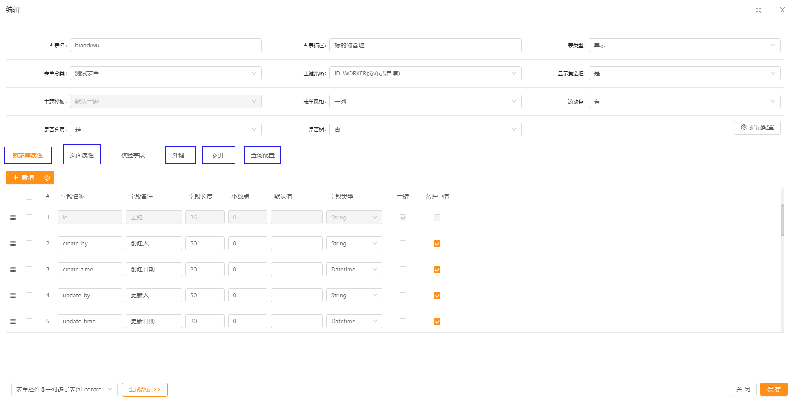

# 环境部署


## 开发环境要求

1、Java SDK 1.8 或 11、17  [下载1 (opens new window)](https://adoptium.net/temurin/releases?version=8)[下载2 (opens new window)](https://developers.redhat.com/products/openjdk/download)[下载3(opens new window)](http://jdk.java.net/java-se-ri/17)
2、Apache Maven 3.6+ [下载 (opens new window)](https://maven.apache.org/download.cgi)（Maven 3.8+ 请删除 settings.xml 里的 `mirror` 配置）
3、IntelliJ IDEA [下载 (opens new window)](http://www.jetbrains.com/idea/download)（根据个人喜好选择）
4、MySql 8.0 [下载 (opens new window)](https://dev.mysql.com/downloads/mysql/)或 5.7.11+ [下载 (opens new window)](https://dev.mysql.com/downloads/windows/installer/5.7.html)（Oracle、PostgreSQL、Sql Server 操作类似）
5、Git [下载 (opens new window)](https://git-scm.com/downloads)、TortoiseGit [下载](https://tortoisegit.org/download/)


## 开发环境安装部署

## 前端

https://gitee.com/changxin-huatian/cap-front.git

## 后端

git地址 https://gitee.com/changxin-huatian/cap-hr.git


## 环境部署

### 准备工作

```text
JDK >= 1.8 (推荐1.8版本)
Mysql >= 5.7.0 (推荐5.7版本)
Redis >= 3.0
Maven >= 3.0
Node >= 12
```

- 修改数据库连接，编辑`resources`目录下的application-druid.yml

```xml
  # 数据源配置
  datasource:
    type: com.alibaba.druid.pool.DruidDataSource
    # mysql
    #        driverClassName: com.mysql.cj.jdbc.Driver
    # 神通
    #        driverClassName: com.oscar.Driver
    # 达梦    dm.jdbc.driver.DmDriver
    driverClassName: com.mysql.cj.jdbc.Driver
    druid:
      # 主库数据源
      master:
        url: jdbc:mysql://47.105.115.251:3306/cap_hr_serv_business?useUnicode=true&characterEncoding=utf8&zeroDateTimeBehavior=convertToNull&useSSL=true&serverTimezone=GMT%2B8&allowMultiQueries=true&rewriteBatchedStatements=true
        username: root
        password: ENC(LZRgsefJ+9vzPr/oTuF3yDqIEHm9P2z2)
        # mysql
        #                url: jdbc:mysql://localhost:3306/ryvue?useUnicode=true&characterEncoding=utf8&zeroDateTimeBehavior=convertToNull&useSSL=true&serverTimezone=GMT%2B8
        #                username: root
        #                password: root
        # 神通
        #                url: jdbc:oscar://127.0.0.1:2003/osrdb
        #                username: ryvue
        #                password: 123123
        # 达梦v7.6
#        url: jdbc:dm://127.0.0.1:5236
#        username: ryvue
#        password: 123123123
      # 从库数据源
      slave:
        # 从数据源开关/默认关闭
        enabled: true
        url:  jdbc:mysql://111.205.247.215:3366/hy_zzbhr?useUnicode=true&characterEncoding=utf8&zeroDateTimeBehavior=convertToNull&useSSL=true&serverTimezone=GMT%2B8
        username: huayun
        password: huayun
```


- redis 配置，编辑resources 目录下的application.yml

```xml
redis:
  # 地址
  host: localhost
  # 端口，默认为6379
  port: 6379
  # 数据库索引
  database: 9
  # 密码
  #password: capinfo123$%^
  password:
```

* 开启ElasticSearch

```xml
easy-es:
  enable: true # 是否开启EE自动配置
  address: 81.70.144.248:9200 # es连接地址+端口 格式必须为ip:port,如果是集群则可用逗号隔开
  schema: http # 默认为http
  username:
  password:
```

* 修改服务器配置，`编辑resources目录下的application.yml`

```yml
# 开发环境配置
server:
  # 服务器的HTTP端口，默认为80
  port: 端口
  servlet:
    # 应用的访问路径
    context-path: /应用路径
```

### 后端部署 

- 打包工程文件

在`cap-hr`项目打包Web工程，生成war/jar包文件。
然后会在项目下生成`target`文件夹包含`war`或`jar`

- 部署工程文件

 1、jar部署方式

使用命令行执行：`java –jar caphr.jar` 

2、war部署方式

pom.xml`中的`packaging`修改为`war`，放入`tomcat`服务器`webapps

```xml
   <packaging>war</packaging>
```


- `SpringBoot`去除内嵌`Tomcat`（PS：此步骤不重要，因为不排除也能在容器中部署`war`）

```xml
<!-- 多模块排除内置tomcat -->
<dependency>
	<groupId>org.springframework.boot</groupId>
	<artifactId>spring-boot-starter-web</artifactId>
	<exclusions>
		<exclusion>
			<groupId>org.springframework.boot</groupId>
			<artifactId>spring-boot-starter-tomcat</artifactId>
		</exclusion>
	</exclusions>
</dependency>
		
<!-- 单应用排除内置tomcat -->		
<exclusions>
	<exclusion>
		<artifactId>spring-boot-starter-tomcat</artifactId>
		<groupId>org.springframework.boot</groupId>
	</exclusion>
</exclusions>
```

### 前端部署（少波补充）


## 


## 文件结构

###  后端结构

```text
com.cap     
├── common            // 工具类
│       └── annotation                    // 自定义注解
│       └── config                        // 全局配置
│       └── constant                      // 通用常量
│       └── core                          // 核心控制
│       └── enums                         // 通用枚举
│       └── exception                     // 通用异常
│       └── filter                        // 过滤器处理
│       └── utils                         // 通用类处理
├── framework         // 框架核心
│       └── aspectj                       // 注解实现
│       └── config                        // 系统配置
│       └── datasource                    // 数据权限
│       └── interceptor                   // 拦截器
│       └── manager                       // 异步处理
│       └── security                      // 权限控制
│       └── web                           // 前端控制
├── cap-generator   // 代码生成（可移除）
├── cap-quartz      // 定时任务（可移除）
├── cap-system      // 系统代码
├── cap-admin       // 后台服务
├── cap-xxxxxx      // 其他模块
│       └── cap-demo-domain                       // pojo类
│       └── cap-demo-service                       // service类
│       └── cap-demo-web                      // 控制类
│       └── pom.xml                      // pom.xml


```

分层原则：

> cap-demo-domain   这个子工程只存放po和vo层
>
> cap-demo-service service类  这个子工程只存放mapper和service层
>
> cap-demo-web 只放controller层

可以参考cap-demo分层方式。


### 前端结构（少波补充）


## 配置文件

通用配置 `application.yml`

```yml
# 项目相关配置
caphr:
  # 名称
  name: 首信HR
  # 版本
  version: 1.0.0
  # 版权年份
  copyrightYear: 2021
  # 实例演示开关
  demoEnabled: true
  # 文件路径 示例（ Windows配置D:/cap/uploadPath，Linux配置 /home/cap/uploadPath）
  profile: D:/caphr/uploadPath
  # 获取ip地址开关
  addressEnabled: false
  # 验证码类型 math 数组计算 char 字符验证
  captchaType: math
  # hr 原系统菜单，ps 支持平台系统菜单
  runverion: hr
  synctoken: 17LSzyPw4M

# 开发环境配置
server:
  # 服务器的HTTP端口，默认为8080
  port: 8071
  servlet:
    # 应用的访问路径 前台访问路径，后端访问路径
    #    context-path: /
    context-path: /
    encoding:
      charset: UTF-8
      enabled: true
      force: true
  tomcat:
    # tomcat的URI编码
    uri-encoding: UTF-8
    # tomcat最大线程数，默认为200
    max-threads: 800
    # Tomcat启动初始化的线程数，默认值25
    min-spare-threads: 30

# 日志配置
logging:
  level:
    com.cap.hr: debug
    org.springframework: error

# Spring配置
spring:
  main:
    allow-bean-definition-overriding: true
  # 资源信息
  messages:
    # 国际化资源文件路径
    basename: i18n/messages
  profiles:
    active: druid_test
  # 文件上传
  servlet:
    multipart:
      # 单个文件大小
      max-file-size:  10MB
      # 设置总上传的文件大小
      max-request-size:  20MB
  batch:
    job:
      enabled: false
  # 服务模块
  devtools:
    restart:
      # 热部署开关
      enabled: true

# token配置
token:
  # 令牌自定义标识
  header: Authorization
  # 令牌密钥
  secret: abcdefghijklmnopqrstuvwxyz
  # 令牌有效期（默认30分钟）
  expireTime: 120

#单点配置
sso:
  #单点token认证地址
  url: http://a.capinfo.com:8889/api/sso/auth
  #开关
  open: true
  # 令牌自定义标识
  header: LtpaToken
# MyBatis配置
mybatis:
  # 搜索指定包别名
  typeAliasesPackage: com.cap.hr.**.entity
  # 配置mapper的扫描，找到所有的mapper.xml映射文件
  mapperLocations: classpath*:mapper/**/*Mapper.xml
  # 加载全局的配置文件
  configLocation: classpath:mybatis/mybatis-config.xml

#mybatis
mybatis-plus:
  mapper-locations: classpath*:mapper/**/*Mapper.xml
  type-aliases-package: com.cap.hr.**.entity
  global-config:
    # 数据库相关配置
    db-config:
      #主键类型
      id-type: auto
      #字段策略
      field-strategy: not_empty
      # mysql
      #      db-type: mysql
      # 神通
      #      db-type: oscar
      # 达梦
      db-type: mysql
  #    page-type: mysql

  #mybatis原生配置
  configuration:
    # 全局映射器启用缓存
    cache-enabled: true
    # 关闭驼峰命名
    map-underscore-to-camel-case: true
    # 这个配置会将执行的sql打印出来，在开发或测试的时候可以用
    #log-impl: org.apache.ibatis.logging.stdout.StdOutImpl
    # 允许 JDBC 支持自动生成主键
    use-generated-keys: true
    # 配置默认的执行器
    call-setters-on-nulls: true
#    default-executor-type: reuse

easy-es:
  enable: true # 是否开启EE自动配置
  address: 81.70.144.248:9200 # es连接地址+端口 格式必须为ip:port,如果是集群则可用逗号隔开
  schema: http # 默认为http
  username:
  password:

# Swagger配置
swagger:
  # 是否开启swagger
  enabled: true
  # 请求前缀
  pathMapping: /

# 防止XSS攻击
xss:
  # 过滤开关
  enabled: true
  # 排除链接（多个用逗号分隔）
  excludes: /system/notice/*
  # 匹配链接
  urlPatterns: /system/*,/monitor/*,/tool/*

# 雪花算法配置
snowflake:
  workId: 1 #不能超过31
  datacenterId: 1 #不能超过31

# 字典翻译配置
easy-trans:
  #启用redis缓存 如果不用redis请设置为false
  is-enable-redis: false
  #启用全局翻译(拦截所有responseBody进行自动翻译)，如果对于性能要求很高可关闭此配置
  is-enable-global: false
  #启用平铺模式
  is-enable-tile: true

# 人员图片路径
personBaseDir: D:\resources_jl\img\images\userPhoto
#nginx路径
nginxUrl: http://192.168.124.19:9998

ss3:
  sys_dict_key: sys_relo_type
  system: system
  audit: audit
  secret: secret

system:
  administrator: admin
syncdata:
  type: .bkrs
jasypt:
  encryptor:
    algorithm: PBEWithMD5AndDES
    iv-generator-classname: org.jasypt.iv.NoIvGenerator
    password: Capinfo123!@#

```

数据源配置 `application-druid.yml`

```yml
server:
  # 服务器的HTTP端口，默认为8080
  port: 8080
spring:
  # redis 配置
  redis:
    # 地址
    host: localhost
    # 端口，默认为6379
    port: 6379
    # 数据库索引
    database: 9
    # 密码
    #password: capinfo123$%^
    password:
    # 连接超时时间
    timeout: 10s
    lettuce:
      pool:
        # 连接池中的最小空闲连接
        min-idle: 0
        # 连接池中的最大空闲连接
        max-idle: 8
        # 连接池的最大数据库连接数
        max-active: 8
        # #连接池最大阻塞等待时间（使用负值表示没有限制）
        max-wait: -1ms
  # 数据源配置
  datasource:
    type: com.alibaba.druid.pool.DruidDataSource
    # mysql
    #        driverClassName: com.mysql.cj.jdbc.Driver
    # 神通
    #        driverClassName: com.oscar.Driver
    # 达梦    dm.jdbc.driver.DmDriver
    driverClassName: com.mysql.cj.jdbc.Driver
    druid:
      # 主库数据源
      master:
        url: jdbc:mysql://47.105.115.251:3306/cap_hr_serv_business?useUnicode=true&characterEncoding=utf8&zeroDateTimeBehavior=convertToNull&useSSL=true&serverTimezone=GMT%2B8&allowMultiQueries=true&rewriteBatchedStatements=true
        username: root
        password: ENC(LZRgsefJ+9vzPr/oTuF3yDqIEHm9P2z2)
        # mysql
        #                url: jdbc:mysql://localhost:3306/ryvue?useUnicode=true&characterEncoding=utf8&zeroDateTimeBehavior=convertToNull&useSSL=true&serverTimezone=GMT%2B8
        #                username: root
        #                password: root
        # 神通
        #                url: jdbc:oscar://127.0.0.1:2003/osrdb
        #                username: ryvue
        #                password: 123123
        # 达梦v7.6
#        url: jdbc:dm://127.0.0.1:5236
#        username: ryvue
#        password: 123123123
      # 从库数据源
      slave:
        # 从数据源开关/默认关闭
        enabled: true
        url:  jdbc:mysql://111.205.247.215:3366/hy_zzbhr?useUnicode=true&characterEncoding=utf8&zeroDateTimeBehavior=convertToNull&useSSL=true&serverTimezone=GMT%2B8
        username: huayun
        password: huayun
      # 初始连接数
      initialSize: 5
      # 最小连接池数量
      minIdle: 10
      # 最大连接池数量
      maxActive: 20
      # 配置获取连接等待超时的时间
      maxWait: 60000
      # 配置间隔多久才进行一次检测，检测需要关闭的空闲连接，单位是毫秒
      timeBetweenEvictionRunsMillis: 60000
      # 配置一个连接在池中最小生存的时间，单位是毫秒
      minEvictableIdleTimeMillis: 300000
      # 配置一个连接在池中最大生存的时间，单位是毫秒
      maxEvictableIdleTimeMillis: 900000
      # 配置检测连接是否有效
      validationQuery: SELECT 1 FROM DUAL
      testWhileIdle: true
      testOnBorrow: false
      testOnReturn: false
      webStatFilter:
        enabled: true
      statViewServlet:
        enabled: true
        # 设置白名单，不填则允许所有访问
        allow:
        url-pattern: /druid/*
        # 控制台管理用户名和密码
        login-username:
        login-password:
      filter:
        stat:
          enabled: true
          # 慢SQL记录
          log-slow-sql: true
          slow-sql-millis: 1000
          merge-sql: true
        wall:
          config:
            multi-statement-allow: true
            
```


## 核心技术

TIP

- 前端技术栈 ES6、vue、vuex、vue-router、vue-cli、axios、element-ui
- 后端技术栈 SpringBoot、MyBatis、Spring Security、Jwt

### 后端技术

#### SpringBoot框架

1、介绍
`Spring Boot`是一款开箱即用框架，提供各种默认配置来简化项目配置。让我们的`Spring`应用变的更轻量化、更快的入门。 在主程序执行`main`函数就可以运行。你也可以打包你的应用为`jar`并通过使用`java -jar`来运行你的Web应用。它遵循"约定优先于配置"的原则， 使用`SpringBoot`只需很少的配置，大部分的时候直接使用默认的配置即可。同时可以与`Spring Cloud`的微服务无缝结合。

提示

`Spring Boot2.x`版本环境要求必须是`jdk8`或以上版本，服务器`Tomcat8`或以上版本

2、优点

- 使编码变得简单： 推荐使用注解。
- 使配置变得简单： 自动配置、快速集成新技术能力 没有冗余代码生成和XML配置的要求
- 使部署变得简单： 内嵌Tomcat、Jetty、Undertow等web容器，无需以war包形式部署
- 使监控变得简单： 提供运行时的应用监控
- 使集成变得简单： 对主流开发框架的无配置集成。
- 使开发变得简单： 极大地提高了开发快速构建项目、部署效率。

#### Spring Security安全控制

1、介绍
`Spring Security`是一个能够为基于`Spring`的企业应用系统提供声明式的安全访问控制解决方案的安全框架。

2、功能
`Authentication` 认证，就是用户登录
`Authorization` 授权，判断用户拥有什么权限，可以访问什么资源
安全防护，跨站脚本攻击，`session`攻击等
非常容易结合`Spring`进行使用

3、`Spring Security`与`Shiro`的区别

> 相同点

1、认证功能
2、授权功能
3、加密功能
4、会话管理
5、缓存支持
6、rememberMe功能
....

> 不同点

优点：

1、Spring Security基于Spring开发，项目如果使用Spring作为基础，配合Spring Security做权限更加方便。而Shiro需要和Spring进行整合开发
2、Spring Security功能比Shiro更加丰富，例如安全防护方面
3、Spring Security社区资源相对比Shiro更加丰富

缺点：

1）Shiro的配置和使用比较简单，Spring Security上手复杂些
2）Shiro依赖性低，不需要依赖任何框架和容器，可以独立运行。Spring Security依赖Spring容器

### 前端技术

- npm：node.js的包管理工具，用于统一管理我们前端项目中需要用到的包、插件、工具、命令等，便于开发和维护。
- ES6：Javascript的新版本，ECMAScript6的简称。利用ES6我们可以简化我们的JS代码，同时利用其提供的强大功能来快速实现JS逻辑。
- vue-cli：Vue的脚手架工具，用于自动生成Vue项目的目录及文件。
- vue-router： Vue提供的前端路由工具，利用其我们实现页面的路由控制，局部刷新及按需加载，构建单页应用，实现前后端分离。
- vuex：Vue提供的状态管理工具，用于统一管理我们项目中各种数据的交互和重用，存储我们需要用到数据对象。
- element-ui：基于MVVM框架Vue开源出来的一套前端ui组件。


## 元数据管理

### 什么是元数据管理

元数据最本质，最抽象的定义为：data about data (关于数据的数据)。而对于经营分析数据仓库而言，形象的定义为：元数据就是数据仓库的规范。这些规范包括对各种指标的定义、解释；包括对各表中数据的来龙去脉、数据的大小和格式的定义。

元数据管理，就是要建立一套行之有效的规范以及该规范的管控体系，实现从管理到查询到综合分析的全面管控，管理层次从接口到ETL处理、业务逻辑处理、结果展现处理和指标分析的方方面面，构成数据仓库应用系统的核心和基础。做到开发者能严格遵守规范，维护者和使用者有规范可查，有力的保障数据仓库项目的健壮性和可维护性。


### 业务元数据

业务元数据包括以下信息：使用者的业务术语所表达的数据模型、对象名和属性名；访问数据的原则和数据来源；系统所提供的分析方法及公式、报表信息。

业务元数据管理除了管理上述信息外，还提供对业务元数据来源的管理和差异性对比功能，使用户能够方便的查询、比较和追溯。

包括两个子模块，项目管理、接口管理。


### 技术元数据

主要是描述系统中技术领域的相关概念信息，包括数据结构、数据处理方面的特征描述，以及数据源接口。

在这里主要包含：表信息、表关系信息、源数据管理等。


### 目前市面上元数据缺点

目前传统开发模型的流程为： 设置元数据->设置页面属性->配置查询属性->配置自定义页面



缺陷：

1、耦合度太高:数据库属性（数据库物理字段）和页面属性（表单填报），现实情况，往往数据库物理字段可能和多个页面进行配置关联,查询配置，与数据库和页面属性绑定太死，每一个查询都要配置一遍，非常麻烦。
2、程序员在开发的过程中，往往是先使用PD设计表结构,生成脚本导入到数据库中。
4、在实践中、元数据一般是有一定开发经验的人使用的，这种设计模式不够智能化（繁琐），造成开发人员在开发的过程中，宁可自己写代码也不愿意配置。
5、元数据开发后台一般都是自己封装的jdbcTemplate（并没有与现在流行的架构做集成，系统往往会使用多种数据操作方法，导致开发时候不一致。）。
6、通常设计元数据的人是抵触传统JavaBean开发方式的，切换起来不够灵活，或者业务复杂的话，程序里面用元数据的工具硬拼sql，就会导致效率异常地下，（曾经估算过  至少会慢3到4倍的时间，并且开发后很难维护，没有分层）


### 新开发元数据特色点

1、智能化SQL，通过对sql语句进行语法分子，自动解析语法特点，并自己做优化处理。

例如:

**使用mybatis-plus 进行开发**

```java
QueryWrapper<HrmCheckDeptPerson> personQueryWrapper=Wrappers.query();
if(CollUtil.isNotEmpty(checkDeptPersonList)){
    personQueryWrapper=Wrappers.query();
    personQueryWrapper.eq("A0101",hrmCheckDeptId);
    personQueryWrapper.eq("A0184",isSpareFine);
    personQueryWrapper.eq("A0104",hrmCheckDeptId);
    personQueryWrapper.eq("A0160",isSpareFine);
    personQueryWrapper.eq("A0192A",isSpareFine);
    personQueryWrapper.eq("A0192D",isSpareFine);
    personQueryWrapper.eq("A8043",isSpareFine);
    personQueryWrapper.eq("A0172",isSpareFine);
    personQueryWrapper.eq("personEditLimitSql",isSpareFine);
    personQueryWrapper.eq("personCutSql",isSpareFine);
    checkDeptPersonList=hrmCheckDeptPersonService.list(personQueryWrapper);
```

写sql语句在Mapper中


**使用元数据开发**

```java
@GetMapping("/demo1")
public String querylist(){

    String sql ="SELECT * FROM rs_a01 A01 WHERE EXISTS (SELECT 1 FROM rs_a02 A02 WHERE A02.SID=A01.ID &{personEditLimitSql} AND &{personCutSql}  AND A02.A0201B LIKE CONCAT(${IDS},'%')) AND A01.A0101 LIKE  CONCAT(${A0101},'%') AND A01.A0184 =${A0184} AND A01.A0104 =${A0104} AND A01.A0160 = ${A0160} AND A01.A0192A LIKE CONCAT('%',${A0192A},'%') AND A01.A0172 = ${A0172} AND A01.A0192D = ${A0192D} AND A01.A8043 = ${A8043} ORDER BY A01.A0192D ASC";
    Map<String,Object> map = new HashMap<>();
    map.put("A0101","李");
    map.put("A0184","");
    map.put("A0104","");
    map.put("A0160","");
    map.put("A0192A","");
    map.put("A0192D","");
    map.put("A8043","");
    map.put("A0172","");
    map.put("personEditLimitSql","1234");
    map.put("personCutSql"," 1=2 ");
    map.put("IDS", ListUtil.toList("12","23","25"));
    generalMetaService.selectDynSql(sql,map);
    return "测试成功";
}
```

程序会智能化识别查询条件、如果为空则自动去掉。

2、元数据对myabtis-plus进行扩展得来Mybatis-plus-matedata，你可以使用mybatis-plus进行开发，也可以使用元数据进行开发，保证技术的一致性。

3、快速配置，通过mysql反向生成表和关系的元数据信息，通过Ast语法树反向生成数据流。

4、插件化管理、不入侵核心代码。

5、开发速度快。只要会写sql语句，您将在短时间内提供出来一套完整的添删改查系统。


## 权限注解

`Spring Security`提供了`Spring EL`表达式，允许我们在定义接口访问的方法上面添加注解，来控制访问权限。

### 权限方法

`@PreAuthorize`注解用于配置接口要求用户拥有某些权限才可访问，它拥有如下方法

| 方法        | 参数   | 描述                                           |
| ----------- | ------ | ---------------------------------------------- |
| hasPermi    | String | 验证用户是否具备某权限                         |
| lacksPermi  | String | 验证用户是否不具备某权限，与 hasPermi逻辑相反  |
| hasAnyPermi | String | 验证用户是否具有以下任意一个权限               |
| hasRole     | String | 判断用户是否拥有某个角色                       |
| lacksRole   | String | 验证用户是否不具备某角色，与 isRole逻辑相反    |
| hasAnyRoles | String | 验证用户是否具有以下任意一个角色，多个逗号分隔 |

### 使用示例

其中`@ss`代表的是服务，对每个接口拦截并调用`PermissionService`的对应方法判断接口调用者的权限。

1. 数据权限示例。

```java
// 符合system:user:list权限要求
@PreAuthorize("@ss.hasPermi('system:user:list')")

// 不符合system:user:list权限要求
@PreAuthorize("@ss.lacksPermi('system:user:list')")

// 符合system:user:add或system:user:edit权限要求即可
@PreAuthorize("@ss.hasAnyPermi('system:user:add,system:user:edit')")
```

1. 角色权限示例。

```java
// 属于user角色
@PreAuthorize("@ss.hasRole('user')")

// 不属于user角色
@PreAuthorize("@ss.lacksRole('user')")

// 属于user或者admin之一
@PreAuthorize("@ss.hasAnyRoles('user,admin')")
```

权限提示

超级管理员拥有所有权限，不受权限约束。

### 公开接口

如果有些接口是不需要验证权限可以公开访问的，这个时候就需要我们给接口放行。

使用注解方式，只需要在`Controller`的类或方法上加入`@Anonymous`该注解即可

```java
// @PreAuthorize("@ss.xxxx('....')") 注释或删除掉原有的权限注解
@Anonymous
@GetMapping("/list")
public List<SysXxxx> list(SysXxxx xxxx)
{
    return xxxxList;
}
```


## 事务管理和多数据源

# 简介

cap-hr的多数据源使用的是dynamic-datasource-spring-boot-starter中间件。

其支持 **Jdk 1.7+, SpringBoot 1.4.x 1.5.x 2.x.x**。

# 特性

- 支持 **数据源分组** ，适用于多种场景 纯粹多库 读写分离 一主多从 混合模式。
- 支持数据库敏感配置信息 **加密** ENC()。
- 支持每个数据库独立初始化表结构schema和数据库database。
- 支持无数据源启动，支持懒加载数据源（需要的时候再创建连接）。
- 支持 **自定义注解** ，需继承DS(3.2.0+)。
- 提供并简化对Druid，HikariCp，BeeCp，Dbcp2的快速集成。
- 提供对Mybatis-Plus，Quartz，ShardingJdbc，P6sy，Jndi等组件的集成方案。
- 提供 **自定义数据源来源** 方案（如全从数据库加载）。
- 提供项目启动后 **动态增加移除数据源** 方案。
- 提供Mybatis环境下的 **纯读写分离** 方案。
- 提供使用 **spel动态参数** 解析数据源方案。内置spel，session，header，支持自定义。
- 支持 **多层数据源嵌套切换** 。（ServiceA >>> ServiceB >>> ServiceC）。
- 提供 **基于seata的分布式事务方案。**
- 提供 **本地多数据源事务方案。** 附：不能和原生spring事务混用。

# 约定

1. 本框架只做 **切换数据源** 这件核心的事情，并**不限制你的具体操作**，切换了数据源可以做任何CRUD。
2. 配置文件所有以下划线 `_` 分割的数据源 **首部** 即为组的名称，相同组名称的数据源会放在一个组下。
3. 切换数据源可以是组名，也可以是具体数据源名称。组名则切换时采用负载均衡算法切换。
4. 默认的数据源名称为 **master** ，你可以通过 `spring.datasource.dynamic.primary` 修改。
5. 方法上的注解优先于类上注解。
6. DS支持继承抽象类上的DS，暂不支持继承接口上的DS。

# 使用方法

cap-hr的多数据源使用的是dynamic-datasource中间件。

maven

```
<dependency>
  <groupId>com.baomidou</groupId>
  <artifactId>dynamic-datasource-spring-boot-starter</artifactId>
  <version>${version}</version>
</dependency>
```

1. 配置数据源。

```
spring:
  datasource:
    dynamic:
      primary: master #设置默认的数据源或者数据源组,默认值即为master
      strict: false #严格匹配数据源,默认false. true未匹配到指定数据源时抛异常,false使用默认数据源
      datasource:
        master:
          url: jdbc:mysql://xx.xx.xx.xx:3306/dynamic
          username: root
          password: 123456
          driver-class-name: com.mysql.jdbc.Driver # 3.2.0开始支持SPI可省略此配置
        slave_1:
          url: jdbc:mysql://xx.xx.xx.xx:3307/dynamic
          username: root
          password: 123456
          driver-class-name: com.mysql.jdbc.Driver
        slave_2:
          url: ENC(xxxxx) # 内置加密,使用请查看详细文档
          username: ENC(xxxxx)
          password: ENC(xxxxx)
          driver-class-name: com.mysql.jdbc.Driver
          
       #......省略
       #以上会配置一个默认库master，一个组slave下有两个子库slave_1,slave_2
# 多主多从                      纯粹多库（记得设置primary）                   混合配置
spring:                               spring:                               spring:
  datasource:                           datasource:                           datasource:
    dynamic:                              dynamic:                              dynamic:
      datasource:                           datasource:                           datasource:
        master_1:                             mysql:                                master:
        master_2:                             oracle:                               slave_1:
        slave_1:                              sqlserver:                            slave_2:
        slave_2:                              postgresql:                           oracle_1:
        slave_3:                              h2:                                   oracle_2:
```

1. 使用 **@DS** 切换数据源。

**@DS** 可以注解在方法上或类上，**同时存在就近原则 方法上注解 优先于 类上注解**。

|     注解      |                   结果                   |
| :-----------: | :--------------------------------------: |
|    没有@DS    |                默认数据源                |
| @DS("dsName") | dsName可以为组名也可以为具体某个库的名称 |

```
@Service
@DS("slave")
public class UserServiceImpl implements UserService {

  @Autowired
  private JdbcTemplate jdbcTemplate;

  public List selectAll() {
    return  jdbcTemplate.queryForList("select * from user");
  }
  
  @Override
  @DS("slave_1")
  public List selectByCondition() {
    return  jdbcTemplate.queryForList("select * from user where age >10");
  }
}
```

### 事务问答环节

- 原生Spring`@Transational`能和`@DS`一起使用吗？
- 本地事务和Spring原生事务不能混用是什么意思？
- 本地事务标准使用。

建议先阅读基础知识。

核心知识： **spring原生事务会保证在事务下整个线程后续拿到的都是同一个connection。**

原生Spring`@Transational`能和`@DS`一起使用吗？

```
public class AService {
    
    @DS("a")
    @Transational
    public void dosomething(){
    //some code
    }
}
```

可以的，其会先切换使用数据源a再开启事务，整个原生事务内部不管是注解切换还是手动调用代码切换都不能切换，会一直使用a数据源。

所以确认整个事务下不再切换其他数据源，用原生 `@Transational` 是建议的，毕竟其更完善。

#### 本地事务和Spring原生事务不能混用是什么意思？

场景一：先使用的Spring`@Transational` 内部方法调用了本地`@DSTransactional`。

```
public class AService {
    
    @DS("a")
    @Transational
    public void dosomething(){
        Bservice.dosomething(); //B是另外数据源，然后注解了@DS("b")和@DSTransactional
        Cservice.dosomething(); //C是另外数据源，然后注解了@DS("c")和@DSTransactional
    }
}
```

基于核心知识： 整理事务下都是a数据源，内部无论做什么都改变不了使用a数据源。

场景二： 先使用的本地`@DSTransactional`内部方法调用了Spring`@Transational` 。

```
public class AService {
    
    @DS("a")
    @DSTransactional
    public void dosomething(){
        Amapper.updateSomeThing();
        Bservice.dosomething(); //B是另外数据源，然后注解了@DS("b")和@Transational
        Cservice.dosomething(); //C是另外数据源，然后注解了@DS("b")和@Transational
    }
}
```

复制

B和C都是独立的事务。C发生错误B会回滚吗？不会B已经提交了。A会回滚吗？会。

不建议混用，除非你确实非常理解事务，能随心所欲掌握你代码的执行流程。

#### 本地事务标准使用。

请结合阅读本地事务章节。

```
public class AService {
    
    @DS("a")
    @DSTransactional//最外层开启即可
    public void dosomething(){
        Amapper.updateSomeThing();
        Bservice.dosomething(); //B是另外数据源，然后注解了@DS("b")
        Cservice.dosomething(); //C是另外数据源，然后注解了@DS("b")
    }
}
```


## 异常处理

通常一个`web`框架中，有大量需要处理的异常。比如业务异常，权限不足等等。前端通过弹出提示信息的方式告诉用户出了什么错误。 通常情况下我们用`try.....catch....`对异常进行捕捉处理，但是在实际项目中对业务模块进行异常捕捉，会造成代码重复和繁杂， 我们希望代码中只有业务相关的操作，所有的异常我们单独设立一个类来处理它。全局异常就是对框架所有异常进行统一管理。 我们在可能发生异常的方法里`throw`抛给控制器。然后由全局异常处理器对异常进行统一处理。 如此，我们的`Controller`中的方法就可以很简洁了。

所谓全局异常处理器就是使用`@ControllerAdvice`注解。示例如下：

1、统一返回实体定义

```java
package com.cap.common.core.domain;

import java.util.HashMap;

/**
 * 操作消息提醒
 * 
 * @author cap
 */
public class AjaxResult extends HashMap<String, Object>
{
    private static final long serialVersionUID = 1L;

    /**
     * 返回错误消息
     * 
     * @param code 错误码
     * @param msg 内容
     * @return 错误消息
     */
    public static AjaxResult error(String msg)
    {
        AjaxResult json = new AjaxResult();
        json.put("msg", msg);
        json.put("code", 500);
        return json;
    }

    /**
     * 返回成功消息
     * 
     * @param msg 内容
     * @return 成功消息
     */
    public static AjaxResult success(String msg)
    {
        AjaxResult json = new AjaxResult();
        json.put("msg", msg);
        json.put("code", 0);
        return json;
    }
}
```

2、定义登录异常定义

```java
package com.cap.common.exception;

/**
 * 登录异常
 * 
 * @author cap
 */
public class LoginException extends RuntimeException
{
    private static final long serialVersionUID = 1L;

    protected final String message;

    public LoginException(String message)
    {
        this.message = message;
    }

    @Override
    public String getMessage()
    {
        return message;
    }
}
```

3、基于`@ControllerAdvice`注解的`Controller`层的全局异常统一处理

```java
package com.cap.framework.web.exception;

import org.slf4j.Logger;
import org.slf4j.LoggerFactory;
import org.springframework.web.bind.annotation.ExceptionHandler;
import org.springframework.web.bind.annotation.RestControllerAdvice;
import com.cap.common.core.domain.AjaxResult;
import com.cap.common.exception.LoginException;

/**
 * 全局异常处理器
 * 
 * @author cap
 */
@RestControllerAdvice
public class GlobalExceptionHandler
{
    private static final Logger log = LoggerFactory.getLogger(GlobalExceptionHandler.class);
	
	/**
     * 登录异常
     */
    @ExceptionHandler(LoginException.class)
    public AjaxResult loginException(LoginException e)
    {
        log.error(e.getMessage(), e);
        return AjaxResult.error(e.getMessage());
    }
}
```

4、测试访问请求

```java
@Controller
public class SysIndexController 
{
    /**
     * 首页方法
     */
    @GetMapping("/index")
    public String index(ModelMap mmap)
    {
        /**
         * 模拟用户未登录，抛出业务逻辑异常
         */
        SysUser user = ShiroUtils.getSysUser();
        if (StringUtils.isNull(user))
		{
            throw new LoginException("用户未登录，无法访问请求。");
        }
		mmap.put("user", user);
        return "index";
    }
}
```

根据上面代码含义，当我们未登录访问`/index`时就会发生`LoginException`业务逻辑异常，按照我们之前的全局异常配置以及统一返回实体实例化，访问后会出现`AjaxResult`格式`JSON`数据， 下面我们运行项目访问查看效果。
界面输出内容如下所示：

```json
{
    "msg": "用户未登录，无法访问请求。",
    "code": 500
}
```

对于一些特殊情况，如接口需要返回`json`，页面请求返回`html`可以使用如下方法：

```java
@ExceptionHandler(LoginException.class)
public Object loginException(HttpServletRequest request, LoginException e)
{
	log.error(e.getMessage(), e);

	if (ServletUtils.isAjaxRequest(request))
	{
		return AjaxResult.error(e.getMessage());
	}
	else
	{
		return new ModelAndView("/error/500");
	}
}
```

若依系统的全局异常处理器`GlobalExceptionHandler`
注意：如果全部异常处理返回`json`，那么可以使用`@RestControllerAdvice`代替`@ControllerAdvice`，这样在方法上就可以不需要添加`@ResponseBody`。

无法捕获异常？

如果您的异常无法捕获，您可以从以下几个方面着手检查

异常是否已被处理，即抛出异常后被catch，打印了日志或抛出了其它异常 异常是否非Controller抛出，即在拦截器或过滤器中出现的异常

## 参数验证

## 系统日志

## 数据权限

## 代码生成

## 定时任务

## 系统接口

在现在的开发过程中还有很大一部分公司都是以口口相传的方式来进行前后端的联调，而接口文档很大一部分都只停留在了说说而已的地步，或者写了代码再写文档。 还有一点就是文档的修改，定义好的接口并不是一成不变的，可能在开发过程中文档修改不止一次的变化，这个时候就会很难受了。 只要不是强制性要求，没人会愿意写这东西，而且在写的过程中，一个字母的错误就会导致联调时候的很大麻烦，但是通过`Swagger`，我们可以省略了这一步，而且文档出错率近乎于零， 只要你在写代码的时候，稍加几个注解，文档自动生成。

1、在控制层`Controller`中添加注解来描述接口信息如:

```java
@Api("参数配置")
@Controller
@RequestMapping("/system/config")
public class ConfigController
```

2、在方法中配置接口的标题信息

```sql
@ApiOperation("查询参数列表")
@ResponseBody
public TableDataInfo list(Config config)
{
	startPage();
	List<Config> list = configService.selectConfigList(config);
	return getDataTable(list);
}
```

3、在`系统工具-系统接口`测试相关接口

```
注意：SwaggerConfig可以指定根据注解或者包名扫描具体的API
```

API详细说明

| 作用范围           | API                | 使用位置                         |
| ------------------ | ------------------ | -------------------------------- |
| 协议集描述         | @Api               | 用于controller类上               |
| 对象属性           | @ApiModelProperty  | 用在出入参数对象的字段上         |
| 协议描述           | @ApiOperation      | 用在controller的方法上           |
| Response集         | @ApiResponses      | 用在controller的方法上           |
| Response           | @ApiResponse       | 用在 @ApiResponses里边           |
| 非对象参数集       | @ApiImplicitParams | 用在controller的方法上           |
| 非对象参数描述     | @ApiImplicitParam  | 用在@ApiImplicitParams的方法里边 |
| 描述返回对象的意义 | @ApiModel          | 用在返回对象类上                 |

`api`标记，用在类上，说明该类的作用。可以标记一个`Controller`类做为`Swagger`文档资源，使用方式：

```java
@Api(value = "/user", description = "用户管理")
```

1

与`Controller`注解并列使用。 属性配置：

| 属性名称       | 备注                                             |
| -------------- | ------------------------------------------------ |
| value          | url的路径值                                      |
| tags           | 如果设置这个值、value的值会被覆盖                |
| description    | 对api资源的描述                                  |
| basePath       | 基本路径可以不配置                               |
| position       | 如果配置多个Api 想改变显示的顺序位置             |
| produces       | For example, "application/json, application/xml" |
| consumes       | For example, "application/json, application/xml" |
| protocols      | Possible values: http, https, ws, wss.           |
| authorizations | 高级特性认证时配置                               |
| hidden         | 配置为true 将在文档中隐藏                        |

`ApiOperation`标记，用在方法上，说明方法的作用，每一个`url`资源的定义,使用方式：

```java
@ApiOperation("获取用户信息")
```

与`Controller`中的方法并列使用，属性配置：

| 属性名称          | 备注                                                         |
| ----------------- | ------------------------------------------------------------ |
| value             | url的路径值                                                  |
| tags              | 如果设置这个值、value的值会被覆盖                            |
| description       | 对api资源的描述                                              |
| basePath          | 基本路径可以不配置                                           |
| position          | 如果配置多个Api 想改变显示的顺序位置                         |
| produces          | For example, "application/json, application/xml"             |
| consumes          | For example, "application/json, application/xml"             |
| protocols         | Possible values: http, https, ws, wss.                       |
| authorizations    | 高级特性认证时配置                                           |
| hidden            | 配置为true将在文档中隐藏                                     |
| response          | 返回的对象                                                   |
| responseContainer | 这些对象是有效的 "List", "Set" or "Map".，其他无效           |
| httpMethod        | "GET", "HEAD", "POST", "PUT", "DELETE", "OPTIONS" and "PATCH" |
| code              | http的状态码 默认 200                                        |
| extensions        | 扩展属性                                                     |

`ApiParam`标记，请求属性，使用方式：

```java
public TableDataInfo list(@ApiParam(value = "查询用户列表", required = true)User user)
```

与Controller中的方法并列使用，属性配置：

| 属性名称        | 备注         |
| --------------- | ------------ |
| name            | 属性名称     |
| value           | 属性值       |
| defaultValue    | 默认属性值   |
| allowableValues | 可以不配置   |
| required        | 是否属性必填 |
| access          | 不过多描述   |
| allowMultiple   | 默认为false  |
| hidden          | 隐藏该属性   |
| example         | 举例子       |

`ApiResponse`标记，响应配置，使用方式：

```java
@ApiResponse(code = 400, message = "查询用户失败")
```

与`Controller`中的方法并列使用，属性配置：

| 属性名称          | 备注                             |
| ----------------- | -------------------------------- |
| code              | http的状态码                     |
| message           | 描述                             |
| response          | 默认响应类 Void                  |
| reference         | 参考ApiOperation中配置           |
| responseHeaders   | 参考 ResponseHeader 属性配置说明 |
| responseContainer | 参考ApiOperation中配置           |

`ApiResponses`标记，响应集配置，使用方式:

```java
@ApiResponses({ @ApiResponse(code = 400, message = "无效的用户") })
```

与`Controller`中的方法并列使用，属性配置：

| 属性名称 | 备注                |
| -------- | ------------------- |
| value    | 多个ApiResponse配置 |

`ResponseHeader`标记，响应头设置，使用方法

```java
@ResponseHeader(name="head",description="响应头设计")
```

与`Controller`中的方法并列使用，属性配置：

| 属性名称          | 备注                   |
| ----------------- | ---------------------- |
| name              | 响应头名称             |
| description       | 描述                   |
| response          | 默认响应类 void        |
| responseContainer | 参考ApiOperation中配置 |


## 防重复提交


